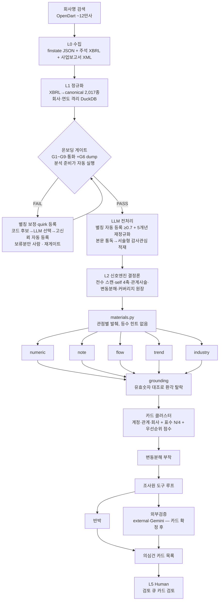

# 2. 전체 파이프라인 (end-to-end)

## 2.1 전체 흐름

## 2.2 단계 요약

| 단계               | 입력            | 처리                                                                     | 출력                                | 상세 장                          |
| ------------------ | --------------- | ------------------------------------------------------------------------ | ----------------------------------- | -------------------------------- |
| L0 수집            | 회사·연도       | OpenDART 재무제표 JSON·주석 XBRL·원문 XML을 raw로 저장(부재≠오류)        | `data/companies/{corp}/{year}/raw/` | [3장](3_COLLECT-NORMALIZE.md)    |
| L1 정규화          | raw CSV         | id-first 매핑·충돌 중재·dedup·SCE 2D·자본분해                            | 회사/연도 격리 DuckDB               | [3장](3_COLLECT-NORMALIZE.md)    |
| 온보딩 게이트      | 정규화 DB       | G1 완결성·BS 항등식·G3 산술·G5 무결성·G7 소계/표간대사·G8 번역품질·G9 연도간대사·통화 검문 | gate_passed 여부                    | [3장](3_COLLECT-NORMALIZE.md)    |
| LLM 전처리         | 게이트 통과 DB  | 별칭 제안·고신뢰(≥0.7) 자동 등록+5개년 재정규화 · 본문 통독 서술추출     | quirk·report_extracts·완료 마커     | [3장](3_COLLECT-NORMALIZE.md)    |
| L2 신호엔진        | 정규화 frame    | 전수 스캔·다축 프로파일러·관계사슬·비율·변동분해·커버리지 원장           | 계정 패널·시계열·큐·원장            | [4장](4_SIGNAL-ENGINE.md)        |
| L3 5관점           | 관점별 material | 병렬 발견(내부 4 + 동종 1), 각 관점 LLM 1회                              | SuspicionItem 목록                  | [5장](5_PERSPECTIVES-CARDS.md)   |
| grounding          | 의심건          | 인용 수치를 실데이터 유효숫자와 대조, 환각 탈락                          | grounded 의심건                     | [6장](6_GROUNDING-GUARDRAILS.md) |
| 카드 조립          | grounded 의심건 | 계정/관계/회사 클러스터·표수·우선순위 점수·브리지 병합                   | AccountFinding 카드                 | [5장](5_PERSPECTIVES-CARDS.md)   |
| 조사·반박·외부검증 | 카드            | 조사원 도구 루프 → 반박·외부검증 병렬                                    | 결론·반대근거·외부근거              | [5장](5_PERSPECTIVES-CARDS.md)   |
| L5 렌더            | 카드 목록       | 3섹션 카드 + 타입별 차트                                                 | Streamlit 화면                      | [7장](7_UI-DASHBOARD.md)         |

**strict 채점 경계 = sj_div ∈ {BS, IS}** (OVERVIEW). CF·CIS·SCE·소급재작성은 결정론 점수에서 제외하고 관점 material에 단서로만 실어 LLM이 맥락 판단한다(원래 출렁이는 항목이라 점수화하면 멀쩡한 회사를 오해).

## 2.3 실증 예시 — 아스트(00409681) 2020 재고분식이 파이프라인을 통과하는 과정

실제 골든 채점(`golden/hit/_score_00409681_2020.md`)에 남은 한 건을 종착까지 따라간다. 아스트는 증선위·법원이 확정한 재고자산 과대계상(2018~2021) 사건이다.

**L0 수집** — `select_annual_report`가 정정 이력에서 원본(as-filed)을 고른다. "사업보고서" AND "(2020.12)"를 포함하고 "정정" 미포함, `rcept_dt` 최소인 최초 제출본을 선택한다. 정정본(재작성 XBRL)이 아니라 **정정 전 세상이 본 값**을 입력으로 고정한다(전후꼬임 차단). CFS 재고자산 원본 값은 우리 DB와 일치함이 별도로 실증됐다(재작성은 OFS만 변경).

**L1 정규화** — `finstate_all_CFS.csv`의 XBRL 행이 canonical로 매핑된다. `재고자산`은 `ifrs-full_Inventories` id로 `EXACT` 매핑. 정규화 DB에 `CFS:재고자산` 시계열이 저장된다: **2016년 45,985,571,411원(459.9억) → 2019년 152,615,809,899원(1,526.2억) → 2020년 168,532,992,835원(1,685.3억)** — 5년간 약 3.7배 단조 증가(수치 출처: `golden/numeric/_report_00409681_2020.md`, DART 원값 대조 match).

**온보딩 게이트** — G1 완결성 OK, BS 항등식 잔차 100만원 이내, 통화 KRW → `gate_passed=True`. 아스트는 L2로 진입한다.

**L2 신호엔진** — `universal.scan_universal_signals`가 `CFS:재고자산`의 YoY를 스캔한다. `profiler`의 trend 축(단조성 1.0 × 누적변화/자산)이 5년 단조 증가로 높은 분위를 받고, `ratios`가 `financial_ratios.yaml`의 정의로 재고회전율·DIO를 계산한다(2020년 실측: 재고회전율 0.38·DIO 952.35일). 관계사슬 `[재고, 매출원가, 재고평가손실]`도 활성화 — 2020년 매출은 544.9억원으로 전년 대비 −62.32%, 매출원가는 615.4억원으로 −44.4% 급감했는데 재고자산만 +10.43% 늘었다.

**materials.py 발췌** — numeric 관점에는 재고자산 패널 행(YoY·자산대비·추세·구성비·z점수)이, flow 관점에는 재고↔매출원가↔매출 관계가 실린다. **코드는 순위를 매기지 않고** 전 계정 계산값을 전량 전달한다.

**L3 관점 발견** — numeric 관점 LLM이 "재고자산이 5년 누적 4배 증가, 재고회전율 급락"을 `SuspicionItem`으로 제출한다(account_id=재고자산, cited_value="168,532,992,835", issue_type=cost_inventory). flow 관점은 재고↔매출원가 역행을 relationship scope로 제출한다.

**grounding** — 인용 값 "168,532,992,835"의 유효숫자가 `CFS:재고자산` 인덱스 풀에 실재하는지 대조 → 통과(grounded=True). 지어낸 값이면 여기서 탈락했을 것이다.

**카드 조립** — grounded 의심건이 `acct:BS:CFS:재고자산` cluster_key로 묶여 계정 카드가 된다. 표수(votes)는 이 계정을 지적한 내부 관점 고유 수. 관계 카드 `rel:CFS:매출|CFS:매출원가|CFS:재고자산`도 별도 생성. 연속 우선순위 점수(materiality 0.35·votes 0.30·anomaly 0.15·confidence 0.20 가중합)로 정렬된다.

**조사·반박** — 조사원이 변동분해로 원인 경로를 좁히고, 반박 에이전트가 "재고 증가는 수주 대비 선제 생산일 수 있다"(정상 설명)·"재고실사·평가충당금 확인"(다음 절차)을 채운다. 위험도 숫자는 건드리지 않는다.

**종착** — 카드 큐에서 **재고자산이 rank 1**로 뜬다(score 0.700). 골든 검사2 채점: recall@5 = 2/3(재고자산 rank1·매출원가 rank5·자기자본 미적중). 동시에 골든 검사1은 이 카드에 찍힌 수치 N=64건이 전부 as-filed DART 원값과 일치함을 전자동 확인했다(불일치 0).

이 한 건이 "숫자 이상치 하나"가 아니라 **관계(재고↔원가 역행)·추세(5년 단조)·수치 정합(원값 일치)** 세 축으로 동시에 포착됨을 보여준다 — 이것이 이 도구가 숫자만 보는 도구, LLM 단순 투입 도구와 다른 지점이다.
