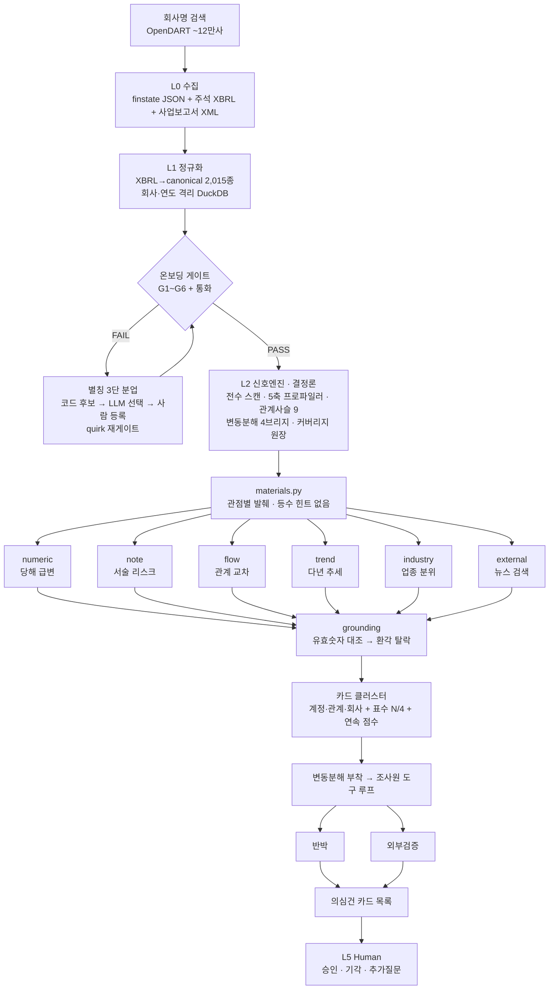

# Disclosure Review Agent

멀티에이전트 교차검증 기반 **공시 재무제표·주석 변화 리뷰 도구**


OpenDART 공시 재무제표·주석을 **결정론 코드로 전량 계산**하고, "무엇이 의심스러운가"의 **발견만 6개 관점 LLM**에 맡겨 교차검증한 뒤, 감사인이 검토할 **리스크 후보 카드**를 근거·반박·다음절차와 함께 제시한다. 부정을 확정하지 않는다.

## 1. 한눈에 보기


> 실제 화면. 아스트(067390) 2020년 재고자산 카드 — 조사 결론 → 검토 포인트 → ① 무엇이 의심스러운가 → ② 결과 분해 → ③ 시각자료 → ④ 반박 순으로 한 화면에 담긴다.

| 지표                                   | 값                                                                  |
| -------------------------------------- | ------------------------------------------------------------------- |
| 표준 계정 매핑                         | 약 **2,015개** canonical (BS/CIS/CF/SCE)                            |
| 검증 관점                              | **6개** (내부 4 + 외부·동종 2), 닫힌 집합                           |
| 관계 사슬 · 재무비율 · 변동분해 브리지 | **9 · 15 · 4**                                                      |
| 실 LLM E2E (전과정)                    | 삼성전자 **231초·₩1,981·10호출** / 대주산업 **158초·₩1,365·10호출** |
| 백테스트 발굴 recall                   | **5/6** (결정론 신호만)                                             |
| 골든 검사1 (수치)                      | 삼성물산 **57/57 match** · 아스트 61건 중 불일치 **0**              |
| 골든 검사2 (적중)                      | 아스트 재고자산 **rank 1** · recall@5 **2/3**                       |

---

## 목차

1. [한눈에 보기](#1-한눈에-보기)
2. [문제 정의 — 왜 이 도구인가](#2-문제-정의--왜-이-도구인가)
3. [파이프라인](#3-파이프라인)
4. [핵심 설계 5원칙](#4-핵심-설계-5원칙)
5. [차별점](#5-차별점)
6. [검증](#6-검증)
7. [트러블슈팅](#7-트러블슈팅)
8. [한계](#8-한계)
9. [기술 스택](#9-기술-스택)
10. [빠른 시작](#10-빠른-시작)

---

## 2. 문제 정의 — 왜 이 도구인가

상장사 공시 재무제표에는 감사인이 봐야 할 리스크 신호가 숨어 있다. 두 가지 접근이 각각 다른 이유로 그 신호를 놓친다.

**숫자만 보는 도구**는 계정 하나의 이상치만 본다. 재무제표 *간*의 모순(매출은 줄었는데 재고는 늘었다)이나 전기 대비 *변화*(주석 문구가 커졌다)를 놓친다.

**LLM에 통째로 넣는 접근**은 네 가지가 무너진다. 이 프로젝트는 그 넷을 구조로 제거한다.

| 약점   | LLM 단순 투입            | 본 프로젝트                              |
| ------ | ------------------------ | ---------------------------------------- |
| 재현성 | 매번 다른 답 · 숫자 환각 | 결정론 코드가 계산 → 같은 입력=같은 답   |
| 전수성 | 토큰 한계로 일부만       | 전 계정·전 연도 결정론 스캔 (top-N 없음) |
| 앵커링 | 학습 선입견              | EvidenceRef 유효숫자 대조 → 환각 탈락    |
| 일관성 | 회사마다 흔들림          | 계정 지식을 config YAML로 외부화         |

근거는 자매 프로젝트에서 실측했다 — LLM 산술 정확도가 Gemini 20~40% vs gpt-4.1-mini 100%로 양립 불가였다. 그래서 **계산은 코드, 발견은 LLM**으로 나눴다.

핵심 통찰은 하나다. 계정은 산업마다 무한 증식하지만(건설사 미청구공사, 금융사 대출채권), **검증 관점은 닫힌 집합**이다. 그래서 에이전트 축은 관점(역할)에만 대응시키고, "이번 회사에서 어떤 계정을 볼지"는 신호엔진이 데이터로 정한다.

> **포지셔닝(고정)** — 이 도구는 "분식 확정 / 부정 자동 적발 / 운영 성능 검증 완료" 같은 표현을 쓰지 않는다. 목적은 분식 탐지가 아니라 **이상 변화·감사인 검토 큐** 생성이다. 백테스트 recall은 목적 잣대가 아니라 회귀 가드다.

---

## 3. 파이프라인

회사명 검색에서 감사인 화면까지 데이터가 가는 경로다.



| 단계          | 입력            | 처리                                          | 출력                                |
| ------------- | --------------- | --------------------------------------------- | ----------------------------------- |
| L0 수집       | 회사·연도       | OpenDART raw 저장 (부재≠오류)                 | `data/companies/{corp}/{year}/raw/` |
| L1 정규화     | raw CSV         | id-first 매핑 · 충돌 중재 · dedup · SCE 2D    | 회사/연도 격리 DuckDB               |
| 온보딩 게이트 | 정규화 DB       | 완결성·BS 항등식·산술·무결성·통화 검문        | gate_passed                         |
| L2 신호엔진   | 정규화 frame    | 전수 스캔 · 5축 · 비율 · 분해 · 커버리지 원장 | 계정 패널 · 시계열 · 원장           |
| L3 6관점      | 관점별 발췌     | 병렬 발견, 관점당 LLM 1회                     | SuspicionItem                       |
| grounding     | 의심건          | 유효숫자 대조                                 | grounded 의심건                     |
| L4 카드       | grounded 의심건 | 클러스터 · 표수 · 점수 · 조사 · 반박          | AccountFinding 카드                 |
| L5 렌더       | 카드 목록       | 3섹션 카드 + 타입별 차트                      | Streamlit 화면                      |

**strict 채점 경계 = `sj_div ∈ {BS, IS}`**. 현금흐름표·포괄손익·자본변동표·소급재작성은 원래 출렁이는 항목이라 결정론 점수에서 빼고 관점 material에 단서로만 실어 LLM이 맥락 판단한다. 멀쩡한 회사를 오해하지 않기 위한 의도적 보수다.

### 한 건을 끝까지 따라가면 — 아스트 2020 재고자산

증선위·법원이 확정한 재고자산 과대계상 사건이다. 실제 채점 리포트에 남은 한 건을 종착까지 추적한다.

**L0** — `select_annual_report`가 정정 이력에서 원본(as-filed)을 고른다. "사업보고서" AND "(2020.12)" 포함, "정정" 미포함, `rcept_dt` 최소인 최초 제출본. 정정본이 아니라 **정정 전 세상이 본 값**을 입력으로 고정한다(전후꼬임 차단).

**L1** — `재고자산`이 `ifrs-full_Inventories` id로 EXACT 매핑돼 시계열이 저장된다. 2016년 45,985,571,411원(459.9억) → 2019년 152,615,809,899원(1,526.2억) → 2020년 168,532,992,835원(1,685.3억). 5년간 약 3.7배 단조 증가.

**게이트** — 완결성 OK, BS 항등식 잔차 100만원 이내, 통화 KRW → 통과.

**L2** — `profiler`의 trend 축(단조성 1.0 × 누적변화/자산)이 5년 단조 증가로 높은 분위를 받는다. `metrics_panel`이 재고회전율 0.38·DIO 952.35일을 계산해 패널에 부착한다. 관계사슬 `[재고, 매출원가, 재고평가손실]`도 활성화 — 2020년 매출은 544.9억원으로 −62.32%, 매출원가는 615.4억원으로 −44.4% 급감했는데 재고자산만 +10.43% 늘었다.

**L3** — numeric 관점이 "매출 급감 국면에 재고 누적"을 제출한다(cited_value `168,532,992,835`). flow 관점은 매출↔매출원가↔재고자산 역행을 relationship scope로 제출한다.

**grounding** — 인용 값의 유효숫자가 `CFS:재고자산` 인덱스에 실재하는지 대조 → 통과. 지어낸 값이면 여기서 탈락한다.

**L4·L5** — `acct:BS:CFS:재고자산` 카드가 큐 **rank 1**(score 0.700)로 뜬다. 골든 검사2 채점 recall@5 = 2/3(재고자산 rank1 · 매출원가 rank5 · 자기자본 미적중). 동시에 검사1이 이 카드 수치 64건 전부 DART 원값과 일치함을 확인했다.

이 한 건은 **관계**(재고↔원가 역행) · **추세**(5년 단조) · **수치 정합**(원값 일치) 세 축에서 동시에 잡혔다.


> 같은 회사의 카드 목록. 계정 카드가 주제 그룹(손익·수익성 / 재무상태 / 현금흐름)으로 접히고, 아래 "계정 관계 이상(흐름)"에 `매출 ↔ 매출원가 ↔ 재고자산` 관계 카드가 별도 단위로 뜬다.

---

## 4. 핵심 설계 5원칙

이후 모든 설계가 종속되는 헌법이다.

| #   | 원칙                                  | 무엇을 강제하나                   | 코드 증거                                     |
| --- | ------------------------------------- | --------------------------------- | --------------------------------------------- |
| 1   | **계산은 코드, 발견은 LLM**           | 숫자 계산을 LLM에 안 맡김         | 수집·정규화·신호엔진 LLM 호출 0               |
| 2   | **에이전트는 역할, 계정은 데이터**    | 데이터 차원을 에이전트화 금지     | `PerspectiveName` 6개 닫힌 집합               |
| 3   | **계정 지식은 플레이북(데이터)**      | 항등식·관계사슬·프롬프트를 YAML로 | `config/playbooks/` 15개 YAML                 |
| 4   | **LLM은 풀되 사실에 앵커링**          | tool DSL + grounding + 반박       | `grounding.py`·`vocab_guard.py`·`rebuttal.py` |
| 5   | **수준(level)과 변화(change)를 함께** | 전기 대비 변화를 1급 축으로       | `series_normalize`·occurrence_state           |

원칙 2에는 **에이전트 추가 게이트**가 붙어 있다. 새 에이전트는 검증 관점이 기존 직교 차원과 구별되고 회사·산업과 무관하게 고정일 때만 추가한다. 분석 대상(계정·엔티티·기간)은 어떤 경우에도 에이전트로 만들지 않는다. 이 게이트가 "계정으로 가면 끝없다"의 재발을 막는다.

---

## 5. 차별점

### 5.1 환각 방지 4중 장치

원칙 4의 구현이다. LLM의 자유 추론은 과잉지적(1종오류)을 유발하므로 네 겹으로 막는다.

```
                 LLM 관점 출력 (SuspicionItem)
                          │
   ┌──────────────────────┼──────────────────────┐
   ▼                      ▼                      ▼
① tool DSL 앵커링      ② grounding            ③ 어휘 게이트
LLM은 함수만 고름      유효숫자 대조          내부 식별자 반려
숫자는 코드가 계산      환각 탈락              (ModelRetry)
   │                      │                      │
   └──────────┬───────────┴──────────┬───────────┘
              ▼                       ▼
        ④ 금액 환산 병기         반박 에이전트
        LLM 나누기 오류 제거      근거 없는 주장 기각
```

| 장치             | 무엇을 막나                 | 어떻게                                                                                                     |
| ---------------- | --------------------------- | ---------------------------------------------------------------------------------------------------------- |
| ① tool DSL       | LLM이 숫자를 지어냄         | LLM은 함수만 고르고 SQL은 코드가 생성·실행. 조사원 도구 4종은 순수함수라 **반환값 밖 숫자를 만들 수 없다** |
| ② grounding      | 인용 수치가 실데이터에 없음 | 유효숫자(앞뒤 0 제거) 대조로 스케일·단위 무관 비교. 관계는 **모든 다리가 실존**해야 통과                   |
| ③ 어휘 게이트    | 백데이터 내부 식별자 노출   | 금지어를 **입력 dict 키에서 자동 추출**(손 열거 아님) → 새 필드 자동 커버                                  |
| ④ 금액 환산 병기 | LLM 자릿수 ÷10 오독         | 입력 경계에서 원값에 환산 표기 병기 → 환산 작업 자체를 걷어냄                                              |

④가 실제로 하는 일은 이렇다. 프롬프트에 "그대로 옮겨 쓰기"만 남긴다.

```python
# src/report/amounts.py — LLM 입력 경계에서 환산 표기 병기
ANNOTATE_THRESHOLD = 1e8          # 1억 이상만 병기
1_253_469_878_367  →  "1,253,469,878,367(1조 2,534.7억)"
#                      ^^^^^^^^^^^^^^^^^ 원값을 앞에 남겨 grounding 유효숫자 대조를 통과시킨다
```

③은 grounding이 숫자에 하는 일을 언어에 한다. `target_value`·`peer_median` 같은 내부 키가 서술에 새면 `ModelRetry`로 반려하되, 오탐을 막으려 5자 이하 일반 단어·감사 약어(roe·dso)는 금지하지 않고 구조 필드(locator)는 면제한다.

### 5.2 멀티에이전트의 "반쪽"을 자각하고 극복

초기엔 내부 3관점이 같은 연결재무제표 패널만 봐서 numeric 관점으로 수렴했다 — "멀티에이전트가 쓸모없다"의 정체였다. 진단은 관점이 아니라 **데이터 축**이었다. 도구가 "연결 본문 계정의 전년 대비 변화" 한 축만 봐서, 해석 다양성만 있고 데이터 차원 다양성이 없었다.

해결은 관점을 쪼개는 게 아니라(그건 원칙 2 위반) 데이터층을 전면 개방하는 쪽이었다. 별도재무제표(OFS) 개방 · 주석 전량 투입 · 자본변동표 2D 편입으로 각 관점이 자기 차원의 데이터를 본다.

### 5.3 조용한 드롭을 구조로 차단 — 커버리지 원장

분석 명단을 "기본 슬라이스(올해·연결·본문)에서 골라 담기"하면 슬라이스 밖은 조용히 사라진다. 원장은 이를 불변식으로 바꾼다.

```
population_n == analyzed_n + len(excluded) + len(unaccounted)   → reconciled
```

모집단은 본문 셀 전량이다. 미설명이 1건이라도 있으면 "⚠ 미분석 N건"으로 화면에 표면화한다. 원장은 실제로 작동했다 — 1차 실행에서 대주산업 미설명 24건(NaN placeholder 거짓 드롭)을 자동 포착해 필터를 고치게 했다.

### 5.4 감사기준서에 앵커링된 방법론

관점·지표·5축이 ISA/KSA·K-IFRS 조항에 1:1 매핑된다. 신호 축이 특정 계정을 잡으려 발명한 과적합이 아니라 기준서에서 도출됐음을 증명해 뒀다.

| 5축                 | 근거 기준서                   |
| ------------------- | ----------------------------- |
| delta (변화금액)    | ISA 320 (materiality)         |
| trend (추세)        | ISA 520 + 710                 |
| volatility (변동성) | ISA 520 + 240                 |
| mix (구성비)        | ISA 520                       |
| peer (업종 분위)    | ISA 520 (industry comparison) |

### 5.5 카드는 삭제하지 않는다

반박 에이전트는 반대근거·정상설명·확인질문·다음절차를 채우되 **위험도 숫자는 건드리지 않고 카드를 제거하지 않는다**. 정상우세로 판정돼도 하단 강등만 한다. 반박이 없으면 verdict=None("반박 미수행")으로 남긴다 — 빈손을 은폐하지 않는다.

같은 이유로 위험 등급(High/Medium/Low) 라벨을 폐지하고 연속 점수로 바꿨다. 임계로 자르면 "기준선 아래 숨는 것"을 잘라내기 때문이다. 점수는 정렬·외부검증 대상 선정에만 쓰고 컷하지 않는다.

```yaml
# config/investigation.yaml — 연속 우선순위 점수 성분 (임계 컷 없음)
priority:
  weights:
    materiality: 0.35   # 규모(자산 대비)
    votes: 0.30         # 내부 4관점 중 몇 곳이 지적했나
    anomaly: 0.15       # 이상 신호 참조 여부
    confidence: 0.20    # grounding 강도·매핑 확신도
```

---

## 6. 검증

정답을 내 이전 실행에서 가져오면 버그까지 잠긴다. 그래서 **DART(수치)와 현실의 제재·재작성(적중)** 두 곳에서 가져왔다.

### 6.1 골든 2검사

**검사1 수치 골든** — 최종 카드(모든 변환 후)에 찍힌 수치를 DART 원천값과 전자동 대조한다. grounding이 못 보는 변환 버그(억/조 환산 ÷10·부호)를 겨냥한다.

| 판정           | 의미                                               |
| -------------- | -------------------------------------------------- |
| match          | 원값 실재 + 환산 정합                              |
| value_mismatch | 계정은 있으나 인용 금액이 없음(환각)               |
| convert_fail   | 원값은 맞으나 표기 스케일 불일치(÷10)              |
| unreconcilable | 계정이 인덱스에 없음 — 조용히 통과 금지, 별도 버킷 |

**검사2 의심 적중 골든** — as-filed 원본을 입력으로 파이프라인을 돌려 실제 제재·재작성 계정이 카드 큐에 뜨는지 순위로 채점한다. 텍스트 비교 없이 **존재+순위만** 보므로 LLM 문구가 매번 달라져도 점수가 안정적이다.

### 6.2 검증 로그 (M/N)

| 항목                       | 방법                   | 결과                                                                |
| -------------------------- | ---------------------- | ------------------------------------------------------------------- |
| 골든 검사1 · 삼성물산 2025 | 카드 수치 vs DART      | **57/57 match, PASS**                                               |
| 골든 검사1 · 아스트 2020   | 카드 수치 vs DART      | **60/61 match · 불일치 0, PASS** (unreconcilable 1 = XBRL 원시태그) |
| 골든 검사2 · 아스트 2020   | recall@5               | **2/3** (재고자산 rank1 · 매출원가 rank5)                           |
| 골든 검사2 · 셀트리온 2019 | 분식벡터 recall        | **2/2** (무형자산 rank2 · 재고자산 rank8)                           |
| 백테스트 발굴 recall       | 결정론 신호만          | **5/6** (세토피아만 miss)                                           |
| 전수 홀리스틱 리뷰         | 138사 LLM 직접 통독    | 항등식 **0 위반** · 정규화 **0 불일치** · 발견 **5유형 수렴**       |
| E2E 충실도                 | 원문 1,736행 전수 대조 | 재무 소실 **0** · 미스매치 **0**                                    |
| 신호 앵커 · 삼성 2025      | 계정/floor 통과        | 61계정 중 **34** 통과 (사용자 독립측정 "34/61" 일치)                |

정답지는 익명 사례집이 아니라 **실명 확정 사건 8사**다 — 분식 6(두산에너빌리티·아스트·셀트리온·디아이동일·모델솔루션·세토피아) + 통제 2(삼성 정상·KAI 무죄확정).

### 6.3 검증이 실제로 고친 것

검증은 통과 도장이 아니라 결함 발견 장치였다.

| 대상                      | before → after                                    |
| ------------------------- | ------------------------------------------------- |
| BS 항등식 잔차 (금융업)   | **−52조 → +0.08조**                               |
| SCE member 부호반전       | **334건 → 0건**                                   |
| 외화 재무                 | 무검문 통과 → 게이트 차단                         |
| 빈 검산 통과(hollow-PASS) | 통과로 둔갑 → FAIL 처리                           |
| 규모 기준                 | 1조 절대값 → 자산총계 비율 (백테스트가 버그 발견) |

### 6.4 실 LLM E2E 실측

| 회사                     |      총시간 |       총비용 | LLM 호출 | 입력/출력 토큰   | 카드             |
| ------------------------ | ----------: | -----------: | :------: | ---------------- | ---------------- |
| 대주산업 (00112457/2024) | **158.4초** | **₩1,364.9** |    10    | 313,178 / 20,608 | 계정 13 + 회사 6 |
| 삼성전자 (00126380/2024) | **231.1초** | **₩1,981.0** |    10    | 487,443 / 21,693 | 계정 12 + 회사 3 |

병목은 Phase2 카드(삼성 115.8초)와 사업보고서 본문 처리(삼성 ₩1,089·304,852토큰)다. 단가는 입력 $2.5/출력 $10 per 1M·₩1,380/$ 가정이다(실단가 미확정). LLM 에이전트 10개(온보딩 3 + 관점 6 + 반박 1)가 호출 수와 일치한다.

---

## 7. 트러블슈팅

실제로 겪은 사고와 근본 원인이다. "코드 한 줄"이 아니라 제거·변경이 조용히 부순 것을 담았다.

| 사고               | 증상·피해                                        | 근본 원인                                                                                            | 복구                                         |
| ------------------ | ------------------------------------------------ | ---------------------------------------------------------------------------------------------------- | -------------------------------------------- |
| id_label_conflict  | 자본 1.4조 둔갑 · 영업이익 10배 과대 (후보 36행) | 매퍼가 영문 account_id를 한글 라벨보다 신뢰 → 의미 뒤집힘. **부호·항등식은 통과**해 기계검산이 못 봄 | label_priority 수정 → **110+ 회사연도 교정** |
| member-sign        | SCE member 셀 부호반전 **334건**                 | grand 축 검산만 통과해 member 셀이 가려짐                                                            | 334 → 0                                      |
| bigger-amount-wins | 자본금 > 자본총계 모순                           | dedup 동점 시 금액 큰 행이 headline 탈취                                                             | 소실 대신 "기타 강등 보존"                   |
| floor 버그         | 정상 노이즈 309개                                | 자산총계가 소계 제외 후 빠져 floor가 1억으로 추락                                                    | 소계 제외 **전** frame으로 floor 계산        |
| SHARES 통화 오판   | 두 회사 "준비완료 없음"                          | 게이트가 EPS 단위 SHARES를 외화로 오판                                                               | `_NON_CURRENCY_UNITS = {KRW, SHARES}`        |
| 반박 수치 환각     | "자산 583.1억 감소"(실제 298.8억)                | 다년 임의 쌍 델타가 도표 집합을 넓혀 환각을 흡수                                                     | 도표 멤버십 감사(연속 YoY만)                 |
| Gemini 503 다발    | 관점 호출 반복 실패                              | gemini-3.5-flash high demand                                                                         | 2.5-flash 전환 + 재시도 정책                 |

### 대표 사고 — id_label_conflict

```
[원인] 회사가 XBRL id 슬롯에 라벨과 다른 실질 신고
       예: dart_BondsIssued(발행사채) 슬롯에 "주식발행초과금" 라벨
                    │
[판정] id-first 원칙 → account_id를 신뢰 (가짜 exact_taxonomy_match)
                    │
[확산] 부호·BS 항등식은 통과 (금액 자체는 맞으니까)
       → 기계검산이 구조적으로 못 봄
                    │
[피해] 1.4조가 발행사채 → 자본으로 둔갑. 9개 청크에서 독립 출현 = systematic
                    │
[발견] 홀리스틱 전수통독 101사/383 회사연도
       (raw 원본을 LLM이 직접 통독 = 도구 밖 검증)
                    │
[복구] label_priority에 충돌 계정 등록 → 110+ 회사연도 자동 교정
       회귀 pytest·recall 5/6 무악화 확인
```

### 교훈

- **검산이 통과해도 안심하지 않는다** — 금액이 맞아도 계정 정체성이 뒤집힐 수 있다.
- **검사 범위 ≠ 데이터 범위** — grand 축만 고치고 member 셀을 방치하면 334건이 남는다.
- **도구 경계 ≠ 감사 경계** — 추적표가 자본변동표 2D를 안 보면 정상이 거짓양성으로 뜬다.
- **자기참조 검증은 사각을 못 본다** — "도구 안에서 도구 검증"은 도구가 못 보는 걸 영원히 못 본다. raw 원본을 LLM이 직접 읽는 게 도구 밖 검증이다.
- **대량 신호는 로직 전에 전처리를 의심한다** — 노이즈 309개는 로직이 아니라 floor 계산 시점 문제였다.
- **변환 오류는 "어떤 진실을 무시하나"를 먼저 묻는다** — 사후 정규식이 아니라 각 경계가 이미 가진 더 권위 있는 데이터(재표시 전기값·원단위 원값·공시 원문 라벨)를 권위로 올린다.
- **실패를 성공으로 둔갑시키지 않는다** — quota로 관점이 전멸하면 "0건 위험없음"이 아니라 failed로 표면화한다.

---

## 8. 한계

부정을 판정하거나 운영 탐지 성능을 보장하지 않는다. 아래를 문서에 그대로 명시한다.

| #   | 한계                           | 성격                                                                    |
| --- | ------------------------------ | ----------------------------------------------------------------------- |
| 1   | 외화 재무 제외                 | 게이트가 차단(환산 안 함 = 시점 다름). 설계상 배제                      |
| 2   | 온보딩 LLM 의존                | 회사당 ₩300~800 · 2~5분                                                 |
| 3   | 서술형 감사관심(소송·특수관계) | 리더 실행 필요 — 미실행 시 누락                                         |
| 4   | 게이트 경계                    | 단일 회사 시계열 범위, 수집 실패 표기 미완                              |
| 5   | 부정 확정 안 함                | 설계 원칙                                                               |
| 6   | Phase2 실호출 비용             | 회사당 ₩1,365~1,981 — 운영 전수 실행은 안 함                            |
| 7   | 데이터 범위                    | 분기 제외 · 2015 이전 미수집 · 금융업 미검증 · 정정공시 provenance 미완 |
| 8   | 주석 숫자표 신규/소멸 미지원   | 분류 축이 매년 재편돼 오탐 34~64%. 계정·자본변동표·서술형은 지원        |
| 9   | 유의성 큰 강등계정 누락        | 개수상한 밖으로 밀림 — 금액 임계 전환 필요(**미해결**)                  |

핵심 트레이드오프는 **점수 경계**다. 재무상태표·손익계산서만 결정론 점수를 매기고 나머지는 LLM 맥락 판단으로 넘긴다.

백테스트 strict recall이 1/6~2/6에 그치는 건 결함이 아니라 역할 분담의 결과다 — 결정론은 발굴기, 판별은 LLM 층이다. **6/6을 억지로 되찾지 않는 것**이 오버피팅 회피 원칙이다.

---

## 9. 기술 스택

| 레이어      | 기술                                                                                                          | 이유                                                            |
| ----------- | ------------------------------------------------------------------------------------------------------------- | --------------------------------------------------------------- |
| 언어·패키지 | Python 3.11+ · uv (dependency-groups)                                                                         | core/agent/dashboard/dev 4그룹 분리                             |
| 에이전트    | PydanticAI + 순수 Python async                                                                                | 구조화 출력이 환각을 막는다. 고정 순서 1회라 프레임워크 불필요  |
| LLM         | OpenAI **gpt-5.4** (6관점·반박·온보딩) · Google **gemini-2.5-flash** / **gemini-3.1-pro-preview** (외부 검색) | 금융 환각 벤치에서 GPT-5.4만 통과                               |
| DB          | DuckDB (회사/연도 격리)                                                                                       | `data/companies/{corp}/{year}/analysis.duckdb` — 전역 공유 금지 |
| 데이터      | OpenDART · Arelle (XBRL) · OpenDartReader                                                                     | 실제 공시 데이터                                                |
| 검증        | Pandera (L1 구조) · pytest (tests + golden)                                                                   | 금액은 round 후 비교                                            |
| UI          | Streamlit + plotly                                                                                            | 색각 이상 대비 검증 통과(ΔE 24.2)                               |

<details>
<summary><b>주요 의사결정 (ADR) — 펼치기</b></summary>

| #       | 결정                          | 검토한 대안          | 채택 이유                                                             |
| ------- | ----------------------------- | -------------------- | --------------------------------------------------------------------- |
| D1      | tool DSL                      | 자유 SQL             | 함수명이 근거로 남고 환각이 안정                                      |
| D2      | 순수 async + PydanticAI       | LangGraph            | 고정 순서 1회라 상태그래프 불필요                                     |
| D3      | MVP 단일회사 시계열           | 업종 벤치마크        | 정규화 N배 부담 — 인터페이스만 확보                                   |
| D4      | 공시변동 독립 에이전트 승격   | 관점 내 흡수         | 역할 추가지 데이터 차원 아님(원칙 2 미위반)                           |
| D8      | 외부맥락 분리                 | 관점 내장            | grounding URL 매칭 안 되면 버림                                       |
| D11     | external을 참고 관점으로      | 판단 관여            | 내부 판단 필드 불변(비오염)                                           |
| D15     | 동종업계 참고 관점            | 판단 관여            | 업종코드 피어 · 지표만 수집                                           |
| **D16** | **판정 모델 = GPT-5.4**       | Gemini 2.5 / 3.1 Pro | **2026 금융 환각 벤치에서 GPT-5.4만 통과 · Gemini 3.1 Pro 전부 실패** |
| D17     | 피어 = 업종 중분류(앞 3자리)  | 5자리 exact          | exact는 대부분 deferred                                               |
| D18     | occurrence 키 = 안정 표준라벨 | 매년 재편되는 축     | 주석 숫자표는 신규/소멸 계산 안 함(오탐 34~64%)                       |

</details>

<details>
<summary><b>프로젝트 구조 — 펼치기</b></summary>

```
src/
  collect/        L0  OpenDART 수집
  normalize/      L1  XBRL → canonical + 온보딩 게이트 + SCE 2D
  notes/          L1.5 주석 인덱서 · 사업보고서 PART 추출
  signals/        L2  신호엔진 (전수 스캔 · 5축 · 비율 · 패널)
  analysis_tools/     tool DSL (SQL은 이 패키지 안에만)
  agents/         L3  PydanticAI 에이전트 · retry · 가드레일
  report/         L4  카드 파이프라인 · grounding · 조사원 · 반박
  schemas/            Pydantic 스키마
  peers/              동종 벤치마크
  db/                 DuckDB 격리
config/playbooks/   회계 항등식 · 관계사슬 · 관점 프롬프트 (지식은 데이터)
dashboard/          L5  Streamlit
golden/             골든 테스트 2검사
FINAL-REPORT/       프로젝트 전체 보고서 13장
```

</details>

---

## 10. 빠른 시작

```bash
# 설치
uv sync --group core --group agent --group dashboard --group dev

# API 키 설정 (DART_API_KEY · OPENAI_API_KEY · GOOGLE_API_KEY)
cp .env.example .env

# 테스트
uv run pytest tests -q

# 실행
uv run streamlit run dashboard/app.py
```

| 문서                                             | 내용                                  |
| ------------------------------------------------ | ------------------------------------- |
| [FINAL-REPORT/](FINAL-REPORT/)                   | 프로젝트 전체 보고서 13장 (전수 기반) |
| [docs/agent/PLAN.md](docs/agent/PLAN.md)         | 설계 단일 출처                        |
| [docs/agent/DECISION.md](docs/agent/DECISION.md) | 의사결정 로그                         |
| [docs/user/](docs/user/)                         | 사람용 설명 (방법론 · 검증 · 한계)    |
