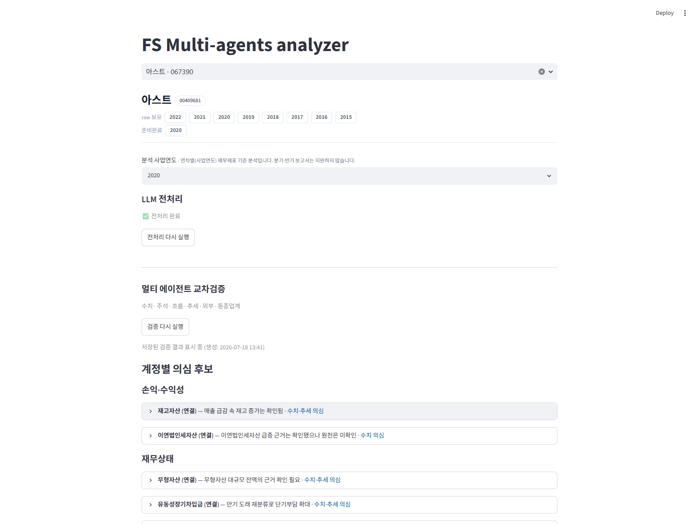
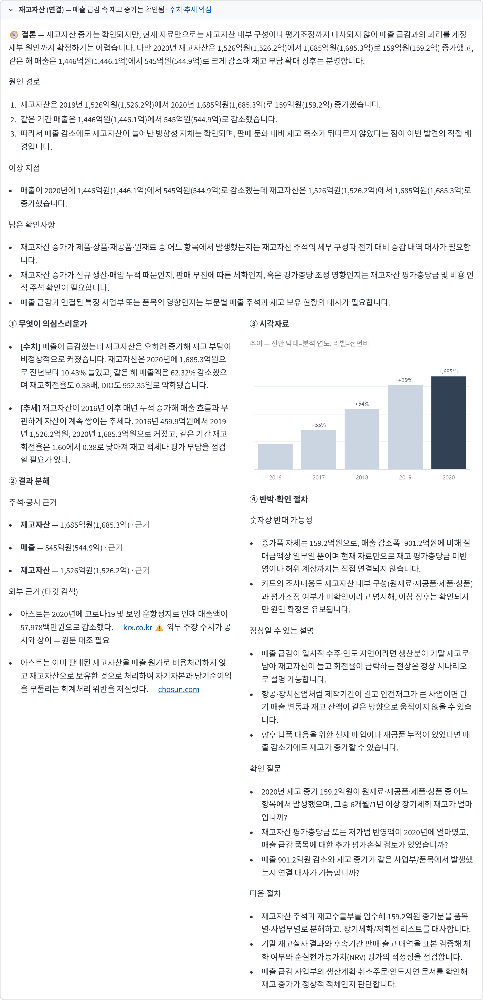
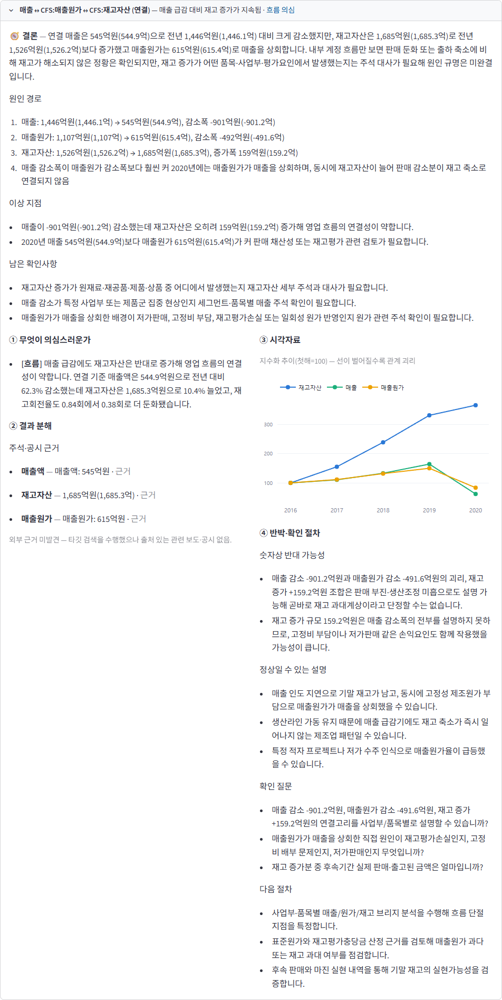

# FS Multi-Agent Analyzer

## 개요

연차별 사업보고서 **멀티에이전트 교차검증** 도구

1. **Collect**   — OpenDART 원본 사업보고서 수집
2. **Normalize** — 회사별 XBRL을 DART 공식 사전으로 정규화
3. **Prepare**   — ① 파싱과정 정합성 검증, ② LLM 전처리 — 미매핑 계정 보정 + 서술형 본문 핵심 내용 추출
4. **Signal**    — 계정 전수 스캔 후 계산 실행 (LLM개입 없음)
5. **Discover**  — 5개 관점 Agents들이 각각 분석 수행 (+ 카드 확정 후 외부검증 1종)
6. **Report**    — 의심스러운 건을 카드 형식으로 제공

```
   회사명 · 연도
       │
       ▼
┌─ 코드 (결정론) 　　　──────────────────────────────────────────────┐
│  collect  ─▶  normalize      ─▶  정합성 검증                   　│
│  원본 수집    공식 사전 정규화     계정·수치·표 등에서       　　　　│
│               회사·연도 격리       파싱단계 노이즈가 있는지 검사 　　│
└────────────────────────┬──────────────────────────────────────────┘
                         ▼  통과
┌─ LLM 전처리 　　　　────────────────────────────────────────────────┐
│  미매핑 계정 보정 → 재정규화                               　　　　　│
│  사업보고서 본문 통독 → 서술형 내용 추출·적재               　　　　　│
└────────────────────────┬───────────────────────────────────────────┘
                         ▼
┌─ 코드 단계에서 계산 수행 　　　　─────────────────────────────────────────────┐
│  signal — 전 계정 전수 스캔                                                　│
│  기준축 5 · 관계사슬 9 · 재무비율 15                                　　　　　│
└────────────────────────┬────────────────────────────────────────────────────┘
                         ▼  관점별 발췌
┌─ LLM 분석 　　　　──────────────────────────────────────────────────┐
│  5관점 병렬    ─▶ grounding    ─▶ 카드·조사·반박 ─▶ 외부검증      │
│  숫자·주석·흐름   원본 수치 대조    의심·이유·확인    출처 대조     　│
│  추세·업종        없는 숫자 탈락    반대근거·다음절차  수치 대사    　│
└────────────────────────┬───────────────────────────────────────────┘
                         ▼
              검토 큐 카드 생성(Streamlit)
```

### 실제 화면
> LG생활건강 2025년 당기순이익 의심 분석 카드


---

## 1. 문제 인식

### 범용 LLM과의 비교

| 약점       | LLM 단순 투입                       | 본 프로젝트                                     |
| ---------- | ----------------------------------- | ----------------------------------------------- |
| 재현성     | LLM이 직접 수치를 연산 →  숫자 환각 | 코드가 계산 수행 → 숫자 환각없음, 동일결과 제공 |
| 일관성     | 분석 논리와 방향이 매번 바뀜        | 고정된 다각적 관점 (멀티 에이전트)              |
| 전수성     | 토큰 한계로 일부 데이터만 샘플링    | 전 계정·전 연도 대상 코드 베이스 결정론적 스캔  |
| 비교가능성 | 회사별, 연도별 비교 어려움          | 똑같은 형식으로 결론제공 → 비교가능성 증가      |

### 핵심 통찰
1. 숫자 연산의 코드화로 환각 원천차단
 - 재무 수치의 증감, 전기 대비 변화량 등을 LLM에게 맡기지 않음
 - 수학적으로 고정된 코드 레벨에서 수행하여 확정된 데이터만을 뽑아냄

2. 다중 관점의 고정으로 일관성 확보
 - LLM 에이전트들의 역할 역시 임의로 방치하지 않고 고정시킴
 - 다각도로 재무제표를 분석하면서 일관되고 뚜렷한 방향성을 지니도록 통제

---

## 2. 파이프라인

```
                회사명 검색 — OpenDART 
                         │
                         ▼
┌─ L0 수집 　　　　───────────────────────────────────────────────────┐
│  본표 수치     · 주석      · 사업보고서                    　　　　　│
└────────────────────────┬───────────────────────────────────────────┘
                         ▼
┌─ L1 정규화 　　　　─────────────────────────────────────────────────┐
│  회사마다 다른 계정명을 표준 계정으로 통일 · 중복·충돌 정리           │
│  회사·연도별로 분리된 DuckDB                             　　　　　　│
└────────────────────────┬───────────────────────────────────────────┘
                         ▼
┌─ 정합성 검증 　　　───────────────────┐
│  계정 정합성, 수치 정합성 검사 　　　　│
└────────────────────────┬─────────────┘
                         │ 통과
                         ▼
┌─ LLM 전처리 　　　　──────────────────────────────────────────────────┐
│  미매핑 계정 별칭 제안 → 확실한 것만 자동 등록 후 5개년 재정규화        │
│  애매하면 등록 없이 "기타 중요 계정"으로 표시                 　　　　　│
│  사업보고서 본문 파트별 전수읽기 → 가치있는 내용만 구조화 추출후 적재　　│
└────────────────────────┬─────────────────────────────────────────────┘
                         ▼
┌─ L2 계산엔진 — (LLM 호출 없음) ──────────────────────────────────────┐
│  전수 조사 →  · 계정별 지표 · 관계 사슬  · 재무비율        　　　　　　│
│  숫자 변동 이유 탐색 · 누락 항목 0건 검증                           　│
└────────────────────────┬────────────────────────────────────────────┘
                         ▼
          재료 준비 완료
                         │  L3 · 5개 관점 동시 실행, 관점당 LLM 1회씩 호출
      ┌───────────┬──────┴────┬──────────┬──────────┐
      ▼           ▼           ▼          ▼          ▼
     숫자        주석        흐름       추세       업종
  당해 급변  서술 리스크  관계 교차  다년 추세  동종사 대비
      └───────────┴──────┬────┴──────────┴──────────┘
                         ▼
        사실 대조 — 인용 금액이 실제와 다르면 탈락
                         │
                         ▼
┌─ L4 카드 　　　　───────────────────────────────────────────────────┐
│  같은 대상끼리 묶기(계정·관계·회사)                              　　│
│  의심 사항 추가 조사 ─┬─▶ 반박(LLM)                       　　　　　│
│                      └─▶ 외부검증(LLM)                       　　　│
└────────────────────────┬───────────────────────────────────────────┘
                         │
                         ▼
┌─ 카드 한 장에 담기는 것 (Streamlit) ─────────────────────────────────┐
│  결론 · 검토 포인트                                                　│
│  ① 무엇이 의심스러운가 — 관점별 주장 원문                             │
│  ② 결과 분해 — 왜 움직였나 표 · 근거 수치 · 주석 근거 · 외부 근거    　│
│  ③ 시각자료 — 추이 · 기여 · 관계                          　　　　　　│
│  ④ 반박·확인 절차 — 반대 가능성 · 정상 설명 · 확인 질문 · 다음 절차    │
└─────────────────────────────────────────────────────────────────────┘
```

---

## 3. 기술설명

파이프라인의 구간을 순서대로 서술(L0~L5)

### 3.1 L0 수집

```
━━━ 입력 ━━━━━━━━━━━━━━━━━━━━━━━━━━━━━━━━━━━━━━━━━━━━━━━━━━━━━━━━━━━━━

    회사명을 OpenDART에서 검색 → 회사 고유번호 + 분석할 사업연도

━━━ [L0] 수집 ━━━━━━━━━━━━━━━━━━━━━━━━━━━━━━━━━━━━━━━━━━━━━━━━━━━━━━━━

  ◆ 수집 대상   
       │
       └─ 분석 연도를 포함, 최근 5개년 수집

  ◆ 수집 원천
      ① 본표 수치(JSON)   재무상태표·손익계산서·현금흐름표·포괄손익·자본변동표(연결+별도)

      ② 주석 XBRL         XBRL = 공시 원문을 기계가 읽도록 데이터에 태그를 달아둔 양식
                          압축본을 받아 Arelle(XBRL 해석기)로 분해

      ③ 사업보고서        게시 원문 전문
                          └ 특수관계자·연결범위처럼 숫자가 아닌 서술
                          └ 파싱은 HTML 파서 + 정규식 헤더 매칭
```

#### 정규화가 필요한 이유

- **회사별로 개별 태그를 생성** — Dart제공 XBRL은 참고사항일 뿐이라 지키지 않는 회사도 존재
- **동일 계정이 연결/별도로 쪼개져 있음** — 금액이 이중계상 될 위험, 한쪽만 수집되어 나머지 데이터를 통째로 놓칠 위험
- **데이터 단위가 금액(돈)만이 아님** — 원화(KRW) 외에도 주식 수, 비율, 텍스트(서술형)가 섞여 있어 계산 오류 발생 위험

### 3.2 L1 정규화

```
━━━ [L1] 정규화 ━━━━━━━━━━━━━━━━━━━━━━━━━━━━━━━━━━━━━━━━━━━━━━━━━━━━━━

  회사마다 다른 태그, 다른 표기

  ◆ 계정 이름 통일 
      1순위  표준 계정 ID   금감원 dart_* 1,313 · 국제기준 ifrs 계열 1,453
      2순위  한글 계정명    별칭 사전 1,805개
        │
        ├─ ID와 한글명이 같은 계정을 가리킴 ───────▶ 정상 매핑
        ├─ ID와 한글명이 서로 다른 계정을 가리킴 ──▶ ID를 채택하고 충돌 기록을 남김
        └─ 둘 다 실패 ───────────────────────────▶  기존 이름 유지하며 미매핑 계정 표시 ("기타 중요 계정")

  ◆ 표 구조 정리
      계열 키          "연결/별도 : 계정"  예: CFS:재고자산

```

#### 표준 계정 사전 : `config/canonical_accounts.yaml` **IFRS 국제표준 + 금감원 DART 확장 택소노미의 표준 ID를 근거로 생성함**

```yaml
매출채권:
  statement: BS
  account_ids:
    - dart_ShortTermTradeReceivable # 금감원 DART 확장
    - ifrs-full_CurrentTradeReceivables # IFRS 국제표준
  aliases: [매출채권]
```

#### 매핑 판정 — ID를 우선시
1. 교차표 오배정 방지 : 한글은 여러 재무제표에서 중복, 현금흐름표 데이터가 자본변동표로 섞일 위험
2. 회사의 임의 라벨링 방어 : 회사마다 한글 항목명을 다르게 사용, 변동이 없는 고유 번호(ID)를 우선시
3. 오류 추적 및 통제력 확보 : ID 우선 + 충돌 시 기록남김, 오류 추적 가능
4. 자본변동표 : 회사가 표준 ID 슬롯에 다른 변동을 신고하는 일이 흔해 한글 라벨이 실질 -> 라벨을 우선

### 3.3 정합성 검증

```
━━━ 정합성 검증 ━━━━━━━━━━━━━━━━━━━━━━━━━━━━━━━━━━━━━━━━━━━━━━━━━━━━━━

  데이터 수집 및 이관 과정에서 무결성 검증

  ◆ 준비 완료 요건 (모두 충족되어야 준비완료)
      ① 이관 완전성: 소실된 계정, 자본변동표 표준화가 모두 성립되었는지 검사
      ② 연산 정확성: 재무제표 및 표 내부의 산식 계산을 검증하여 숫자가 잘 옮겨졌는지 검사
      ③ 데이터 일치성: 서로 다른 표에 기재된 동일 수치가 일치하는지 검사
      ④ 분석 가능성: 미매핑 비중·필수 표 존재·총계 부호를 확인하여 분석이 성립하는 상태인지 검사
      ⑤ 계정 유효성: 신호 엔진이 조회할 계정이 사전에 실제로 존재하는지 검사
      ⑥ 통화 기준 일치: 원화(KRW)와 주식 수 외의 단위가 섞이지 않았는지 검사

```

| 통과 조건            | 무엇을 검사하나                                            | 차단 기준                                |
| -------------------- | ---------------------------------------------------------- | ---------------------------------------- |
| **①** 이관 완전성    | 필수 테이블 3종 적재 · 계정 소실 후보 · 자산 = 부채 + 자본 | 잔차 100만원 초과, 또는 검산 0건         |
| **②** 연산 정확성    | 한 표 안에서 합계 = 구성요소                               | 구성요소가 다 있는데 합이 안 맞을 때     |
| **③** 데이터 일치성  | 두 표에 함께 적힌 값                                       | 한 식이라도 불일치                       |
| **④** 분석 가능성    | 미매핑 금액 비중 · 핵심 표 결손 · 총계 부호                | 미매핑 20% 초과, 핵심 표 없음, 총계 음수 |
| **⑤** 계정 유효성    | 신호 엔진이 참조하는 계정명 ↔ 표준 계정 사전               | 사전에 없는 참조 1건 이상                |
| **⑥** 통화 기준 일치 | 적재된 단위 표기                                           | KRW·SHARES 외 통화 1건 이상              |

### 3.4 LLM 전처리

```
━━━ LLM 전처리  ━━━━━━━━━━━━━━━━━━━━━━━━━━━━━━━━━━━━━━━━━━━━━━━

  ◆ 별칭 자동 보정 - 표준분류가 안 된 계정 이름을 사전에 등록
      → LLM이 별칭 분석 후 매핑 선택
      → 신뢰도 0.7 이상만 자동 등록 + 5개년 전체 재정규화
      → 신뢰도 0.7 미만은 등록하지 않고 "기타 중요 계정"으로 게시

  ◆ 본문 통독 - 사업보고서 서술형 본문을 파트별로 리딩
      소송·특수관계·우발부채 같은 서술형 감사관심을 추출해 저장

  비용은 회사당 약 ₩300~800 · 2~5분

```

### 3.5 L2 계산엔진

```
━━━ [L2] 계산엔진  ━━━━━━━━━━━━━━━━━━━━━━━━━━━━━━━━━━━━━━━━━━━━━━━━━━

  ◆ 계정별 지표   
                  대상 = 재무상태표 · 손익계산서 · 포괄손익 · 현금흐름표
                  자본변동표는 자본거래 × 자본구성요소의 2차원 표라 따로 계산

      원본        연도별 금액        {연도: 금액}
                  전년 대비 증감율   {연도: %}

      크기 
                  규모 대비 변동폭   |당기 − 전기| ÷ 총계
                  추세 강도          방향 일관성 × |당기 − 최초| ÷ 총계
                  변동성             표준편차 ÷ |평균|
                  표 내 비중·변화    같은 표에서의 비중(%)과 전기 대비 변화(%p)

      비교 
                  과거 대비 이례도   자기 과거 시계열 기준 z값
                  전체 분포상 위치   다른 모든 계정과 비교했을 때의 백분위

      맥락        등장 상태          계속 있음 / 올해 새로 생김 / 올해 사라짐
                  공시 원문 계정명   회사가 실제로 쓴 이름

                  그 외              소속 표 · 연결/별도 ·
                                     전기 수치 재작성 불일치 · 표시 방법 변경

  ◆ 계정 간 연관성 
      동기화 계정 간 괴리 탐지   (예: 매출은 느는데 매출채권만 급증)
      변동 부호 및 방향의 논리적 정합성 확인
      기준 계정과 참조 계정의 증감률 교차 대조
      전 계정 스캔 · 연결재무제표와 별도재무제표 간 차이 분석
      관계 사슬                      config/playbooks/relationship_chains.yaml
                                     예: [재고자산, 매출원가, 재고평가손실]

  ◆  파생변수 분석
      재무비율         config/playbooks/financial_ratios.yaml
      이익 변동성 분해  매출총이익 → 영업이익 → 세전이익 → 당기순이익 4단계.
                      각 단계별 이익 증감을 세부 구성 요소의 기여도로 분할

  ◆ 누락 없음을 구조로 증명   
      전체 건수 == 분석한 건수 + 사유 명시 예외 건수 + 미분류 누락 건수
        │
        └─ 미분류 누락이 1건이라도 발생 시 ──▶ 화면·리포트에 "⚠ 미분석 N건"
```


#### 축 기준

| 축        | 계산                                  | 잡는 것         |
| --------- | ------------------------------------- | --------------- |
| 변화금액  | 절대값(당기−전기) / 자산총계          | 갑자기 급변     |
| 추세      | 단조성 × 절대값(당기−최초) / 자산총계 | 여러 해 한 방향 |
| 변동성    | std / 절대값(mean) — 변동계수         | 변동성이 큼     |
| 구성비    | 표 내 비중의 전기 대비 변화           | 구성이 바뀜     |
| 업종 분위 | 동종업계 대비                         | 업계와 다름     |

#### 관계사슬

| 사슬                    | 보는 계정                                                  | 근거        |
| ----------------------- | ---------------------------------------------------------- | ----------- |
| 수익의 질·회수가능성    | 매출 · 매출채권 · 대손충당금 · 영업활동CF                  | ISA/KSA 520 |
| 재고 진부화·원가        | 재고자산 · 매출원가 · 재고평가손실                         | ISA/KSA 501 |
| 진행률 수익·계약자산    | 매출 · 계약자산 · 계약부채 · 공사손실충당부채              | ISA/KSA 520 |
| 유동성·계속기업         | 단기차입금 · 장기차입금 · 사채 · 이자비용 · 재무활동CF     | ISA/KSA 520 |
| 영업손익에서 순이익으로 | 영업이익 · 금융수익 · 이자비용 · 법인세비용 · 당기순이익   | ISA/KSA 520 |
| 차입금 조달과 사용처    | 차입금 · 재무활동CF · 투자활동CF · 유형자산취득            | ISA/KSA 520 |
| 순이익·영업CF·운전자본  | 당기순이익 · 영업CF · 운전자본변동(매출채권·재고·매입채무) | ISA/KSA 520 |
| 충당부채·우발부채 교차  | 충당부채 · 장기충당부채 · 우발부채주석                     | ISA/KSA 501 |
| 자산 손상·자산화        | 무형자산 · 영업권 · 연구개발비 · 무형자산손상차손          | ISA/KSA 540 |
| 현금·금융자산 실재성    | 현금및현금성자산 · 단기금융상품 · 이자수익                 | ISA/KSA 505 |
| 특수관계자 자금 유출    | 대여금증가 · 투자활동CF · 관계기업투자                     | ISA/KSA 550 |
| 연결 구조               | 연결범위                                                   | —           |

#### 재무비율

| 묶음      | 비율                                                                         |
| --------- | ---------------------------------------------------------------------------- |
| 수익성    | ROE · ROA · ROI · 매출총이익률 · 영업이익률                                  |
| 활동성    | 매출채권회전율 · 매출채권회수기간 · 재고회전율 · 재고보유기간 · 총자산회전율 |
| 안정성    | 부채비율 · 유동비율 · 이자보상배율                                           |
| 이익의 질 | 영업현금흐름/당기순이익 · 발생액 비율                                        |

#### 변동분해

```
━━━ 손익 4단계  ━━━━━━━━━━━━━━━━━━━━━━━━━━━━━━━━━━━━━━━━━━━━━━━━━━━

  매출 − 매출원가                          ─▶  매출총이익
  매출총이익 − 판매비와관리비 (± 기타손익)  ─▶  영업이익
  영업이익 + 금융수익 − 이자비용
            (± 기타손익 · 지분법이익)       ─▶  세전이익
  세전이익 − 법인세비용                     ─▶  당기순이익
                                                  │
━━━ 현금흐름 2단계  ━━━━━━━━━━━━━━━━━━━━━━━━━━━━━━━━━━━━━━━━━━━━━━━━━
                                                  ▼
  당기순이익 + 비현금조정 + 운전자본변동    ─▶  영업창출현금흐름
  영업창출현금흐름 + 이자수취 ± 이자지급
            ± 법인세납부 (+ 배당금수취)     ─▶  영업활동현금흐름
```

### 3.6 L3 멀티에이전트

```
━━━ [L3] 위험 발견 — 5개 관점 동시 실행 (관점당 LLM 1회 호출) ━━━━━━━━━━━━━━━━━━━

      숫자 관점   당해 연도 급변 항목 탐지
      흐름 관점   계정 간 교차 검증 및 정합성  
      추세 관점   다년간 시계열 추세·자본 거래 내역
      주석 관점   서술적 리스크·우발부채·특수관계자 거래
      업종 관점   동종 업계 대비 상대적 위치 (참조용)

  ◆ 출력 포맷 강제 — 비정형 자유 서술 반환 차단
      지적 대상   ┳ 단일 계정    → 계정 ID 및 인용 금액 명시 필수
                  ┣ 계정 간 관계 → 대표 계정 및 1개 이상의 연관 계정 명시 필수
                  ┗ 회사 전체    → 외부 사건·소송·지배구조 이슈

      영역 분류   지정된 영역으로 고정 — 부정행위 단정이 아닌 어느 영역에 속한 리스크인가만 식별
      
      설명        내용 누락 시 응답 거부 (근거 없는 단순 지적 차단)

━━━ 사실 대조 — 인용 수치 실재성 코드 단독 판정 ━━━━━━━━━━━━━━━━━━━━━━━━━━━━━━━━━━━

  동일 금액을 원·백만·억 단위로 혼용하여 반환할 위험 ──▶ 단위를 해석해 원 단위로 복원한 뒤 실제 장부값과 자릿수까지 대조
      "1,961억"  ·  "196,100,000,000"   →  196100000000원 - 통과(실제 장부값과 일치)
      "1,961백만"                       →  1961000000원   - 탈락(자릿수 불일치)
      └ 반올림 인용("1,960.5억")은 허용오차(1% 또는 100만원) 안에서 통과
      └ 단위 없는 짧은 맨숫자("1,961")는 복원 불가 ──▶ 유효숫자만 대조하고 자릿수 미확인으로 표시

  ◆ 판정 로직 :   본표·주석·자본변동표의 [계정명 ↔ 실존 금액] 인덱스를 구축하여 대조
      계정 지적   계정이 색인에 없음 ──▶ 탈락 "존재하지 않는 계정"
                  인용 금액이 실제 값에 없음 ──▶ 탈락 "실제 값과 불일치"
                  인용 금액이 아예 없음 ──▶ 통과 (추세·비율 분석으로 간주)
      관계 지적   연결된 계정이 하나라도 장부에 부재 ──▶ 탈락 (없는 관계 날조 차단)

  ◆ 규율   검증에서 탈락한 항목도 사유를 명시하여 로깅/반환
```

#### 관점별 투입 재료

| 관점 | 받는 재료                                                                    |
| ---- | ---------------------------------------------------------------------------- |
| 숫자 | 계정 지표 전량 · 재무비율 요약과 시계열 · 관계 신호 · 사건 연표              |
| 주석 | 주석 섹션과 주석 값 전량 · 사업보고서에서 뽑은 서술                          |
| 흐름 | 계정 지표 · 관계 신호 · 활동성·이익의 질 비율 · 미매핑 중요 계정 · 사건 연표 |
| 추세 | 계정 지표 전량 · 비율 시계열 · 자본변동표 격자 · 관계 신호 · 사건 연표       |
| 업종 | 동종사 지표 · 업종 규칙 · 비율 시계열 · 우선순위 상위 5건(비용상 제한뒀음)   |

#### 투입 원칙 

1. 전량 투입 : 전 계정 계산값을 통째로 제공, 무엇이 중요한지는 각 관점이 직접 선별
2. 에이전트간 정보 공유 금지
- 판단 오염 차단 : 관점끼리 의견을 주고받으면 한 관점의 주장이 다른 관점의 판단을 물들일 위험
- 신호 가치 : 독립적으로 발견한 결론이 겹쳐야 복수 관점 합의 의미가 있음
- 교차검증의 자리 분리 : 관점 간 교차는 토론이 아니라 뒤 단계 몫 - 반박 에이전트가 그 의견 전체를 상대

### 3.7 L4 카드

```
━━━ [L4] 카드 생성 ━━━━━━━━━━━━━━━━━━━━━━━━━━━━━━━━━━━━━━━━━━━━━━━━━━━━━━━━━━━━━

  ◆ 각 에이전트들의 중복 지적 카드 합치기
      계정 카드   같은 계정을 지적한 건끼리 병합
                  예: "매출채권 급증"(숫자) + "매출채권 회수 지연"(흐름) → 1장
                  연결·별도는 다른 카드로 구분
      관계 카드   연관 계정 목록을 정렬 후 병합 → A↔B와 B↔A 중복 제거
      회사 카드   계정이 특정되지 않는 지적(소송·지배구조)을 영역별로 병합

  ◆ 한 사건이 여러 계정으로 번진 카드 합치기 
      매출원가 급증 ─▶ 매출총이익 ↓ ─▶ 영업이익 ↓ ─▶ 세전이익 ↓ ─▶ 순이익 ↓
        └ 각 단계를 관점들이 지적하면 카드 4장 — 아래 단계를 위 단계로 흡수해 1장

  ◆ 카드 순서 — 기준을 순서대로 비교
      ① 반박 정상우세    반박 에이전트가 "정상 설명이 더 그럴듯"으로 본 카드는 하단으로

      ② 표수            내부 4관점(숫자·주석·흐름·추세) 중 몇 곳이 겹쳤나
                         └ 업종·외부검증은 집계 제외 (참고 배지로만 표시)
      ③ 금액            같은 표수 안에서는 규모가 큰 쪽이 위로

━━━ 조사 - 분해 설명력에 따라 경로 분기 ━━━━━━━━━━━━━━━━━━━━━━━━━━━━━━━━

  ◆ 분기 판정   변동 원인이 내부 자료로 설명되는가?
      다음 중 하나라도 해당 시 "미설명"
       분해 부재 · 미설명 잔차 20% 초과 · 작년 대비 변동 없음 ·
       분해결과 세부 항목 부재 · 분해결과 최대 원인 항목 기여 60% 미만
        │
        ├── 미설명 ──▶ 도구 루프 심층 조사 (최대 8회 호출)
        │              시계열 조회 · 변동 분해 조회 · 주석 검색 · 대변동 목록
        │              조사 실패 시 결론을 창작하지 않고 "조사 미수행"으로 기록
        │
        └── 설명됨 ──▶ 종합 1회로 결론 작성
                         │
        ┌────────────────┴────────────┐  동시 실행
        ▼                              ▼
   ━━━ 반박 ━━━━━━━━━━━━━━     ━━━ 외부검증 ━━━━━━━━━━━━━━━━━━━━━━━━━

   의도적 반대 입장 수행        검증 대상 — 내부적으로 설명이 안되는 카드
   판정 3종           　　　　　대상  조사 미해결 카드
    ┣ 정상 설명 우세        　　(조사 실패·미수행도 "미확인"이라 포함)
    ┣ 판단 유보(반반)       　　제외  조사로 원인이 설명된 카드
    ┗ 의심 우세         　　　　상한  최대 30장 (폭주 방지)
   필수 산출 4종          　　　
    · 반대 근거         　　　　검색어는 분해의 주도 요인으로 생성
    · 정상 설명         　　　　"○○사 2025 영업이익 급감 매출 감소 원인"
    · 확인 질문         　　　　기사 인용 금액을 공시 값과 대조
    · 다음 절차         　　　　┣ 일치 / 불일치 / 대조 불가
                        　　　 ┗ 불일치 시 "공시와 상이"로 표시
                        　　　　출처 URL 부재 근거는 폐기
        └────────────────┬────────────┘
                         │
                         ▼
━━━ [L5] 감사인 판단 — Streamlit 검토 화면 ━━━━━━━━━━━━━━━━━━━━━━━━━━

  계정 / 관계 / 회사 3개 구역으로 카드 배치, 카드 유형별 시각화 차트 제공

```
---

## 4. 검증 

2020년 아스트의 사업보고서 **정정 공시 전 원본**의 END-to-END 실행 기록

### 4.1 분식 판정 이유

- **이미 판매된 재고자산을 매출원가로 비용 처리하지 않고 여전히 보유 중인 것으로 회계처리**
- 기말 재고 과대 → 매출 원가 과소
- 자기자본, 당기순이익 과대

프로젝트가 지적해야할 정답 : **재고자산·매출원가·자기자본** 

### 4.2 입력

정정 공시 전 원본을 입력

```
━━━ 입력 고정 ━━━━━━━━━━━━━━━━━━━━━━━━━━━━━━━━━━━━━━━━━━━━━━━━━━━━━

  아스트 2020 사업보고서 제출 이력
       │
       ├─ 최초 제출본  ─────────▶  분석 입력으로 채택
       │                           정정 전
       │
       └─ 이후 정정·재작성본  ──▶  제외
                                  

  로드 연도도 2015~2020으로 제한 — 2021년 이후 재표시 값이 영향을 끼치지 않도록
```

### 4.3 생성된 카드 24장

LLM 관점 5개가 각자 독립으로 본 결과를 병합해 **계정 12 · 관계 5 · 회사 7 = 24장** 생성



정답 계정의 순위는 다음과 같다.

| 정답 계정 | 순위                         | 어떻게 올라왔나                       |
| --------- | ---------------------------- | ------------------------------------- |
| 재고자산  | **1위** (겹친 관점 2)        | 숫자·추세가 각각 독립으로 지적        |
| 매출원가  | **4위** (매출↔매출원가↔재고) | 흐름 관점이 세 계정의 괴리로 지적     |
| 자기자본  | 미적중                       | 이익잉여금 카드(11위)로만 간접 표면화 |

recall@5 = **2/3**. 자기자본을 놓친 이유는 4.5에서 따로 다룬다.

### 4.4 1위 카드가 실제로 무엇을 말했나

재고자산 카드 한 장에 결론·원인 경로·근거 수치·반박이 함께 들어간다.



코드가 계산한 사실만 추리면 이렇다 — 매출은 1,446.1억에서 **544.9억으로 62.3% 감소**했는데 재고자산은 1,526.2억에서 **1,685.3억으로 10.4% 증가**했다. 재고회전율은 2016년 1.60에서 **0.38**로, 재고가 팔려나가는 데 걸리는 기간은 **952일**까지 늘었다. 재고는 2016년 459.9억에서 5년간 3.7배 쌓였다.

도구는 **"분식"이라고 단정하지 않았다**. 결론 문장은 "재고자산 증가는 확인되지만 내부 구성·평가조정까지 대사되지 않아 원인 확정은 어렵다"이고, 반대 가능성으로 "제작기간이 긴 항공·장치산업이면 매출과 재고가 같은 방향으로 안 움직일 수 있다"를 스스로 붙였다. 대신 감사인이 실제로 할 일을 남긴다 — 재고수불부 입수, 장기체화 재고 목록 대사, 순실현가능가치 평가 점검. **공교롭게도 증선위가 조작을 확인한 바로 그 장부가 첫 번째 다음 절차로 지목됐다.**

외부검증도 두 갈래로 갈렸다. 하나는 제재 사실 기사를 물어왔고(카드 하단 외부 근거), 다른 하나는 매출액을 579.78억으로 적은 기사여서 공시값 544.9억과 어긋나 **"외부 주장 수치가 공시와 상이"** 경고가 붙었다. 외부 근거라도 숫자가 안 맞으면 그대로 표시한다.

관계 카드(4위)는 같은 사건을 계정 사이의 괴리로 잡았다.



### 4.5 못 잡은 것과 틀렸던 것

| 항목               | 실제                                                | 판단                                                                                                   |
| ------------------ | --------------------------------------------------- | ------------------------------------------------------------------------------------------------------ |
| 자기자본 미적중    | 카드 없음, 이익잉여금 11위로만 표면화               | 자기자본은 분식의 **결과** 계정이라 원인 계정을 지적하면 별도 카드가 안 선다 — 채점상 miss로 남겨둔다  |
| 반박 에이전트 환각 | "자산 583.1억 감소" 주장, 실제 감소폭은 298.8억     | 여러 해 임의 쌍의 차이를 근거 집합에 넣어 대조가 헐거워진 사고 — 연속 연도 비교만 근거로 인정하게 수정 |
| 연도 간 대사       | 2019년 무형자산 1,761억이 2020년 보고서에서 1,438억 | 재표시 후보 36건을 게이트가 자동 포착 — 실제로 있었던 재작성 사실                                      |

### 4.6 카드 숫자는 전량 원천과 대조한다

적중 여부와 별개로, 카드에 찍힌 수치가 DART 원값과 같은지를 전자동으로 다시 대조한다. 관점이 옳은 계정을 짚어도 화면 표기 단계에서 자릿수가 틀어지면 감사인은 틀린 숫자를 보게 된다.

| 판정      | 의미                                                  | 아스트 2020 |
| --------- | ----------------------------------------------------- | ----------: |
| 일치      | 원값 실재 + 억·조 환산까지 정합                       |    **53건** |
| 값 불일치 | 계정은 있으나 인용 금액이 장부에 없음                 |         0건 |
| 환산 실패 | 원값은 맞으나 표기 자릿수가 어긋남                    |         0건 |
| 대사 불능 | 계정이 색인에 없음 — 조용히 통과시키지 않고 별도 버킷 |         0건 |

**53/53 일치, PASS** (2026-07-18 실행 카드를 2026-07-19에 재측정).

---

## 5. 트러블슈팅

프로젝트 시작 시 핵심은 LLM 멀티에이전트이고, 데이터 적재는 준비작업 정도로만 생각했음
실제로 재작업이 집중된 구간은 반대

```
━━━ 착수 시 예상 ━━━━━━━━━━━━━━━━━━━━━━━━━━━━━━━━━━━━━━━━━━━━━━━━━━━━

  수집·적재 ──────▶ 멀티에이전트 ──▶ 카드
   준비 작업          본체 

━━━ 실제 ━━━━━━━━━━━━━━━━━━━━━━━━━━━━━━━━━━━━━━━━━━━━━━━━━━━━━━━━━━━

  수집·분해·적재 ─────────────────▶ 멀티에이전트 ──▶ 카드
   조직 축 재설계 · 기록의 대부분     
                                     
```

### 분해가 어려웠던 이유

1. 계정 이름이 회사마다 다름
- DART의 XBRL 태그 표준은 권고라 지키지 않는 회사가 많음, 같은 계정에 회사가 임의 라벨을 붙임.
- 비교 가능한 시계열을 만들기 위해 표준 계정 사전 먼저 구축함
2. 숫자와 서술이 한 문서에 섞임
- 본표는 계정 축, 주석은 계정·카테고리 축, 본문 서술은 공시 주제 축. 세 축이 달라 하나의 적재 구조로 봉합되지 않았음
3. 표마다 구조가 다름
- 자본변동표는 자본거래 × 자본구성요소의 2차원이라 1차원 계정 처리를 그대로 적용할 수 없음
4. 회사별, 연도별 데이터 표기 방식이 변경됨
- LG생활건강 사례 : 계정명을 "투자활동으로 인한 현금유출액"에서 "투자활동으로부터의 현금유출"로 바꾸면서 표기 부호까지 뒤집음. 실제 현금흐름은 두 해 다 동일
- 데이터에는 `2024 +1,666억 → 2025 −1,905억`으로만 남아 **진짜 재작성과 구분되지 않음**
- 다음 해 보고서의 전기 표시값과 대조해야 갈림 — 이 대조로 진짜 재표시 6건 신규 포착

5. 사전에 없는 계정
- 회사 고유 항목(예: 신종자본증권변동)인지 우리 사전 누락인지 **둘 다 "미매핑"으로 동일 표시**
- 사전 누락을 방치하면 그 금액이 분석에서 빠지고, 고유 항목을 억지로 붙이면 기존 계정이 오염됨
- 자본변동표 1,494건 전수 조사로 판별 — 여러 회사 공통이면 사전 누락, 1~2사 고유면 원문 유지
- 미매핑 비중 : 아스트 32% → 5% · 셀트리온 35% → 0%

### 대표 사고 3건

**① 자본변동표 합계 행이 이중계상 — 라벨 등록으로 5회 실패**

- 증상 : `소계`·`합계` 행을 세부 항목과 같이 더해 금액이 두 번 계산됨 (00123772/2025 검산 FAIL 26,742)
- 대응 : 합계 행 라벨을 사전에 등록해 제외 → 다음 회사에서 새 라벨이 또 등장
  - `소계` · `합계` · `자기주식 거래 합계` · `회계정책변경에 따른 증가(감소)` …
  - 00631518은 한 표에 `소계`가 여러 블록으로 반복 — 라벨만으로는 어느 블록의 합계인지 구분 불가
- 해결 : 라벨을 안 보고 **구조로 판별** — 직전 합계 행 이후의 자식 행 전체합이 그 값과 같으면 합계로 확정
- 5회 반복(Round 8~12)의 원인은 사전 부실이 아니라 **판별 축을 라벨에 둔 것**

**② 게이트가 정상 회사 2곳을 막음**

- 증상 : 골든 벤치마크 2사(아스트 2020 · 셀트리온 2019)가 화면에 "준비완료 없음"으로만 떠 분석 진입 불가
- 원인 : 게이트가 통화 목록 `{KRW, SHARES}`에서 **SHARES(주식 수)를 외화로 오판**해 차단
  - 주당이익 행에만 붙는 단위인데 외화 차단 규칙이 같이 삼킴
  - 회계항등식(자산 5,204억 = 부채 + 자본, 차이 0) · 산술 · 신호 게이트는 전부 통과였음
- 해결 : 통화 판정에서 SHARES 제외 (USD 등 실제 외화 차단은 유지)
- **단위와 통화는 다르다** — 차단 규칙의 사정거리를 확인하지 않으면 정상 데이터가 막힌다

**③ 변환 지점이 이미 가진 진실을 안 씀**

- 증상 : LG생활건강 카드 27장을 DART 원문과 전수 대조 → 결함 4계열

| 결함             | 증상                                           | 안 쓰고 있던 데이터   |
| ---------------- | ---------------------------------------------- | --------------------- |
| 부호 아티팩트    | 표기 변경을 "부호 반전"으로 승격               | 다음 해 보고서 전기값 |
| 억원 오환산      | 1조 2,535억 → "1,253.47억" (LLM이 나눗셈)      | 원 단위 원값          |
| 계정명 오표기    | 금융원가 387억을 "이자비용"으로 (실제 112.5억) | 공시 원문 계정명      |
| 외부 수치 무대조 | 기사 수치를 검증 없이 저장                     | 내부 공시값           |

- 원인 : 넷 다 하나 — **더 권위 있는 데이터가 이미 저장돼 있는데 안 쓰고 있었음**
- 해결 : 산출물 사후 검사 대신 각 변환 경계가 권위 원천을 쓰도록 교체

### 교훈

가장 크게 바뀐 판단은 이것이다. **LLM의 품질은 프롬프트보다 투입 데이터의 분해 품질에
좌우된다.** 미매핑 계정이 30%대면 어떤 관점을 붙여도 그만큼을 못 본다(현재 데모 3사
0~5%). 멀티에이전트는 잘 분해된 데이터 위에서만 제 몫을 한다.

---

## 8. 한계

| #   | 한계                           | 성격                                                                                      |
| --- | ------------------------------ | ----------------------------------------------------------------------------------------- |
| 1   | 외화 재무 제외                 | 게이트가 차단(환산 안 함 = 시점 다름). 설계상 배제                                        |
| 2   | 전처리 LLM 의존                | 회사당 ₩300~800 · 2~5분                                                                   |
| 3   | 서술형 감사관심(소송·특수관계) | LLM 전처리가 추출 — 실패는 완료 처리되지 않고(마커 금지) 진짜 0건만 경고와 함께 진행 가능 |
| 4   | 게이트 경계                    | 단일 회사 시계열 범위, 수집 실패 표기 미완                                                |
| 5   | 부정 확정 안 함                | 설계 원칙                                                                                 |
| 6   | Phase2 실호출 비용             | 회사당 ₩1,365~1,981 — 운영 전수 실행은 안 함                                              |
| 7   | 데이터 범위                    | 분기 제외 · 2015 이전 미수집 · 제조업 한정 · 정정공시 provenance 미완                     |
| 8   | 주석 숫자표 신규/소멸 미지원   | 분류 축이 매년 재편돼 오탐 34~64%. 계정·자본변동표·서술형은 지원                          |
| 9   | 유의성 큰 강등계정 누락        | 개수상한 밖으로 밀림 — 금액 임계 전환 필요(**미해결**)                                    |

핵심 트레이드오프는 **점수 경계**다. 재무상태표·손익계산서만 결정론 점수를 매기고 나머지는 LLM 맥락 판단으로 넘긴다.

백테스트 strict recall이 1/6~2/6에 그치는 건 결함이 아니라 역할 분담의 결과다 — 결정론은 발굴기, 판별은 LLM 층이다. **6/6을 억지로 되찾지 않는 것**이 오버피팅 회피 원칙이다.

---

## 9. 기술 스택

| 레이어      | 기술                                                                                                                              | 이유                                                            |
| ----------- | --------------------------------------------------------------------------------------------------------------------------------- | --------------------------------------------------------------- |
| 언어·패키지 | Python 3.11+ · uv (dependency-groups)                                                                                             | core/agent/dashboard/dev 4그룹 분리                             |
| 에이전트    | PydanticAI + 순수 Python async                                                                                                    | 구조화 출력이 환각을 막는다. 고정 순서 1회라 프레임워크 불필요  |
| LLM         | OpenAI **gpt-5.4** (5관점·조사·반박·전처리) · Google **gemini-2.5-flash** (외부 검색; **gemini-3.1-pro-preview**는 백테스트 전용) | 금융 환각 벤치에서 GPT-5.4만 통과                               |
| DB          | DuckDB (회사/연도 격리)                                                                                                           | `data/companies/{corp}/{year}/analysis.duckdb` — 전역 공유 금지 |
| 데이터      | OpenDART · Arelle (XBRL) · OpenDartReader                                                                                         | 실제 공시 데이터                                                |
| 검증        | Pandera (L1 구조) · pytest (tests + golden)                                                                                       | 금액은 round 후 비교                                            |
| UI          | Streamlit + plotly                                                                                                                | 색각 이상 대비 검증 통과(ΔE 24.2)                               |

---

## 10. 빠른 시작

```bash
# 설치
uv sync --group core --group agent --group dashboard --group dev

# API 키 설정 (DART_API_KEY · OPENAI_API_KEY · GOOGLE_API_KEY)
cp .env.example .env

# 테스트
uv run pytest tests -q

# 실행
uv run streamlit run dashboard/app.py
```