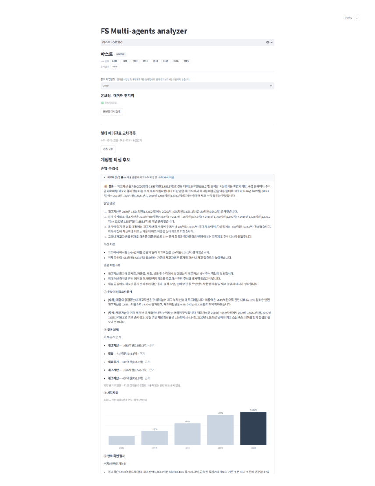

# FS Multi-Agent Analyzer

## 개요

연차별 사업보고서 **멀티에이전트 교차검증** 도구

1. **Collect**   — OpenDART 원본 사업보고서 수집
2. **Normalize** — 회사별 XBRL을 DART 공식 사전으로 정규화
3. **Prepare**   — ① 파싱과정 정합성 검증, ② LLM 전처리 — 미매핑 계정 보정 + 서술형 본문 핵심 내용 추출
4. **Signal**    — 계정 전수 스캔 후 계산 실행 (LLM개입 없음)
5. **Discover**  — 5개 관점 Agents들이 각각 분석 수행 (+ 카드 확정 후 외부검증 1종)
6. **Report**    — 의심스러운 건을 카드 형식으로 제공

```
   회사명 · 연도
       │
       ▼
┌─ 코드 (결정론) ────────────────────────────────────────────────────┐
│  collect  ─▶  normalize      ─▶  정합성 검증                       │
│  원본 수집    공식 사전 정규화     계정·수치·표 등에서            │
│               회사·연도 격리       파싱단계 노이즈가 있는지 검사                            │
└────────────────────────┬───────────────────────────────────────────┘
                         ▼  통과
┌─ LLM 전처리 ───────────────────────────────────────────────────────┐
│  미매핑 계정 보정 → 재정규화                                  │
│  사업보고서 본문 통독 → 서술형 내용 추출·적재                      │
└────────────────────────┬───────────────────────────────────────────┘
                         ▼
┌─ 코드 단계에서 계산 수행 ────────────────────────────────────────────────────┐
│  signal — 전 계정 전수 스캔                                        │
│  기준축 5 · 관계사슬 9 · 재무비율 15                               │
└────────────────────────┬───────────────────────────────────────────┘
                         ▼  관점별 발췌
┌─ LLM 분석 ─────────────────────────────────────────────────────────┐
│  5관점 병렬    ─▶ grounding    ─▶ 카드·조사·반박 ─▶ 외부검증       │
│  숫자·주석·흐름   원본 수치 대조    의심·이유·확인    출처 대조    │
│  추세·업종        없는 숫자 탈락    반대근거·다음절차  수치 대사   │
└────────────────────────┬───────────────────────────────────────────┘
                         ▼
              검토 큐 카드 생성(Streamlit)
```

### 실제 화면
> LG생활건강 2025년 당기순이익 의심 분석 카드



---

## 1. 문제 인식

### 범용 LLM과의 비교

| 약점       | LLM 단순 투입                       | 본 프로젝트                                     |
| ---------- | ----------------------------------- | ----------------------------------------------- |
| 재현성     | LLM이 직접 수치를 연산 →  숫자 환각 | 코드가 계산 수행 → 숫자 환각없음, 동일결과 제공 |
| 일관성     | 분석 논리와 방향이 매번 바뀜        | 고정된 다각적 관점 (멀티 에이전트)              |
| 전수성     | 토큰 한계로 일부 데이터만 샘플링    | 전 계정·전 연도 대상 코드 베이스 결정론적 스캔  |
| 비교가능성 | 회사별, 연도별 비교 어려움          | 똑같은 형식으로 결론제공 → 비교가능성 증가      |

### 핵심 통찰
1. 숫자 연산의 코드화로 환각 원천차단
 - 재무 수치의 증감, 전기 대비 변화량 등을 LLM에게 맡기지 않음
 - 수학적으로 고정된 코드 레벨에서 수행하여 확정된 데이터만을 뽑아냄

2. 다중 관점의 고정으로 일관성 확보
 - LLM 에이전트들의 역할 역시 임의로 방치하지 않고 고정시킴
 - 다각도로 재무제표를 분석하면서 일관되고 뚜렷한 방향성을 지니도록 통제

---

## 2. 파이프라인

```
                회사명 검색 — OpenDART 
                         │
                         ▼
┌─ L0 수집 　　　　───────────────────────────────────────────────────┐
│  본표 수치     · 주석      · 사업보고서                    　　　　　│
└────────────────────────┬───────────────────────────────────────────┘
                         ▼
┌─ L1 정규화 　　　　─────────────────────────────────────────────────┐
│  회사마다 다른 계정명을 표준 계정으로 통일 · 중복·충돌 정리           │
│  회사·연도별로 분리된 DuckDB                             　　　　　　│
└────────────────────────┬───────────────────────────────────────────┘
                         ▼
┌─ 정합성 검증 　　　───────────────────┐
│  계정 정합성, 수치 정합성 검사 　　　　│
└────────────────────────┬─────────────┘
                         │ 통과
                         ▼
┌─ LLM 전처리 　　　　──────────────────────────────────────────────────┐
│  미매핑 계정 별칭 제안 → 확실한 것만 자동 등록 후 5개년 재정규화        │
│  애매하면 등록 없이 "기타 중요 계정"으로 표시                 　　　　　│
│  사업보고서 본문 파트별 전수읽기 → 가치있는 내용만 구조화 추출후 적재　　│
└────────────────────────┬─────────────────────────────────────────────┘
                         ▼
┌─ L2 신호엔진 — 계산은 전부 여기서 (LLM 호출 없음) ────────────────────┐
│  전수 조사 →  · 계정별 지표 · 관계 사슬  · 재무비율        　　　　　　│
│  숫자 변동 이유 탐색 · 누락 항목 0건 검증                           　│
└────────────────────────┬────────────────────────────────────────────┘
                         ▼
          재료 준비 완료
                         │  L3 · 5개 관점 동시 실행, 관점당 LLM 1회씩 호출
      ┌───────────┬──────┴────┬──────────┬──────────┐
      ▼           ▼           ▼          ▼          ▼
     숫자        주석        흐름       추세       업종
  당해 급변  서술 리스크  관계 교차  다년 추세  동종사 대비
      └───────────┴──────┬────┴──────────┴──────────┘
                         ▼
        사실 대조 — 인용 금액이 실제와 다르면 탈락
                         │
                         ▼
┌─ L4 카드 　　　　───────────────────────────────────────────────────┐
│  같은 대상끼리 묶기(계정·관계·회사)                              　　│
│  의심 사항 추가 조사 ─┬─▶ 반박(LLM)                       　　　　　│
│                      └─▶ 외부검증(LLM)                       　　　│
└────────────────────────┬───────────────────────────────────────────┘
                         │
                         ▼
┌─ 카드 한 장에 담기는 것 (Streamlit) ─────────────────────────────────┐
│  결론 · 검토 포인트                                                　│
│  ① 무엇이 의심스러운가 — 관점별 주장 원문                             │
│  ② 결과 분해 — 왜 움직였나 표 · 근거 수치 · 주석 근거 · 외부 근거    　│
│  ③ 시각자료 — 추이 · 기여 · 관계                          　　　　　　│
│  ④ 반박·확인 절차 — 반대 가능성 · 정상 설명 · 확인 질문 · 다음 절차    │
└─────────────────────────────────────────────────────────────────────┘
```

---

## 3. 기술설명

파이프라인의 구간을 순서대로 서술(L0~L5)

### 3.1 L0 수집

```
━━━ 입력 ━━━━━━━━━━━━━━━━━━━━━━━━━━━━━━━━━━━━━━━━━━━━━━━━━━━━━━━━━━━━━

    회사명을 OpenDART에서 검색 → 회사 고유번호 + 분석할 사업연도

━━━ [L0] 수집 ━━━━━━━━━━━━━━━━━━━━━━━━━━━━━━━━━━━━━━━━━━━━━━━━━━━━━━━━

  ◆ 수집 대상   
       │
       └─ 분석 연도를 포함, 최근 5개년 수집

  ◆ 수집 원천
      ① 본표 수치(JSON)   재무상태표·손익계산서·현금흐름표·포괄손익·자본변동표(연결+별도)

      ② 주석 XBRL         XBRL = 공시 원문을 기계가 읽도록 데이터에 태그를 달아둔 양식
                          압축본을 받아 Arelle(XBRL 해석기)로 분해

      ③ 사업보고서        게시 원문 전문
                          └ 특수관계자·연결범위처럼 숫자가 아닌 서술
                          └ 파싱은 HTML 파서 + 정규식 헤더 매칭
```

#### 정규화가 필요한 이유

- **회사별로 개별 태그를 생성** — Dart제공 XBRL은 참고사항일 뿐이라 지키지 않는 회사도 존재
- **동일 계정이 연결/별도로 쪼개져 있음** — 금액이 이중계상 될 위험, 한쪽만 수집되어 나머지 데이터를 통째로 놓칠 위험
- **데이터 단위가 금액(돈)만이 아님** — 원화(KRW) 외에도 주식 수, 비율, 텍스트(서술형)가 섞여 있어 계산 오류 발생 위험

### 3.2 L1 정규화

```
━━━ [L1] 정규화 ━━━━━━━━━━━━━━━━━━━━━━━━━━━━━━━━━━━━━━━━━━━━━━━━━━━━━━

  회사마다 다른 태그, 다른 표기

  ◆ 계정 이름 통일 
      1순위  표준 계정 ID   금감원 dart_* 1,313 · 국제기준 ifrs 계열 1,453
      2순위  한글 계정명    별칭 사전 1,805개
        │
        ├─ ID와 한글명이 같은 계정을 가리킴 ───────▶ 정상 매핑
        ├─ ID와 한글명이 서로 다른 계정을 가리킴 ──▶ ID를 채택하고 충돌 기록을 남김
        └─ 둘 다 실패 ───────────────────────────▶  기존 이름 유지하며 미매핑 계정 표시 ("기타 중요 계정")

  ◆ 표 구조 정리
      계열 키          "연결/별도 : 계정"  예: CFS:재고자산

```

#### 표준 계정 사전 : `config/canonical_accounts.yaml` **IFRS 국제표준 + 금감원 DART 확장 택소노미의 표준 ID를 근거로 생성함**

```yaml
매출채권:
  statement: BS
  account_ids:
    - dart_ShortTermTradeReceivable # 금감원 DART 확장
    - ifrs-full_CurrentTradeReceivables # IFRS 국제표준
  aliases: [매출채권]
```

#### 매핑 판정 — ID를 우선시
1. 교차표 오배정 방지 : 한글은 여러 재무제표에서 중복, 현금흐름표 데이터가 자본변동표로 섞일 위험
2. 회사의 임의 라벨링 방어 : 회사마다 한글 항목명을 다르게 사용, 변동이 없는 고유 번호(ID)를 우선시
3. 오류 추적 및 통제력 확보 : ID 우선 + 충돌 시 기록남김, 오류 추적 가능
4. 자본변동표 : 회사가 표준 ID 슬롯에 다른 변동을 신고하는 일이 흔해 **한글 라벨이 실질** -> 라벨을 우선

### 3.3 정합성 검증

```
━━━ 정합성 검증 ━━━━━━━━━━━━━━━━━━━━━━━━━━━━━━━━━━━━━━━━━━━━━━━━━━━━━━

  데이터 수집 및 이관 과정에서 

  ◆ 통과 조건   아래를 전부 만족해야 준비완료
      ① 옮기다 빠뜨린 것 없나
      ② 표 안의 산수가 맞나
      ③ 두 표에 적힌 같은 값이 같나
      ④ 우리가 이 회사를 얼마나 읽었나
      ⑤ 신호엔진이 볼 계정이 실제로 있나
      ⑥ 통화가 원화인가

```

| 통과 조건                              | 검사 내용                                                                                                                                                                                                                                                                                                                                                                             | 예외·의미                                                                                                                                                                     |
| -------------------------------------- | ------------------------------------------------------------------------------------------------------------------------------------------------------------------------------------------------------------------------------------------------------------------------------------------------------------------------------------------------------------------------------------- | ----------------------------------------------------------------------------------------------------------------------------------------------------------------------------- |
| **①** 옮기다 빠뜨린 것 없나            | 계정 소실 여부 · 자산 = 부채 + 자본 (오차 100만원까지 허용) · 자본변동표 표준화 성공 여부                                                                                                                                                                                                                                                                                             | —                                                                                                                                                                             |
| **②** 표 안의 산수가 맞나              | 표마다 "합계 = 구성요소"를 검산한다. 자산총계 = 유동 + 비유동 · 부채총계 = 유동 + 비유동 · 자산총계 = 부채총계 + 자본총계 · 자본총계 = 지배지분 + 비지배지분 · 당기순이익 = 지배귀속 + 비지배 = 계속영업 + 중단영업 · 총포괄손익 = 당기순이익 + 기타포괄손익 = 지배귀속 + 비지배 · 기타포괄손익 = 재분류 가능 + 재분류 불가능 · 매출총이익 = 매출 − 매출원가 · 세전이익 ↔ 법인세 크기 | 구성요소가 아예 없으면 실패가 아니라 건너뜀 (은행은 유동/비유동 구분이, 지주는 매출원가가 없다)                                                                               |
| **③** 두 표에 적힌 같은 값이 같나      | 재무상태표 현금 = 현금흐름표 기말현금 · 재무상태표 자본총계·지배지분·이익잉여금·자본금·자본잉여금·기타포괄손익누계액 = 자본변동표의 기말 잔액 · 손익 당기순이익 = 자본변동표의 당기순이익 변동                                                                                                                                                                                        | 표 하나만 잘못 붙어도 드러난다. 업종·부호 규약과 무관해서 정상 회사가 걸릴 일이 없다. 마지막 식이 손익-자본을 잇는 고리다 — 벌어들인 이익이 자본으로 실제로 넘어갔는지를 본다 |
| **④** 우리가 이 회사를 얼마나 읽었나   | 미매핑 금액이 자산의 20%를 넘으면 차단 · 재무상태표·손익계산서가 없으면 차단 · 총계 계정이 음수면 부호를 잘못 옮긴 것 → 차단                                                                                                                                                                                                                                                          | —                                                                                                                                                                             |
| **⑤** 신호엔진이 볼 계정이 실제로 있나 | 신호엔진이 조회하는 계정이 사전에 실제로 존재하는지 전사 1회 대조                                                                                                                                                                                                                                                                                                                     | 사전에서 계정 이름이 바뀌면 조회 결과가 0줄이 되고, 그러면 잡아야 할 신호가 소리 없이 죽는다                                                                                  |
| **⑥** 통화가 원화인가                  | 원화·주식수 외의 통화가 섞이면 차단                                                                                                                                                                                                                                                                                                                                                   | 환산을 하지 않으므로 외화는 기준 시점이 달라진다                                                                                                                              |

| 검문                | 코드                                                   | 판정                                |
| ------------------- | ------------------------------------------------------ | ----------------------------------- |
| **G1** 기계검사     | `_p1_company_review` 산출 파싱 (BS 항등식 tol 100만원) | 차단                                |
| **G3** 산술검산     | `_is_cf_arithmetic.check_company_year`                 | 손익 2식 차단 · 현금흐름 2식 기록   |
| **G5** 신호 무결성  | `_f1_signal_dangling` (전사 1회)                       | 차단                                |
| **통화**            | `_NON_CURRENCY_UNITS = {KRW, SHARES}`                  | 차단                                |
| **G7** 소계·대사    | `gate_identities.py` — 소계 10식 + 표 간 대사 8식      | 차단 (영업이익식만 기록)            |
| **G8** 번역 품질    | `gate_quality.py`                                      | 분석 불가 상태만 차단 · 나머지 경고 |
| **G9** 연도 간 대사 | `gate_yoy.py`                                          | 기록 전용                           |

G2(id-라벨 충돌 인벤토리)·G6(LLM 통독 dump)은 **보고용**이라 통과 판정에 안 들어간다.

산술검산에서 손익 두 식만 차단인 이유는 부호 규약이 회사마다 다르기 때문이다. 매출원가를 양수로 내는 회사와 음수로 내는 회사가 섞여 있어 그냥 빼면 정상 회사가 걸린다 — 그래서 차감 계정은 **항상 절대값을 빼고**, 법인세는 뺄셈이 아니라 **크기끼리 비교**한다(중단영업이 섞이면 계속영업 소계를 쓰거나 건너뛴다). 현금흐름 두 식은 연결범위 변동·매각예정 대체 때문에 정상 회사에서도 잔차가 남아 경성 판정이 불가능해 잔차만 기록한다.

표 간 대사가 다른 검문과 성격이 다르다. 소계 항등식은 "그 회사 표 구조가 우리 식과 맞나"에 걸릴 수 있지만, **같은 값이 두 표에 적혀 있는 것은 업종과 무관하게 반드시 일치**한다. 한 표 안에서만 아귀가 맞아 기계검산을 통과하던 오배정(§7 id_label_conflict)이 이 축에서 드러난다.

핵심은 **빈 검사가 통과로 둔갑하는 것을 막는 장치**다.

> BS 항등식 검산이 0건이면 '검산 못함'이지 '통과'가 아니다. 자산총계 등 BS 핵심행이 결손되면 검산행이 0이 되어, 빈 검사가 통과로 둔갑하던 갭
> — `onboarding_gate.py:_g1_verdict`

그래서 검산이 최소 1건은 나와야 통과를 인정한다. 같은 규율이 G7에도 걸려 있다 — 구성요소 결측으로 전 항목이 SKIP되면 `executed=0`이 되고, 그때는 통과가 아니라 "검산 못함"으로 떨어진다. 반대로 과잉 차단도 막는다: 소계는 있는데 구성요소가 없으면 FAIL이 아니라 SKIP이다(은행·보험은 매출총이익 개념 자체가 없다).

실제로 준비완료 3개 회사연도에 돌리면 회사당 소계·대사 **26~28건**이 실행되고 위반 0이다. 검문을 넓히면서 잡은 결함(자본거래 이름 병합·본문 통독 실패 위장·측정 대상이 틀린 거짓 경고)은 §6.3과 §7에 정리했다.

### 3.4 LLM 전처리

```
━━━ LLM 전처리 — 게이트 통과 후, 카드 분석 전 1회 ━━━━━━━━━━━━━━━━━━━

  사람이 고르는 화면이 아니다 — 버튼 한 번에 자동으로 돌고, 완료 기록이
  남으면 다시 요구하지 않는다. 이 단계를 마쳐야 카드 분석이 열린다.

  ◆ 별칭 자동 보정   표준분류가 안 된 계정 이름을 사전에 등록한다
      코드가 같은 표 안에서 비슷한 후보를 12개 이내로 좁히고
      → LLM이 그 안에서만 하나를 고르고 (목록 밖 답은 무효 처리)
      → 신뢰도 0.7 이상만 자동 등록 + 5개년 전체 재정규화
          └ 전년도가 미매핑이면 올해 "신규 발생"으로 오인한다.
            그래서 분석연도만이 아니라 5개년에 함께 등록한다
      → 애매한 제안은 등록하지 않고 "기타 중요 계정"으로 게시
          └ 사람이 직접 등록하는 폼은 별도 정비 화면에만 남아 있다

  ◆ 본문 통독       사업보고서 본문을 파트별로 읽는다
      소송·특수관계·우발부채 같은 서술형 감사관심을 추출해 저장
      → 주석 관점이 이 저장분을 입력으로 쓴다
      → 끝맺음을 세 가지로 구분한다
          다 읽고 뽑았다        저장 + 완료
          다 읽었는데 0건       저장 + 완료 (빈 결과가 "진짜 0건"의 증거)
          읽다가 실패했다       저장도 완료 처리도 안 한다
            └ 실패를 "0건"으로 적으면 다음 사람이 재조사할 근거가 사라진다.
              파트별 실패 사유를 남기고, 사람이 다시 돌릴 수 있게 둔다

  비용은 회사당 약 ₩300~800 · 2~5분. 한 번 완료하면 재실행하지 않는다.
```

참고로 G6 덤프(LLM이 통째로 읽을 수 있게 뽑은 점검 파일)는 게이트가 계속 생성하지만, 이를 통독하는 LLM은 배선돼 있지 않다 — 전처리 LLM의 역할은 위 별칭 보정과 본문 통독으로 확정됐고, 감사 소견은 관점 분석이 전담한다.

### 3.4 L2 계산엔진

```
━━━ [L2] 계산엔진  ━━━━━━━━━━━━━━━━━━━━━━━━━━━━━━━━━━━━━━━━━━━━━━━━━━

  ◆ 계정별 지표   모든 계정에 대해 16종을 계산
                  대상 = 재무상태표·손익계산서·포괄손익·현금흐름표
                  (자본변동표는 격자 형태라 따로 흐른다)
      연도별 금액           {연도: 금액}          
      전년 대비 증감율      {연도: %}              
      규모 대비 변동폭      |당기−전기| ÷ 자산총계                         　　　─┐
      추세 강도             방향 일관성 × |당기−최초| ÷ 자산총계                　│ 자기 자신을
      변동성                표준편차 ÷ |평균|                                  　│ 네 각도로 본 것
      표 내 비중과 그 변화  같은 표에서 차지하는 비중(%)과 전기 대비 변화(%p)     ─┘
      과거 대비 이례도      자기 과거 시계열 기준 z값(과거 4년 미만이면 계산 안 함)
      전체 분포상 위치      다른 모든 계정과 견줬을 때의 백분위 — 위와 다른 각도
      등장 상태             계속 있음 / 올해 새로 생김 / 올해 사라짐 /
                            한 해 건너뛰고 다시 나타남
                            └ 신규·소멸은 증감율이 계산되지 않아 변화율만 보는
                              신호에서는 소리 없이 빠진다. 그래서 따로 표시한다
      공시 원문 계정명      회사가 실제로 쓴 이름 — 우리 정준명이 잘못 붙었을 때
                            그 오류가 서술로 흘러가는 것을 막는다
      그 외                 계정·소속 표·연결/별도 · 전기 수치 재작성 불일치 ·
                            표시 방법 변경 여부

  ◆ 계정 사이 관계   서로 맞물려 움직여야 할 계정들을 교차로 본다
      같이 가야 할 계정이 갈라졌나   예: 매출은 느는데 매출채권만 급증
      부호·방향이 앞뒤가 맞나
      기준 계정과 참조 계정의 증감율 대조
      전 계정 훑기 · 연결과 별도의 차이
      관계 사슬 9종   config/playbooks/relationship_chains.yaml
                      예: [재고자산, 매출원가, 재고평가손실]

  ◆ 여기서 파생되는 값
      재무비율 15종   config/playbooks/financial_ratios.yaml
      이익 변동 분해  매출총이익 → 영업이익 → 세전이익 → 당기순이익 4단계.
                      각 단계의 증감을 구성 요소별 기여로 쪼갠다
                      (분해식 7가지 중 설명 못 한 잔여가 가장 작은 것을 채택)
                      └ 남은 잔여는 "미설명 %"로 그대로 표시한다

  ◆ 빠진 것이 없음을 구조로 증명   커버리지 원장
      전체 건수 == 분석한 건수 + 이유를 달고 제외한 건수 + 이유 없이 빠진 건수
        │
        └─ 이유 없이 빠진 게 1건이라도 있으면 ──▶ 화면·리포트에 "⚠ 미분석 N건"
             이유 없이 사라진 항목을 구조가 숨기지 못하게 한다
             └ 다만 CI가 막지는 않는다 — 0건 단언은 합성 데이터 테스트에만 걸려 있다
```

여기서 나온 값을 뒤에서 LLM이 해석만 한다. `src/signals/` 11개 파일에 `openai`·`pydantic_ai`·`genai` 계열 import가 **0건**이다 — "LLM 호출 0"은 표어가 아니라 import 목록으로 확인되는 사실이다.

#### 계정 패널 — 전 계정, 순위 없음

`account_metrics_panel`이 계정마다 키 **16개**를 채운다(`src/signals/metrics_panel.py:179-196`). 임계도 개수 컷도 없고, 정렬조차 하지 않는다 — `DECISION_FIELDS` 가드와 전용 테스트가 "판단 필드를 패널에 넣지 마라"를 강제한다.

연도별 dict는 `amounts`·`yoy_pct` 둘뿐이고, 나머지 축은 분석 연도 기준 스칼라다. 모집단은 `sj_div ∈ (BS, IS, CIS, CF)`이라 자본변동표는 패널이 아니라 2D 셀로 따로 흐른다.

`occurrence_state`가 **4종**인 게 이 패널의 요점 중 하나다.

| 값            | 뜻                                                |
| ------------- | ------------------------------------------------- |
| `present`     | 당기·전기 모두 존재(정상 변화 대상)               |
| `appeared`    | 당기 존재, 과거 전무 — **올해 신규**              |
| `resumed`     | 당기 존재, 직전기 없음, 더 과거엔 존재 — **재개** |
| `disappeared` | 당기 없음, 과거 존재 — **소멸**                   |

신규·소멸은 전년비가 0이나 `None`이 되어 변화율 기반 신호에서 조용히 죽는다. 그래서 별도 축으로 표시한다(`metrics_panel.py:32-49`). 자본변동표에도 같은 판정이 붙는데, 여기서는 **무엇을 한 거래로 볼지**가 먼저다 — 표준분류 안이면 표준 변동명, 밖이면 회사가 쓴 원문 이름이 정체성이다. 이걸 안 지키면 서로 다른 자본거래가 한 키로 합쳐져 "올해 새로 생긴 자기주식 취득"이 "계속 있던 것"으로 둔갑한다.

#### 5축 — 계정 하나를 다섯 각도로

`src/signals/profiler.py`가 계정마다 원점수를 낸다. **delta·trend는 분모가 자산총계**라 규모로 정규화되고(삼성 1조와 소형사 1조를 다르게 본다), volatility는 자기 시계열 변동계수(std/|평균|), mix는 표 내 비중 변화(pp)로 잰다.

| 축                  | 계산                                  | 잡는 것         |
| ------------------- | ------------------------------------- | --------------- |
| delta (변화금액)    | 절대값(당기−전기) / 자산총계          | 올해 갑자기 튐  |
| trend (추세)        | 단조성 × 절대값(당기−최초) / 자산총계 | 여러 해 한 방향 |
| volatility (변동성) | std / 절대값(mean) — 변동계수         | 들쭉날쭉        |
| mix (구성비)        | 표 내 비중의 전기 대비 변화(pp)       | 구성이 바뀜     |
| peer (업종 분위)    | 동종업계 대비                         | 남들과 다름     |

앞 넷은 자기 시계열만 보는 **self 4축**이고, peer만 남과 비교라 `src/peers/benchmark.py`가 맡는다(`profiler.py:211`). 각 축의 감사기준서 근거는 §5.4.

여기선 **점수만 내고 자르지 않는다** — `profiler.py`에 "임계 리터럴 없음"이 명시돼 있다. 참고로 `z_score`는 "전 계정 분포에서의 위치"가 아니라 **자기 과거 시계열 대비 z**이고, 이력이 4개 미만이면 `None`이다. 분포상 위치는 별도 키 `percentiles`가 맡는다.

#### 관계사슬 9 — 계정 하나로는 안 보이는 모순

`config/playbooks/relationship_chains.yaml`. 각 사슬에 감사기준서 근거(`audit_basis`)가 붙어 있다 — 특정 사건을 잡으려 발명한 게 아니라 기준서에서 도출했다는 증거다.

| 사슬                    | 보는 계정                                                   | 근거        |
| ----------------------- | ----------------------------------------------------------- | ----------- |
| 수익의 질·회수가능성    | 매출 → 매출채권 → 대손충당금 → 영업활동CF                   | ISA/KSA 520 |
| **재고 진부화·원가**    | **재고자산 → 매출원가 → 재고평가손실**                      | ISA/KSA 501 |
| 진행률 수익·계약자산    | 매출 → 계약자산 → 계약부채 → 공사손실충당부채               | ISA/KSA 520 |
| 유동성·계속기업         | 단기차입금 → 장기차입금 → 사채 → 이자비용 → 재무활동CF      | ISA/KSA 520 |
| 영업손익에서 순이익으로 | 영업이익 → 금융수익 → 이자비용 → 법인세비용 → 당기순이익    | ISA/KSA 520 |
| 차입금 조달과 사용처    | 차입금 → 재무활동CF → 투자활동CF → 유형자산취득             | ISA/KSA 520 |
| 순이익·영업CF·운전자본  | 당기순이익 → 영업CF → 운전자본변동 → 매출채권·재고·매입채무 | ISA/KSA 520 |
| 충당부채·우발부채 교차  | 충당부채 → 장기충당부채 → 우발부채주석                      | ISA/KSA 501 |
| 연결 구조               | 연결범위                                                    | —           |

굵은 사슬이 아스트에서 걸린 것이다. 재고자산만 보면 "좀 늘었네"지만, 매출 −62.32% · 매출원가 −44.4%인데 재고만 +10.43%라는 건 셋을 같이 봐야 보인다.

#### 재무비율 15

`config/playbooks/financial_ratios.yaml`.

```
roe · roa · roi · gross_profit_margin · operating_margin
receivable_turnover · dso · inventory_turnover · dio · total_asset_turnover
debt_to_equity · current_ratio · interest_coverage
ocf_to_net_income · accruals_ratio
```

아스트 카드의 **재고회전율 0.38 · DIO 952.35일**이 이 중 둘이다. DIO(Days Inventory Outstanding)는 재고가 팔리기까지 걸리는 일수 — 952일이면 창고에 2년 반이다.

맨 끝 `accruals_ratio = (당기순이익 − 영업현금흐름) / 평균자산총계`는 발생액 지표다. **장부 이익은 나는데 현금이 안 들어오면** 커진다.

#### 변동분해 4브리지 — "왜 움직였나"를 코드가 답한다

`config/decomposition.yaml`. 매출총이익 → 영업이익 → 법인세비용차감전순이익 → 당기순이익이 재귀로 연결돼, 소계의 전년비 변동을 구성 항목의 기여로 쪼갠다.

```
delta_parent = Σ(구성 항목 delta) + residual        (src/report/decomposition.py:132,147)
residual_pct = residual / |delta_parent| × 100
```

**미설명 잔차를 지우지 않고 남기는 게 핵심이다.** 잔차가 크면 "분해가 원인을 설명 못 했다"는 뜻이고, 그 사실이 뒤에서 조사원 도구 루프를 여는 트리거가 된다(§3.9). 브리지는 4개지만 회사마다 계정 구성이 달라 variants가 총 7개이고, 잔차 절대값이 가장 작은 것을 고른다.

#### 커버리지 원장 — 조용한 드롭을 구조로 막는다

분석 명단을 "기본 슬라이스에서 골라 담기"로 만들면 슬라이스 밖은 소리 없이 사라진다. 원장은 그걸 등식으로 바꾼다(`src/report/coverage.py:107`).

```
population_n == analyzed_n + len(excluded) + len(unaccounted)     → reconciled
```

모집단은 본문 셀 전량이다. 빠진 셀은 **사유가 있으면 `excluded`, 없으면 `unaccounted`** 로 간다. `unaccounted`가 1건이라도 있으면 화면과 리포트에 "⚠ 커버리지 경고 — 미분석 N건"으로 표면화된다. 실제로 작동했다 — 1차 실행에서 대주산업 미설명 24건(NaN placeholder 거짓 드롭)을 자동 포착해 필터를 고치게 했다.

> **정확히 말하면** — `reconciled`는 예외를 던지는 assert가 아니라 원장이 반환하는 **bool 필드**다. 그리고 `unaccounted == []`를 단언하는 테스트는 9행짜리 합성 픽스처 대상이다(`tests/test_coverage_ledger.py:68`). 실데이터에서 미설명이 생기면 화면 경고로는 드러나지만 CI가 막지는 않는다.

### 3.5 materials — 등수 힌트를 주지 않는다

```
━━━ 재료 준비 — 관점마다 무엇을 보여줄지 · 등수는 안 알려준다 ━━━━━━━━

  코드가 미리 추려둔 "의심 후보 목록"은 LLM에게 주지 않는다. 전 계정 계산값을
  통째로 주고, 무엇이 중요한지는 각 관점이 직접 고르게 한다.
  (코드가 어디를 주목했는지가 LLM의 판단을 미리 물들이는 것을 막는다)

      숫자 관점   ◀ 계정 지표 전량 · 재무비율 요약과 시계열 · 관계 신호 · 사건 연표
      주석 관점   ◀ 주석 섹션과 주석 값 전량 · 사업보고서에서 뽑은 서술
      흐름 관점   ◀ 계정 지표 · 관계 신호 · 활동성/이익의 질 비율 ·
                    미매핑 중요 계정 · 사건 연표
      추세 관점   ◀ 계정 지표 전량 · 비율 시계열 · 자본변동표 격자 · 관계 신호 · 연표
                    └ "추세만 보라"는 입력을 잘라서가 아니라 지시문으로 건다
      업종 관점   ◀ 동종사 지표 · 업종 규칙 · 비율 시계열 · 우선순위 상위 5건
                    └ ★ 예외 — 등수 힌트를 받는 유일한 관점.
                      참고용이라 최종 판단에는 관여하지 않기 때문

  ◆ 넘기기 전 두 가지 처리
      단위 병기   원래 금액 옆에 억·조 표기를 같이 적는다
                  → LLM이 직접 나눗셈할 일 자체를 없앤다
      용어 차단   재료에 들어간 내부 키 이름을 자동으로 모아 금지어로 등록.
                  결론 문장에 그 키가 새어 나오면 다시 쓰게 만든다
                  손으로 나열한 게 아니라 자동 수집이라, 필드가 늘어도 따라온다
```

| 관점     | 받는 재료                                                                                      |
| -------- | ---------------------------------------------------------------------------------------------- |
| numeric  | panel 전량 · ratio_summary · ratio_time_series · snapshot · report_event_timeline              |
| note     | note_sections · note_facts 전량 · report_extracts                                              |
| flow     | panel · snapshot · 비율{활동성·이익의 질} · unmapped_material_accounts · report_event_timeline |
| trend    | panel 전량 · ratio_time_series · sce_cells 2D · snapshot · report_event_timeline · target_year |
| industry | peer 지표 · rules · ratio_time_series · review_queue[:5]                                       |

투입 경계에서 코드가 두 가지를 한다.

- **`annotate_amounts`** — 원값 옆에 억/조를 병기한다(임계 1억, `src/report/amounts.py:46-47`). `1,253,469,878,367(1조 2,534.7억)`처럼 원값을 앞에 남기는 게 요점이다. LLM이 나눗셈을 안 하면 나눗셈을 틀릴 수도 없고, 원값이 남아 있어 grounding 유효숫자 대조를 통과한다.
- **`vocab_guard`** — 재료 dict의 키를 **자동 수집**해 금지어로 삼는다(손으로 열거하지 않으니 새 필드가 자동 커버된다). 그 내부 식별자가 결론 본문에 새면 `ModelRetry`로 반려한다(`src/report/vocab_guard.py:51-68`). 오탐을 막으려 4자 미만 키는 수집하지 않고 단일 영단어는 6자 이상만 금지하며(ROE·DSO 같은 짧은 감사 약어는 자연 면제), 구조 필드 21종(locator 등)은 면제한다.

> **예외 하나** — "등수 힌트 없음"은 5관점 중 4관점에만 참이다. `industry`만 `review_queue[:5]`를 받는다(`src/report/industry.py:32`). 참고 관점이라 판단에 관여하지 않지만, 원칙의 구멍인 건 맞다.

### 3.6 L3 발견 — 5관점 병렬, 관점당 1회

```
━━━ [L3] 발견 — 5개 관점이 동시에, 관점당 LLM 1회 ━━━━━━━━━━━━━━━━━━━

      숫자 관점   당해 급변            주석 관점   서술 리스크·우발·특수관계
      흐름 관점   계정 사이 교차 검증  추세 관점   여러 해 추세·자본거래
      업종 관점   동종사 대비 위치(참고용)

  ※ 외부검증은 여기 없다 — 발견자가 아니라, 카드가 확정된 뒤 특정 카드를
    겨냥해 검증하는 역할로 뒤에 배치했다(아래 외부검증)

  ◆ 관점이 내놓는 것   형식을 강제한다. 자유 서술 덩어리는 받지 않는다
      무엇에 대한 지적인가
                   ┳ 특정 계정   → 계정 ID와 인용 금액 필수
                   ┣ 계정 간 관계 → 대표 계정 + 관련 계정 1개 이상 필수
                   ┗ 회사 전체   → 외부 사건·소송·지배구조 같은 이슈
      어느 영역인가  10종 중 하나로 고정. 분식 수법이 아니라 재무제표 영역이다
                   수익·채권 / 원가·재고 / 자산평가 / 부채·유동성 / 자본
                   우발·특수관계 / 손익·세무 / 현금흐름 / 미매핑 / 기타
                   └ 부정을 전제하지 않고 "어느 영역의 우려인가"만 표시한다
      세부 성격      위 10종에 안 맞는 실제 성격은 자유롭게 적어 보존
      인용 금액      다음 단계에서 실제 값과 대조할 대상
      근거           어느 데이터를 봤는지
      설명           비어 있으면 거부 (알맹이 없는 지적 차단)

  ◆ 관점이 못 건드리게 코드가 덮어쓰는 것
      관점 이름     LLM이 스스로 붙인 라벨을 믿지 않고 코드가 다시 박는다
      실행 결과     ┳ 정상 응답 (0건도 정상이다)
                    ┣ 의도적 건너뜀 (API 키나 데이터가 없어서)
                    ┗ 호출 실패 (한도 초과·타임아웃)
                      └ 실패를 "건너뜀"으로 묻으면, 0건이 "위험 후보 없음"으로
                        둔갑한다. 그래서 셋을 반드시 구분한다
```

```python
# src/report/perspective_runner.py:27-35
# 발견자 관점(카드 생성 전 병렬 스캔). external은 발견자가 아니라 카드 확정 후
# 타깃 검증자(src/report/external_verify.py)로 재배치됨.
ALL_PERSPECTIVES = ("numeric", "note", "flow", "trend", "industry")
```

`asyncio.gather`로 5개를 동시에 돌리고 관점당 `agent.run` 1회다. 출력은 자유 서술이 아니라 **PydanticAI 구조화 강제**(`SuspicionItem`)이고, 스키마가 빈손을 거부한다.

| 필드          | 강제                                                                                                                     |
| ------------- | ------------------------------------------------------------------------------------------------------------------------ |
| `scope`       | `account`(→ `account_id`+`cited_value` 필수) · `relationship`(→ 대표 `account_id`+`related_accounts`≥1 필수) · `company` |
| `issue_type`  | 닫힌 enum **10종** — 재무제표 영역 축                                                                                    |
| `subtype`     | 자유 부제(enum에 안 맞는 실제 성격 보존)                                                                                 |
| `description` | 비면 `ValueError` — hollow 의심건 차단                                                                                   |

필수는 문구가 아니라 `@model_validator`가 실제로 `raise`한다(`src/schemas/suspicion.py:70-84`).

`issue_type`이 **분식 가설 축이 아니라 재무제표 영역 축**인 게 설계 선택이다 — 수익·채권 / 원가·재고 / 자산평가 / 부채·유동성 / 자본 / 우발·특수관계 / 손익·세무 / 현금흐름 / 미매핑 / 기타. "매출 부풀리기" 같은 가설로 축을 짜면 부정을 전제하게 되므로, 중립적으로 "어느 영역의 우려인가"만 표시한다(`src/schemas/findings.py:17-37`).

코드가 LLM 출력을 덮어쓰는 곳이 둘이다.

- **`perspective` 재주입** — `item.model_copy(update={"perspective": perspective})`. LLM의 자기 라벨링을 믿지 않는다(`perspective_runner.py:124-126`).
- **`status` 3분기** — `completed`(0건도 정상) / `deferred`(의도적 건너뜀) / `failed`(호출 실패). 스키마 주석이 이유를 못박는다 — _"failed는 빈 결과로 둔갑시키지 않고 표면화한다."_ quota로 관점이 전멸했는데 "0건 = 위험 없음"이 되는 게 이 도구에서 가장 위험한 실패다.

### 3.7 grounding — 인용 수치가 실재하나

```
━━━ 사실 대조 — 인용한 숫자가 실제로 있나 · 코드가 단독 판정 ━━━━━━━━

  LLM은 같은 금액을 원·백만·억으로 뒤섞어 인용한다. 그래서 값을 그대로 비교하지
  않고, 앞뒤 0을 떼어낸 유효숫자만 남겨 대조한다 — 단위가 달라도 걸린다.
      "1,961억"  ·  "196100000000"   →   둘 다  "1961"

  ◆ 대조표 만들기   계정 이름 → 그 계정에 실제로 존재하는 금액들의 유효숫자 모음
      본표   연결/별도 붙인 계열 키 · 정준명 · 원문 계정명 · 미매핑 계정
             (+ "소속 표:이름" 형태의 한정 키)
             └ 한정 키는 재무상태표와 손익계산서에 같은 이름이 있을 때
               잘못 붙는 것을 막는다. 다만 강제가 아니라 우선 조회일 뿐이라,
               LLM이 소속 표를 비워 보내면 전체 합집합으로 폴백해 헐거워진다
      주석   주석 라벨 · 주석 분류 · 서술 공시
      자본   자본변동표의 변동 이름 · 자본 항목 이름

  ◆ 판정
      계정 지적   그 계정이 대조표에 있나 ── 없음 ──▶ 탈락 "존재하지 않는 계정"
                      └ 있음 → 인용한 숫자가 그 계정의 금액 중에 있나
                                 ├─ 아니오 ──▶ 탈락 "인용 금액이 실제 값과 불일치"
                                 ├─ 예 ─────▶ 통과 (금액까지 확인됨)
                                 └─ 애초에 숫자를 인용 안 함 ─▶ 통과
                                    (추세·비율 주장이라 대조할 숫자가 없는 경우)
      관계 지적   연결된 계정이 전부 실존하나 ── 아니오 ──▶ 탈락
                  (있지도 않은 계정 사이의 관계를 지어내는 것 차단)
      회사 지적   업종 관점은 동종사 대조 (참고용이라 탈락시키지 않음)
                  나머지 관점은 통과
                  └ 외부 출처 URL을 검사하는 분기가 코드에 남아 있지만 실제로는
                    도달하지 않는다. 외부검증은 발견자가 아니라 뒤 단계에 있다

  ◆ 규율   탈락한 것도 이유를 달아 전부 돌려준다 — 조용히 버리지 않는다
```

`build_account_index`가 식별자 → 그 계정 금액들의 유효숫자 집합을 만든다. 네임스페이스는 본문(`series_key`·`canonical`·`label` + `"{sj_div}:{key}"` 한정키) · 주석(`note:{label}`·`note:{category}`·`note:__disclosure__`) · 자본(`sce:{change}`·`sce:{component}`)이다.

판정은 3갈래다(`grounding.py:186-222`).

| 상황                              | 결과                                         |
| --------------------------------- | -------------------------------------------- |
| 계정이 색인에 없음                | **탈락** — "계정이 데이터에 없음(환각)"      |
| 인용 유효숫자가 그 계정 풀에 없음 | **탈락** — "인용 수치가 실값과 불일치(환각)" |
| 금액 주장 자체가 없음(추세·비율)  | `grounded` 유지, `value_verified=False`      |

관계 의심건은 **다리 전원이 실존해야** 통과한다 — 가짜 계정 사이의 관계를 날조하는 걸 막는다. 그리고 탈락 건도 사유를 달아 전부 반환한다. 파일 첫 줄에 `§9 silent drop 금지`(여기서 §9는 이 문서가 아니라 PLAN.md의 절)가 박혀 있다.

> **한계** — `sj_div` 한정키는 우선 조회일 뿐 강제가 아니다. 한정키 풀이 없으면 비한정 키로 폴백하는데, 그 풀은 전 `sj_div` 금액의 합집합이다. LLM이 `sj_div`를 비우거나 틀리면 동명이계(BS와 IS에 같은 계정명) 오매칭이 통과할 수 있다.

### 3.8 L4 카드 — 점수는 코드가 매긴다

```
━━━ [L4] 카드 조립 — 점수는 코드가 매긴다 ━━━━━━━━━━━━━━━━━━━━━━━━━━━

  ◆ 같은 대상을 지적한 것끼리 묶어 카드 한 장으로
      계정 카드   같은 표의 같은 계정끼리
      관계 카드   연결된 계정 목록을 정렬해 묶는다 → A↔B와 B↔A가 한 장이 된다
      회사 카드   같은 영역의 회사 이슈끼리
      단계 병합   매출총이익 카드는 영업이익 카드로 흡수한다
                  (한 사건이 이익 단계마다 카드로 쪼개지는 것 방지)

  ◆ 점수 — 전부 코드가 계산한다. LLM은 못 건드린다
      금액 규모     이 카드의 당해 금액 ÷ 전체 카드 중 최대 금액 (0~1로 환산)
      지적 표수     내부 4관점(숫자·주석·흐름·추세) 중 몇 곳이 지적했나 = N/4
                    └ 업종·외부검증은 표에 안 들어간다(참고 배지로만 붙는다)
      신호 여부     신호엔진이 이 계정을 이미 짚었나 (0 또는 1)
      신뢰도        +1 인용 금액이 실제 값과 일치
                    +1 두 관점 이상이 지적
                    +1 계정 매핑이 정상
                    −1 미매핑인데 지적한 관점도 없음
                    → 2점 이상 높음 / 1점 보통 / 그 외 낮음
      우선순위 = 0.35·금액규모 + 0.30·표수 + 0.15·신호 + 0.20·신뢰도
                    └ 정렬과 외부검증 대상 선정에만 쓴다.
                      점수로 카드를 잘라내지 않는다
```

| 클러스터 키                  | 대상                                        |
| ---------------------------- | ------------------------------------------- |
| `acct:{sj_div}:{account_id}` | 계정 카드                                   |
| `rel:{다리\|다리\|다리}`     | 관계 카드 — 다리를 정렬해 A↔B와 B↔A가 한 장 |
| `company:{issue_type}`       | 회사 카드                                   |

브리지 병합도 있다. 매출총이익 카드는 영업이익 카드로 흡수된다 — 같은 사건이 부모·자식 두 장으로 뜨는 걸 막는다(`src/report/card_builder.py:168-199`).

점수는 **전부 코드가 산정하고 LLM이 못 건드린다**. 반박 에이전트는 텍스트 4종과 verdict만 세팅한다.

```yaml
# config/investigation.yaml — 가중치 합 1.00, 임계 컷 없음
priority:
  weights:
    materiality: 0.35   # 당해 금액 / 카드 집합 내 최댓값
    votes: 0.30         # 내부 4관점(numeric·note·flow·trend) 중 몇 곳 = N/4
    anomaly: 0.15       # 신호엔진이 이 계정을 참조했나 (0 또는 1)
    confidence: 0.20    # High 1.0 / Medium 0.5 / Low 0.0
```

`votes`의 분모가 **4**인 게 중요하다. `industry`·`external`은 참고 관점이라 표수에 안 들어가고 배지로만 표시된다(`INTERNAL_PERSPECTIVES`, `src/schemas/suspicion.py:18`). 그리고 `priority_score`는 **정렬·외부검증 대상 선정에만 쓰고 임계로 자르지 않는다** — 코드 전역에 이 값과 비교하는 필터가 0건이다.

완성된 카드는 파일로 남겨 재방문 때 LLM을 다시 돌리지 않는다(회사당 ₩1~2천). 다만 **저장에도 조건이 있다** — 관점이 하나라도 실패한 채 카드가 0장이면 저장을 거부하고 이전 결과를 그대로 둔다. API 한도가 소진돼 관점 5개가 전멸한 실행이 빈 결과를 그대로 덮어써 멀쩡한 카드 27장을 날린 적이 있고, 그때 화면에는 오류가 아니라 "0건"으로만 보였다. 실패는 실패로 기록하고, 덮어쓰지 않는다.

### 3.9 조사·반박·외부검증 — 모든 카드가 결론을 받는다

```
━━━ 조사 — 카드마다 결론을 붙인다. 카드에 따라 경로가 갈린다 ━━━━━━━━

  ◆ 갈림길   변동 원인이 이미 설명됐나? 아래 중 하나라도 해당하면 "아직"
      분해가 아예 없음 · 설명 못 한 잔여가 20% 초과 · 변동이 0 ·
      말단 항목이 없음 · 가장 큰 말단 항목의 기여가 60% 미만
        │
        ├── 아직 ──▶ 도구를 쓰며 파고든다 (최대 8회 호출)
        │              시계열 조회 · 변동 분해 조회 · 주석 검색 · 큰 변동 목록
        │              └ 네 도구 모두 계산 없는 조회 함수라,
        │                LLM은 돌려받은 값 밖의 숫자를 만들어낼 수 없다
        └── 설명됨 ──▶ 종합 1회로 마무리 (분해가 이미 원인을 말해준다)
      ※ 배제가 아니라 경로 차이다. 모든 카드가 결론을 받는다.
        조사가 실패하면 결론을 지어내지 않고 "조사 미수행"으로 남긴다
                         │
        ┌────────────────┴───────────────┐  동시 실행
        ▼                                 ▼
   ━━━ 반박 ━━━━━━━━━━━━━━ 　　　　━━━ 외부검증 ━━━━━━━━━━━━━━━━━━━━━━━━━

   일부러 반대편에 선다.　　　　　　대상 고르기
   판정 3종              　　　　　= 우선순위 상위 3장(무조건)
    ┣ 정상 설명이 더 그럴듯        + 조사가 안 끝난 카드 전부 (최대 30장)
    ┣ 반반             　　　　　　└ 상위 카드가 "조사가 잘 끝났다는 이유로"
    ┗ 의심이 더 그럴듯           　외부검증에서 빠지는 역설을 차단한다
   같이 내놓는 것              　　검색어는 분해에서 나온 주도 요인으로 만든다
    · 반대 근거            　　　　"○○사 2025 영업이익 급감 매출 감소 원인"
    · 정상적인 설명            　　찾아온 기사의 금액을 공시 값과 대조
    · 확인 질문            　　　　┣ 일치 / 불일치 / 대조 불가
    · 다음 절차            　　　　┗ 불일치도 지우지 않는다 — "공시와 상이"로 표시
   ※ 위험도 점수는 안 건드리고 　　출처 URL이 없으면 버린다.
      판정 표시만 붙인다           아무것도 못 찾아도 "검증함"으로 기록한다
        └────────────────┬───────────────┘
```

분해가 원인을 이미 설명했으면 종합 1호출로 끝내고, 설명이 부족하면 도구를 쥐여준다. **배제가 아니라 경로 차이**다(`src/report/investigator.py:183-200`).

```python
if not decomposition:                                  return True   # 분해 없음
if residual_pct is None or abs(residual_pct) > 20.0:   return True   # 잔차 과다
if not delta:                                          return True   # 변동 0
if not leaves:                                         return True   # leaf 없음
return top_share < 60.0                                              # 최대 leaf 기여 < 60%
```

도구 루프에 붙는 함수는 4종이고 전부 **순수 함수**다 — `get_series` · `get_decomposition` · `find_notes` · `top_changes`. 반환값 밖의 숫자를 만들 수 없다는 뜻이다. 호출 상한은 `max_requests: 8`이고, 실패하면 결론이 `None`("조사 미수행")으로 남는다. 빈손을 은폐하지 않는다.

그다음 **반박과 외부검증이 병렬**로 붙는다.

반박은 반대근거·정상설명·확인질문·다음절차를 채우고 `verdict`(normal_dominant / mixed / suspicion_dominant)만 부여한다. **위험도 숫자를 건드리지 않고 카드를 지우지도 않는다** — 정상우세로 판정돼도 표시 순서가 아래로 밀릴 뿐이다.

외부검증은 여기가 `external`의 자리다. 대상 선정에 안전핀이 있다(`src/report/external_verify.py:45-65`).

```
우선순위 상위 3장(무조건)  +  조사가 미해결인 카드 전부       →  최대 30장
```

상위 3장을 무조건 넣는 이유는, 조사가 잘 끝났다는 이유로 정작 가장 중요한 카드가 외부검증에서 빠지는 역설을 막기 위해서다. 외부 인용 금액은 `figure_check`로 내부 공시값과 대조해 `match` / `mismatch` / `uncheckable`을 붙이는데, **`mismatch`도 삭제하지 않고 "공시와 상이"로 표시**한다. 출처 URL이 없는 근거는 버리고, 못 찾아도 `checked=True`로 "검색은 했다"를 남긴다.


```
━━━ [L5] 사람이 판단 — Streamlit 화면 ━━━━━━━━━━━━━━━━━━━━━━━━━━━━━━

  계정 / 관계 / 회사 3개 구역으로 카드를 펼치고, 유형에 맞는 차트를 붙인다
  → 사람이 승인 · 기각 · 추가질문 중에 고른다
  카드는 삭제하지 않는다 — 반박이 이겨도 아래로 내려갈 뿐이다
```

---

## 4. 핵심 설계 5원칙

이후 모든 설계가 종속되는 헌법이다.

| #   | 원칙                                  | 무엇을 강제하나                   | 코드 증거                                          |
| --- | ------------------------------------- | --------------------------------- | -------------------------------------------------- |
| 1   | **계산은 코드, 발견은 LLM**           | 숫자 계산을 LLM에 안 맡김         | 수집·정규화·신호엔진 LLM 호출 0                    |
| 2   | **에이전트는 역할, 계정은 데이터**    | 데이터 차원을 에이전트화 금지     | `PerspectiveName` 6개 닫힌 집합(발견 5 + external) |
| 3   | **계정 지식은 플레이북(데이터)**      | 항등식·관계사슬·프롬프트를 YAML로 | `config/playbooks/` 15개 YAML                      |
| 4   | **LLM은 풀되 사실에 앵커링**          | tool DSL + grounding + 반박       | `grounding.py`·`vocab_guard.py`·`rebuttal.py`      |
| 5   | **수준(level)과 변화(change)를 함께** | 전기 대비 변화를 1급 축으로       | `series_normalize`·occurrence_state                |

원칙 2에는 **에이전트 추가 게이트**가 붙어 있다. 새 에이전트는 검증 관점이 기존 직교 차원과 구별되고 회사·산업과 무관하게 고정일 때만 추가한다. 분석 대상(계정·엔티티·기간)은 어떤 경우에도 에이전트로 만들지 않는다. 이 게이트가 "계정으로 가면 끝없다"의 재발을 막는다.

---

## 5. 차별점

### 5.1 환각 방지 4중 장치

원칙 4의 구현이다. LLM의 자유 추론은 과잉지적(1종오류)을 유발하므로 네 겹으로 막는다.

```
                 LLM 관점 출력 (SuspicionItem)
                          │
   ┌──────────────────────┼──────────────────────┐
   ▼                      ▼                      ▼
① tool DSL 앵커링      ② grounding            ③ 어휘 게이트
LLM은 함수만 고름      유효숫자 대조          내부 식별자 반려
숫자는 코드가 계산      환각 탈락              (ModelRetry)
   │                      │                      │
   └──────────┬───────────┴──────────┬───────────┘
              ▼                       ▼
        ④ 금액 환산 병기         반박 에이전트
        LLM 나누기 오류 제거      근거 없는 주장 기각
```

| 장치             | 무엇을 막나                 | 어떻게                                                                                                     |
| ---------------- | --------------------------- | ---------------------------------------------------------------------------------------------------------- |
| ① tool DSL       | LLM이 숫자를 지어냄         | LLM은 함수만 고르고 SQL은 코드가 생성·실행. 조사원 도구 4종은 순수함수라 **반환값 밖 숫자를 만들 수 없다** |
| ② grounding      | 인용 수치가 실데이터에 없음 | 유효숫자(앞뒤 0 제거) 대조로 스케일·단위 무관 비교. 관계는 **모든 다리가 실존**해야 통과                   |
| ③ 어휘 게이트    | 백데이터 내부 식별자 노출   | 금지어를 **입력 dict 키에서 자동 추출**(손 열거 아님) → 새 필드 자동 커버                                  |
| ④ 금액 환산 병기 | LLM 자릿수 ÷10 오독         | 입력 경계에서 원값에 환산 표기 병기 → 환산 작업 자체를 걷어냄                                              |

④가 실제로 하는 일은 이렇다. 프롬프트에 "그대로 옮겨 쓰기"만 남긴다.

```python
# src/report/amounts.py — LLM 입력 경계에서 환산 표기 병기
ANNOTATE_THRESHOLD = 1e8          # 1억 이상만 병기
1_253_469_878_367  →  "1,253,469,878,367(1조 2,534.7억)"
#                      ^^^^^^^^^^^^^^^^^ 원값을 앞에 남겨 grounding 유효숫자 대조를 통과시킨다
```

③은 grounding이 숫자에 하는 일을 언어에 한다. `target_value`·`peer_median` 같은 내부 키가 서술에 새면 `ModelRetry`로 반려하되, 오탐을 막으려 4자 미만 키·5자 이하 단일 영단어(roe·dso 같은 감사 약어가 여기 해당)는 금지하지 않고 구조 필드 21종(locator 등)은 면제한다.

### 5.2 멀티에이전트의 "반쪽"을 자각하고 극복

초기엔 내부 3관점이 같은 연결재무제표 패널만 봐서 numeric 관점으로 수렴했다 — "멀티에이전트가 쓸모없다"의 정체였다. 진단은 관점이 아니라 **데이터 축**이었다. 도구가 "연결 본문 계정의 전년 대비 변화" 한 축만 봐서, 해석 다양성만 있고 데이터 차원 다양성이 없었다.

해결은 관점을 쪼개는 게 아니라(그건 원칙 2 위반) 데이터층을 전면 개방하는 쪽이었다. 별도재무제표(OFS) 개방 · 주석 전량 투입 · 자본변동표 2D 편입으로 각 관점이 자기 차원의 데이터를 본다.

### 5.3 조용한 드롭을 구조로 차단 — 커버리지 원장

분석 명단을 "기본 슬라이스(올해·연결·본문)에서 골라 담기"하면 슬라이스 밖은 조용히 사라진다. 원장은 이를 불변식으로 바꾼다.

```
population_n == analyzed_n + len(excluded) + len(unaccounted)   → reconciled
```

모집단은 본문 셀 전량이다. 미설명이 1건이라도 있으면 "⚠ 미분석 N건"으로 화면에 표면화한다. 원장은 실제로 작동했다 — 1차 실행에서 대주산업 미설명 24건(NaN placeholder 거짓 드롭)을 자동 포착해 필터를 고치게 했다.

### 5.4 감사기준서에 앵커링된 방법론

관점·지표·5축이 ISA/KSA·K-IFRS 조항에 1:1 매핑된다. 신호 축이 특정 계정을 잡으려 발명한 과적합이 아니라 기준서에서 도출됐음을 증명해 뒀다.

| 5축                 | 근거 기준서                   |
| ------------------- | ----------------------------- |
| delta (변화금액)    | ISA 320 (materiality)         |
| trend (추세)        | ISA 520 + 710                 |
| volatility (변동성) | ISA 520 + 240                 |
| mix (구성비)        | ISA 520                       |
| peer (업종 분위)    | ISA 520 (industry comparison) |

### 5.5 카드는 삭제하지 않는다

반박 에이전트는 반대근거·정상설명·확인질문·다음절차를 채우되 **위험도 숫자는 건드리지 않고 카드를 제거하지 않는다**. 정상우세로 판정돼도 하단 강등만 한다. 반박이 없으면 verdict=None("반박 미수행")으로 남긴다 — 빈손을 은폐하지 않는다.

같은 이유로 위험 등급(High/Medium/Low) 라벨을 폐지하고 연속 점수로 바꿨다. 임계로 자르면 "기준선 아래 숨는 것"을 잘라내기 때문이다. 점수는 정렬·외부검증 대상 선정에만 쓰고 컷하지 않는다.

```yaml
# config/investigation.yaml — 연속 우선순위 점수 성분 (임계 컷 없음)
priority:
  weights:
    materiality: 0.35   # 규모(자산 대비)
    votes: 0.30         # 내부 4관점 중 몇 곳이 지적했나
    anomaly: 0.15       # 이상 신호 참조 여부
    confidence: 0.20    # grounding 강도·매핑 확신도
```

---

## 6. 검증

정답을 내 이전 실행에서 가져오면 버그까지 잠긴다. 그래서 **DART(수치)와 현실의 제재·재작성(적중)** 두 곳에서 가져왔다.

### 6.1 골든 2검사

**검사1 수치 골든** — 최종 카드(모든 변환 후)에 찍힌 수치를 DART 원천값과 전자동 대조한다. grounding이 못 보는 변환 버그(억/조 환산 ÷10·부호)를 겨냥한다.

| 판정           | 의미                                               |
| -------------- | -------------------------------------------------- |
| match          | 원값 실재 + 환산 정합                              |
| value_mismatch | 계정은 있으나 인용 금액이 없음(환각)               |
| convert_fail   | 원값은 맞으나 표기 스케일 불일치(÷10)              |
| unreconcilable | 계정이 인덱스에 없음 — 조용히 통과 금지, 별도 버킷 |

**검사2 의심 적중 골든** — as-filed 원본을 입력으로 파이프라인을 돌려 실제 제재·재작성 계정이 카드 큐에 뜨는지 순위로 채점한다. 텍스트 비교 없이 **존재+순위만** 보므로 LLM 문구가 매번 달라져도 점수가 안정적이다.

### 6.2 검증 로그 (M/N)

| 항목                         | 방법                    | 결과                                                           |
| ---------------------------- | ----------------------- | -------------------------------------------------------------- |
| 골든 검사1 · LG생활건강 2025 | 카드 수치 vs DART       | **72/72 match, PASS**                                          |
| 골든 검사1 · 아스트 2020     | 카드 수치 vs DART       | **53/53 match, PASS**                                          |
| 골든 검사2 · 아스트 2020     | recall@5                | **2/3** (재고자산 rank1 · 매출원가 rank5)                      |
| 골든 검사2 · 셀트리온 2019   | 분식벡터 recall         | **2/2** (무형자산 rank2 · 재고자산 rank8)                      |
| 백테스트 발굴 recall         | 결정론 신호만           | **5/6** (세토피아만 miss)                                      |
| 전수 홀리스틱 리뷰           | 138사 LLM 직접 통독     | 항등식 **0 위반** · 정규화 **0 불일치** · 발견 **5유형 수렴**  |
| E2E 충실도                   | 원문 1,736행 전수 대조  | 재무 소실 **0** · 미스매치 **0**                               |
| 신호 앵커 · 삼성 2025        | 계정/floor 통과         | 61계정 중 **34** 통과 (사용자 독립측정 "34/61" 일치)           |
| 게이트 소계·표간대사(G7)     | 준비완료 3사            | 회사당 검산 **18~20건 실행 · 위반 0** (검산 0건이면 통과 아님) |
| 게이트 연도 간 대사(G9)      | 올해 전기 칸 vs 작년 DB | 아스트 **재표시 후보 36건** 자동 포착(2019 재작성 실제 사실)   |

정답지는 익명 사례집이 아니라 **실명 확정 사건 8사**다 — 분식 6(두산에너빌리티·아스트·셀트리온·디아이동일·모델솔루션·세토피아) + 통제 2(삼성 정상·KAI 무죄확정).

### 6.3 검증이 실제로 고친 것

검증은 통과 도장이 아니라 결함 발견 장치였다.

| 대상                      | before → after                                                                               |
| ------------------------- | -------------------------------------------------------------------------------------------- |
| BS 항등식 잔차 (금융업)   | **−52조 → +0.08조**                                                                          |
| SCE member 부호반전       | **334건 → 0건**                                                                              |
| 외화 재무                 | 무검문 통과 → 게이트 차단                                                                    |
| 빈 검산 통과(hollow-PASS) | 통과로 둔갑 → FAIL 처리                                                                      |
| 규모 기준                 | 1조 절대값 → 자산총계 비율 (백테스트가 버그 발견)                                            |
| 자본거래 이름 병합        | 서로 다른 거래 7종이 "기타 중요 계정" 한 이름 → 원문 이름 복원 + 별칭 확충(표준분류 밖 0~5%) |
| 본문 통독 실패 위장       | 전 파트 실패가 "추출 0건 완료"로 둔갑 → 실패/미실행/진짜 0건 3분류 + 실패는 완료 처리 금지   |
| 실패 실행의 카드 파괴     | 관점 전멸 실행이 빈 결과로 정상 카드 덮어씀 → 저장 거부(이전본 보존)                         |

### 6.4 실 LLM E2E 실측

| 회사                     |      총시간 |       총비용 | LLM 호출 | 입력/출력 토큰   | 카드             |
| ------------------------ | ----------: | -----------: | :------: | ---------------- | ---------------- |
| 대주산업 (00112457/2024) | **158.4초** | **₩1,364.9** |    10    | 313,178 / 20,608 | 계정 13 + 회사 6 |
| 삼성전자 (00126380/2024) | **231.1초** | **₩1,981.0** |    10    | 487,443 / 21,693 | 계정 12 + 회사 3 |

병목은 Phase2 카드(삼성 115.8초)와 사업보고서 본문 처리(삼성 ₩1,089·304,852토큰)다. 단가는 입력 $2.5/출력 $10 per 1M·₩1,380/$ 가정이다(실단가 미확정). LLM 에이전트 10개(전처리 3 + 관점 6 + 반박 1)가 호출 수와 일치한다 — **측정 당시 구성**이다(당시 external이 발견 관점에 포함된 6관점, 현행은 5관점 + 카드 확정 후 외부검증).

---

## 7. 트러블슈팅

실제로 겪은 사고와 근본 원인이다. "코드 한 줄"이 아니라 제거·변경이 조용히 부순 것을 담았다.

| 사고                | 증상·피해                                              | 근본 원인                                                                                            | 복구                                                                           |
| ------------------- | ------------------------------------------------------ | ---------------------------------------------------------------------------------------------------- | ------------------------------------------------------------------------------ |
| id_label_conflict   | 자본 1.4조 둔갑 · 영업이익 10배 과대 (후보 36행)       | 매퍼가 영문 account_id를 한글 라벨보다 신뢰 → 의미 뒤집힘. **부호·항등식은 통과**해 기계검산이 못 봄 | label_priority 수정 → **110+ 회사연도 교정**                                   |
| member-sign         | SCE member 셀 부호반전 **334건**                       | grand 축 검산만 통과해 member 셀이 가려짐                                                            | 334 → 0                                                                        |
| bigger-amount-wins  | 자본금 > 자본총계 모순                                 | dedup 동점 시 금액 큰 행이 headline 탈취                                                             | 소실 대신 "기타 강등 보존"                                                     |
| floor 버그          | 정상 노이즈 309개                                      | 자산총계가 소계 제외 후 빠져 floor가 1억으로 추락                                                    | 소계 제외 **전** frame으로 floor 계산                                          |
| SHARES 통화 오판    | 두 회사 "준비완료 없음"                                | 게이트가 EPS 단위 SHARES를 외화로 오판                                                               | `_NON_CURRENCY_UNITS = {KRW, SHARES}`                                          |
| 반박 수치 환각      | "자산 583.1억 감소"(실제 298.8억)                      | 다년 임의 쌍 델타가 도표 집합을 넓혀 환각을 흡수                                                     | 도표 멤버십 감사(연속 YoY만)                                                   |
| Gemini 503 다발     | 관점 호출 반복 실패                                    | gemini-3.5-flash high demand                                                                         | 2.5-flash 전환 + 재시도 정책                                                   |
| 자본거래 이름 병합  | 자기주식 매입 582억 등 7종이 정체 없이 흐름            | 미매핑 강등이 이름 칸에 "기타 중요 계정" 문구를 채워, 이름 폴백이 원문 라벨을 영영 못 봄             | 미매핑이면 원문 라벨을 정체성으로 복원                                         |
| 본문 통독 0건 오진  | 한 회사 "서술 추출 0건"으로 몇 주 방치                 | 전 파트 실패가 "정상 완료·0건"으로 위장 + 실패 기록이 어디에도 안 남아 재조사 불가                   | 재실행 1회로 **104건 정상 추출** — 실패/미실행/진짜 0건 3분류로 위장 원천 차단 |
| 한도 소진 카드 파괴 | 관점 5개 전멸한 실행이 정상 카드 27장을 빈 파일로 덮음 | 실패 여부와 무관하게 결과를 저장 — 429가 화면엔 "0건"으로만 보임                                     | 실패+0장이면 저장 거부 + 실패 사유 로그                                        |

### 대표 사고 — id_label_conflict

```
[원인] 회사가 XBRL id 슬롯에 라벨과 다른 실질 신고
       예: dart_BondsIssued(발행사채) 슬롯에 "주식발행초과금" 라벨
                    │
[판정] id-first 원칙 → account_id를 신뢰 (가짜 exact_taxonomy_match)
                    │
[확산] 부호·BS 항등식은 통과 (금액 자체는 맞으니까)
       → 기계검산이 구조적으로 못 봄
                    │
[피해] 1.4조가 발행사채 → 자본으로 둔갑. 9개 청크에서 독립 출현 = systematic
                    │
[발견] 홀리스틱 전수통독 101사/383 회사연도
       (raw 원본을 LLM이 직접 통독 = 도구 밖 검증)
                    │
[복구] label_priority에 충돌 계정 등록 → 110+ 회사연도 자동 교정
       회귀 pytest·recall 5/6 무악화 확인
```

### 교훈

- **검산이 통과해도 안심하지 않는다** — 금액이 맞아도 계정 정체성이 뒤집힐 수 있다.
- **검사 범위 ≠ 데이터 범위** — grand 축만 고치고 member 셀을 방치하면 334건이 남는다.
- **도구 경계 ≠ 감사 경계** — 추적표가 자본변동표 2D를 안 보면 정상이 거짓양성으로 뜬다.
- **자기참조 검증은 사각을 못 본다** — "도구 안에서 도구 검증"은 도구가 못 보는 걸 영원히 못 본다. raw 원본을 LLM이 직접 읽는 게 도구 밖 검증이다.
- **대량 신호는 로직 전에 전처리를 의심한다** — 노이즈 309개는 로직이 아니라 floor 계산 시점 문제였다.
- **변환 오류는 "어떤 진실을 무시하나"를 먼저 묻는다** — 사후 정규식이 아니라 각 경계가 이미 가진 더 권위 있는 데이터(재표시 전기값·원단위 원값·공시 원문 라벨)를 권위로 올린다.
- **실패를 성공으로 둔갑시키지 않는다** — quota로 관점이 전멸하면 "0건 위험없음"이 아니라 failed로 표면화한다.

---

## 8. 한계

부정을 판정하거나 운영 탐지 성능을 보장하지 않는다. 아래를 문서에 그대로 명시한다.

| #   | 한계                           | 성격                                                                                      |
| --- | ------------------------------ | ----------------------------------------------------------------------------------------- |
| 1   | 외화 재무 제외                 | 게이트가 차단(환산 안 함 = 시점 다름). 설계상 배제                                        |
| 2   | 전처리 LLM 의존                | 회사당 ₩300~800 · 2~5분                                                                   |
| 3   | 서술형 감사관심(소송·특수관계) | LLM 전처리가 추출 — 실패는 완료 처리되지 않고(마커 금지) 진짜 0건만 경고와 함께 진행 가능 |
| 4   | 게이트 경계                    | 단일 회사 시계열 범위, 수집 실패 표기 미완                                                |
| 5   | 부정 확정 안 함                | 설계 원칙                                                                                 |
| 6   | Phase2 실호출 비용             | 회사당 ₩1,365~1,981 — 운영 전수 실행은 안 함                                              |
| 7   | 데이터 범위                    | 분기 제외 · 2015 이전 미수집 · 금융업 미검증 · 정정공시 provenance 미완                   |
| 8   | 주석 숫자표 신규/소멸 미지원   | 분류 축이 매년 재편돼 오탐 34~64%. 계정·자본변동표·서술형은 지원                          |
| 9   | 유의성 큰 강등계정 누락        | 개수상한 밖으로 밀림 — 금액 임계 전환 필요(**미해결**)                                    |

핵심 트레이드오프는 **점수 경계**다. 재무상태표·손익계산서만 결정론 점수를 매기고 나머지는 LLM 맥락 판단으로 넘긴다.

백테스트 strict recall이 1/6~2/6에 그치는 건 결함이 아니라 역할 분담의 결과다 — 결정론은 발굴기, 판별은 LLM 층이다. **6/6을 억지로 되찾지 않는 것**이 오버피팅 회피 원칙이다.

---

## 9. 기술 스택

| 레이어      | 기술                                                                                                                              | 이유                                                            |
| ----------- | --------------------------------------------------------------------------------------------------------------------------------- | --------------------------------------------------------------- |
| 언어·패키지 | Python 3.11+ · uv (dependency-groups)                                                                                             | core/agent/dashboard/dev 4그룹 분리                             |
| 에이전트    | PydanticAI + 순수 Python async                                                                                                    | 구조화 출력이 환각을 막는다. 고정 순서 1회라 프레임워크 불필요  |
| LLM         | OpenAI **gpt-5.4** (5관점·조사·반박·전처리) · Google **gemini-2.5-flash** (외부 검색; **gemini-3.1-pro-preview**는 백테스트 전용) | 금융 환각 벤치에서 GPT-5.4만 통과                               |
| DB          | DuckDB (회사/연도 격리)                                                                                                           | `data/companies/{corp}/{year}/analysis.duckdb` — 전역 공유 금지 |
| 데이터      | OpenDART · Arelle (XBRL) · OpenDartReader                                                                                         | 실제 공시 데이터                                                |
| 검증        | Pandera (L1 구조) · pytest (tests + golden)                                                                                       | 금액은 round 후 비교                                            |
| UI          | Streamlit + plotly                                                                                                                | 색각 이상 대비 검증 통과(ΔE 24.2)                               |

<details>
<summary><b>주요 의사결정 (ADR) — 펼치기</b></summary>

| #       | 결정                          | 검토한 대안          | 채택 이유                                                             |
| ------- | ----------------------------- | -------------------- | --------------------------------------------------------------------- |
| D1      | tool DSL                      | 자유 SQL             | 함수명이 근거로 남고 환각이 안정                                      |
| D2      | 순수 async + PydanticAI       | LangGraph            | 고정 순서 1회라 상태그래프 불필요                                     |
| D3      | MVP 단일회사 시계열           | 업종 벤치마크        | 정규화 N배 부담 — 인터페이스만 확보                                   |
| D4      | 공시변동 독립 에이전트 승격   | 관점 내 흡수         | 역할 추가지 데이터 차원 아님(원칙 2 미위반)                           |
| D8      | 외부맥락 분리                 | 관점 내장            | grounding URL 매칭 안 되면 버림                                       |
| D11     | external을 참고 관점으로      | 판단 관여            | 내부 판단 필드 불변(비오염)                                           |
| D15     | 동종업계 참고 관점            | 판단 관여            | 업종코드 피어 · 지표만 수집                                           |
| **D16** | **판정 모델 = GPT-5.4**       | Gemini 2.5 / 3.1 Pro | **2026 금융 환각 벤치에서 GPT-5.4만 통과 · Gemini 3.1 Pro 전부 실패** |
| D17     | 피어 = 업종 중분류(앞 3자리)  | 5자리 exact          | exact는 대부분 deferred                                               |
| D18     | occurrence 키 = 안정 표준라벨 | 매년 재편되는 축     | 주석 숫자표는 신규/소멸 계산 안 함(오탐 34~64%)                       |

</details>

<details>
<summary><b>프로젝트 구조 — 펼치기</b></summary>

```
src/
  collect/        L0  OpenDART 수집
  normalize/      L1  XBRL → canonical + 온보딩 게이트 + SCE 2D
  notes/          L1.5 주석 인덱서 · 사업보고서 PART 추출
  signals/        L2  신호엔진 (전수 스캔 · 5축 · 비율 · 패널)
  analysis_tools/     tool DSL (SQL은 이 패키지 안에만)
  agents/         L3  PydanticAI 에이전트 · retry · 가드레일
  report/         L4  카드 파이프라인 · grounding · 조사원 · 반박
  schemas/            Pydantic 스키마
  peers/              동종 벤치마크
  db/                 DuckDB 격리
config/playbooks/   회계 항등식 · 관계사슬 · 관점 프롬프트 (지식은 데이터)
dashboard/          L5  Streamlit
golden/             골든 테스트 2검사
FINAL-REPORT/       프로젝트 전체 보고서 13장
```

</details>

---

## 10. 빠른 시작

```bash
# 설치
uv sync --group core --group agent --group dashboard --group dev

# API 키 설정 (DART_API_KEY · OPENAI_API_KEY · GOOGLE_API_KEY)
cp .env.example .env

# 테스트
uv run pytest tests -q

# 실행
uv run streamlit run dashboard/app.py
```