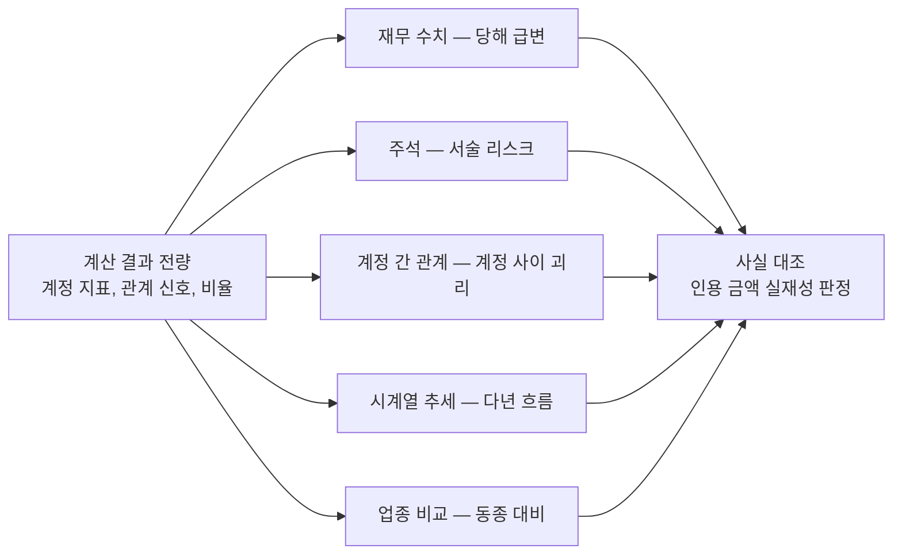

# FS Multi-agents analyzer
---

## 개요

### 1. 프로젝트 소개

5개년 공시 데이터 기반 검토 대상 목록 자동 생성 도구

#### 실제 사용 스크린샷

**1. 회사명 검색** — OpenDART 등록사(118,578개) 검색 (종목코드, 비상장 태그 표기)

<p align="center"></p>

**2. 연도 선택 및 분석 실행** — 사업연도 선택 후 분석 실행 - 준비 → 검문 → 분석 → 산출 4국면 순차 수행

<p align="center"></p>

**3. 검토 목록 생성** — 제무재표 영역별 검토 목록 생성 (손익, 재무상태, 현금흐름, 계정 관계 등)

<p align="center"></p>

**4. 검토 목록 상세 조회** — 카드 형태로 제공 (결론, 원인 경로, 관점별 주장, 수치 시각화, 반대 가능성, 확인 질문, 후속 절차)

<p align="center"></p>

#### 분석 대상 및 포지셔닝

- 분석 대상 데이터 : 최근 5개년 연결 및 별도 재무제표, 주석(XBRL), 사업보고서 원문
- 포지셔닝 : 감사인의 전문가적 판단을 돕는 공시 데이터 분석 도구

### 2. 문제 인식

#### 재무제표 전수 검토의 한계

- 방대한 검토 데이터 : 단일 기업 1개년(연결/별도, 주석, 사업보고서 등) 기준에 매년 시계열까지 더해져 검토량 증가
- 공시 정보 구조의 이질성 : 재무제표, 주석, 서술형 문서의 형식이 달라 수동 대조 시 정보 누락 위험
- 비표준화된 검토 방식 : 검토자의 역량, 경험에 따라 분석 결과 편차 발생

#### 범용 LLM 분석의 한계

- 재현성 : LLM 직접 연산 → 수치 환각 발생 위험
- 일관성 : 응답 생성 시마다 분석 논리와 방향 변동
- 정보 누락 : 원문 직접 투입 → 임의적 데이터 누락 발생 위험
- 비교 가능성 : 회사별, 연도별 비교 어려움

### 3. 프로젝트 기능 및 기대 효과

| 기능                       | 기대 효과                                                                      |
| -------------------------- | ------------------------------------------------------------------------------ |
| 코드 기반의 사전 수치 연산 | 100% 수치 재현성 확보 및 LLM 환각 차단                                         |
| 데이터 전수 스캔           | 5개년 전체 계정 전수 분석 → 유의미한 항목만 검토단계로 승격                    |
| 검토 관점 고정             | 재무 수치, 주석, 계정 간 관계, 시계열 추세, 업종 비교 5가지 고정 에이전트 분석 |
| 인용 수치 사실 대조        | 생선된 검토 카드 ↔ 사업보고서 원본 금액 자동 비교 후 불일치 항목 탈락          |
| 검토 결과 규격화           | 기업 및 연도와 무관하게 동일한 UI 구조 제공 → 비교가능성 제고                  |


### 4. 핵심 설계

<pre>
데이터 파이프라인

[입력] 회사명 및 사업연도
  │
  ├─ 준비 ──────────────────────────────────────────────────────────────────────────────────
  │    데이터 수집     OpenDART 연동, 5개년 재무제표, 주석, 사업보고서 원문 적재
  │    계정 정규화     기업별 계정명을 <a href="#표준-계정-사전-구축">표준 사전</a>으로 매핑                  ◀──┐
  │    주석 인덱싱     <a href="#3-3-기술-설명--주석-인덱싱">XBRL 주석 개념 선별, 주제 28종 분류</a>                                 │
  │    본문 서술 추출  <a href="#3-4-기술-설명--본문-서술-추출">LLM을 기반으로 사업보고서 분석 및 위험 요소 추출</a>                          │
  │                                                                                        │
  ├─ 검문 ─────────────────────────────────────────────────────────────────────────────────│
  │    정합성 검문     <a href="#3-5-기술-설명--정합성-검문">데이터 준비 중 유실된 항목 점검 + 대차,합계 검산</a> → 통과 여부 판정 │
  │    데이터 보정     <a href="#3-6-기술-설명--데이터-보정">표준 사전 미등록 계정 보정</a> ─────────────────────────────────────────┘
  │
  ├─ 분석 ──────────────────────────────────────────────────────────────────────────────────
  │    신호엔진        통합 재무 지표 산출 — <a href="#계정별-지표">계정별 지표</a>, <a href="#관계사슬">11개 관계사슬</a>, <a href="#재무비율">15개 재무비율</a>, <a href="#변동분해">변동분해</a>
  │    멀티 에이전트   각 LLM 독립 실행 — 재무 수치, 주석, 계정 간 관계, 시계열 추세, 업종 비교
  │
  └─ 산출 ──────────────────────────────────────────────────────────────────────────────────
       리포트 병합    인용 수치와 원장 수치 대조 검증, 통과분만 검토 카드로 확정
                      외부 근거 검증 에이전트는 카드 확정 이후 수행
  ▼
  검토 카드
</pre>

#### 핵심 설계 원칙

- **연산/분석 역할 분리**
  - 코드 연산 : 증감률, 비율, 기여도 등 수치 연산은 알고리즘으로 처리 → 수치 환각 가능성 원천 차단
  - LLM 분석 : 코드로 산출된 결과값을 받아 의미 해석 및 주요 쟁점 식별
- **분석 관점 고정, 동적 데이터 라우팅**
  - 분석 관점 고정 : 멀티 에이전트(재무 수치, 주석, 계정 간 관계, 시계열 추세, 업종 비교)로 검토 일관성 유지
  - 동적 계정 유입: 신호엔진 연산 결과에서 검토가 필요한 계정만 멀티 에이전트 단계로 유입
  - 외부 검증 절차: 리포트 병합 후 외부 데이터 교차 검증 에이전트 실행 → 검토 카드에 분석 지표로 더해짐
- **원본 대조를 통한 환각 차단**
  - 정합성 대조: 결론에 인용 및 서술한 금액 데이터를 원 단위로 복원하여 실제 장부 데이터 대조
  - 자동 기각 및 로깅: 존재하지 않는 계정, 잘못된 금액으로 도출된 결론 - 시스템 자동 기각, 탈락 사유 기록

### 5. 주요 성능 평가 및 실증 사례 분석

공시된 실제 부정 사례 **(아스트, 2020년)**의 정정 전 사업보고서로 End-to-End 검증 수행

- 사례 선정 기준 : 금융위원회 지적 확정 건 중 재무제표 수치 기반 탐지 가능한 사례 + 2015년 이후 시계열 데이터 보유 기업
- 타겟 계정 : 재고자산, 매출원가, 자기자본 (실행 전 타겟 계정 고정)
- 입력 통제 : 사후 정정된 데이터가 아닌 최초 DART 공시 사업보고서 투입
- 사전 지식 통제 : LLM의 사전 학습 정보 개입 차단
  - 마스킹 대상 : 회사명, 계열사명, 종목코드, 법인번호, 대표자명, 영문사명 + 외부 검색 에이전트 차단
  - 보존 데이터 : 계정명, 금액, 연도
- 핵심 검증 지표
  - 타겟 탐지 정확도 : 타겟 계정 - 최우선 검토 대상 목록에 식별
  - 수치 정합성 : 검토 카드에 인용된 금액 = DART 원장 수치


| 평가 항목        | 측정 결과                                                                                              |
| ---------------- | ------------------------------------------------------------------------------------------------------ |
| 입력             | 아스트 2020년 최초 제출본(정정 전), (시계열 분석 범위 : 2015\~2020년)                                  |
| 생성된 검토 카드 | [**총 24장**](#분석-대상-카드-도출-내역) (계정 13, 관계 4, 회사 7)                                     |
| 타겟 계정 적중   | 재고자산 — (재무 수치, 시계열 추세 2관점), 매출원가 — (계정 간 관계)                                   |
| 미탐지 사유      | 자기자본 — 왜곡이 이익잉여금으로 유입되는 합계 계정 → 자체 급변 신호 약함, 이익잉여금 카드로 부분 적중 |
| 수치 정합성      | **59/59 일치**, 환각 환산오류 없음                                                                     |

---

## 목차

1. [적용 범위 및 데이터 구성](#1-적용-범위-및-데이터-구성)
2. [실증 예시](#2-실증-예시)
3. 기술 설명
   - 준비 — [데이터 수집](#3-1-기술-설명--데이터-수집), [계정 정규화](#3-2-기술-설명--계정-정규화), [주석 인덱싱](#3-3-기술-설명--주석-인덱싱), [본문 서술 추출](#3-4-기술-설명--본문-서술-추출)
   - 검문 — [정합성 검문](#3-5-기술-설명--정합성-검문), [데이터 보정](#3-6-기술-설명--데이터-보정)
   - 분석 — [신호엔진](#3-7-기술-설명--신호엔진), [멀티 에이전트](#3-8-기술-설명--멀티-에이전트)
   - 산출 — [리포트 병합](#3-9-기술-설명--리포트-병합)
4. [검증](#4-검증)
5. [핵심 의사결정](#5-핵심-의사결정--데이터-파이프라인-재평가)
6. [한계](#6-한계)
7. [기술 스택](#7-기술-스택)
8. [빠른 시작](#8-빠른-시작)

---

## 1. 적용 범위 및 데이터 구성

### 시스템 적용 범위

| 구분   | 포함 대상                          | 제외 대상                               |
| ------ | ---------------------------------- | --------------------------------------- |
| 검색   | OpenDART 등록사 전체 (118,578개)   | 검색은 모든 업종 가능                   |
| 분석   | 비금융 일반 기업(제조, 판매, 건설) | 금융업, 보험업, 지주사 등 특수계정 업종 |
| 보고서 | 연간 사업보고서                    | 분기 및 반기 보고서                     |
| 연도   | 2015년 이후                        | 2015년 이전 미수집                      |
| 통화   | 원화(KRW)                          | 외화 재무제표 분석 제외                 |

### 분석 투입 데이터

분석 사업연도 지정 시 직전 4개년을 포함한 총 5개년 시계열 데이터 적재

| 분류            | 구성                                                         |
| --------------- | ------------------------------------------------------------ |
| 재무제표 수치   | 재무상태표, 손익계산서, 포괄손익, 현금흐름표, 자본변동표 5종 |
| 재무제표 구분   | 연결 및 별도 재무제표 (식별 키 분리 → 데이터 이중 계상 차단) |
| 주석            | XBRL 주석 (주제 28종 분류 후 적재)                           |
| 사업보고서 본문 | 소송, 우발부채, 특수관계자 거래 등 공시 사항                 |

---

## 2. 실증 예시

아스트의 2020년 사후 정정 전 최초 공시 원본을 파이프라인에 투입하여 End-to-End 검증을 수행<BR>
사전 지식 통제를 위한 마스킹 적용, 총 24장의 검토 대상 카드 도출

### 사건 개요

- 회계 처리 오류 : 판매 완료 재고자산을 매출원가로 대체하지 않고, 가공의 재고자산을 보유 중인 것으로 과대 계상
- 재무제표 왜곡 : 기말 재고자산 과대 계상 → 매출원가 과소 계상 → 당기순이익 및 자기자본(이익잉여금) 과대 계상
- 타겟 계정 : 재고자산, 매출원가, 자기자본

### 분석 대상 카드 도출 내역

| 재무제표 영역  | 계정 카드                                                        | 관계 카드                          | 회사 카드                                 |
| -------------- | ---------------------------------------------------------------- | ---------------------------------- | ----------------------------------------- |
| **재고, 원가** | 재고자산                                                         | 매출↔매출원가↔재고자산             | 재고 체류 장기화·재고효율 저하            |
| 자산 평가      | 무형자산, 이연법인세자산                                         | —                                  | 무형자산 손상평가                         |
| 부채, 유동성   | 유동성장기차입금, 유동부채, 장기차입금, 단기차입금               | 차입금 조달↔상환↔재무활동CF        | 조기상환청구권 포함 전환사채와 단기유동성 |
| 현금흐름       | 단기차입금증가, 영업활동CF, 유형자산취득, 투자활동CF, 재무활동CF | 당기순이익↔영업CF, 이자지급↔재무CF | 이익의 현금화 저하                        |
| 자본           | 이익잉여금                                                       | —                                  | 자본성 조달 반복과 후속 BW 발행           |
| 우발, 특수관계 | —                                                                | —                                  | 종속회사 차입 연대보증                    |
| 이익, 세금     | —                                                                | —                                  | 수익성 급락                               |
| **합계**       | **13**                                                           | **4**                              | **7**                                     |

회사 카드는 계정이 특정되지 않는 지적으로, 재무제표 영역별 1장으로 병합된다

**타겟 계정 탐지 결과 분석**

| 타겟 계정 | 도출 카드 유형               | 탐지 결과                                    |
| --------- | ---------------------------- | -------------------------------------------- |
| 재고자산  | 계정, 관계, 회사             | 재무 수치와 시계열 추세 에이전트가 함께 지목 |
| 매출원가  | 관계(매출↔매출원가↔재고자산) | 계정 간 관계가 세 계정의 증감 괴리로 지목    |
| 자기자본  | 미적중                       | 이익잉여금 계정으로만 부분 표면화            |

---

## 3-1. 기술 설명 : 데이터 수집

> **실제 구현**
> - 수집 : [`opendart.py`](src/collect/opendart.py), [`notes_xbrl.py`](src/collect/notes_xbrl.py), [`report_doc.py`](src/collect/report_doc.py)

OpenDART API를 연동 → 대상 기업 고유번호 식별, 분석 연도 포함 **최근 5개년** 수집

| 수집 원천           | 범위                                                            | 처리                                 |
| ------------------- | --------------------------------------------------------------- | ------------------------------------ |
| 재무제표 수치(JSON) | 재무상태표, 손익계산서, 현금흐름표, 포괄손익, 자본변동표        | 연결 + 별도 개별 추출 후 병합        |
| XBRL 주석           | 사업보고서 XBRL 압축본에 담긴 주석                              | Arelle로 전개, 개념과 값 단위로 추출 |
| 사업보고서          | 특수관계자 거래, 연결 범위 변동 등 비재무적 서술 정보 공시 전문 | HTML 파서                            |

---

## 3-2. 기술 설명 : 계정 정규화

> **실제 구현**
> - 정규화 : [`mapper.py`](src/normalize/mapper.py), [`pipeline.py`](src/normalize/pipeline.py)
> - 표준 사전 : [`canonical_accounts.yaml`](config/canonical_accounts.yaml)

### 도입 배경

- **기업별 비표준 태그 사용** — DART 제공 XBRL 택소노미를 사용 하지 않고 기업 자체 개별 태그 생성으로 식별 불가 문제 발생
- **연결/별도 기준 간 데이터 파편화** — 연결 및 별도 재무제표에 동일 계정 데이터 분산 공시 → 금액 이중 계상 및 누락 위험
- **데이터 타입 혼재** — 원화 외에 주식 수, 백분율(%), 서술형 텍스트 등이 혼재 → 연산 오류 위험

### 표준 계정 사전 구축

**IFRS 국제표준 + 금감원 DART 확장 택소노미의 표준 ID**를 근거로 2,017종 등재

```yaml
매출채권:
  statement: BS
  account_ids:
    - dart_ShortTermTradeReceivable # 금감원 DART 확장
    - ifrs-full_CurrentTradeReceivables # IFRS 국제표준
  aliases: [매출채권]
```

### 매핑 정책 — 식별자(ID) 최우선 매핑

- 재무제표 간 오배정 방지 : 국문 명칭 → 복수의 재무제표에서 중복 사용되는 경우가 많았음 (예: 현금흐름표 데이터가 자본변동표로 라우팅되는 현상 방지)
- 기업의 임의 라벨링 통제 : 기업마다 한글 항목명이 달라 변동 없는 고유 번호(ID) 우선 매핑
- 오류 추적 가능 : ID 우선 매핑, 충돌 시 로그 생성으로 오류 추적 가능
- **예외 - 자본변동표** : 표준 ID 슬롯에 기업이 임의의 변동 내역을 기재하는 예외 케이스 다수 발견 → 국문 라벨 매핑 우선

### 매핑 실패 계정
- 

---

## 3-3. 기술 설명 : 주석 인덱싱

> **실제 구현**
> - 주석 수집 : [`notes_xbrl.py`](src/collect/notes_xbrl.py)
> - 주제 분류 : [`notes_classify.py`](src/normalize/notes_classify.py)
> - 주석 사전 : [`note_mappings.yaml`](config/playbooks/note_mappings.yaml)

### 도입 배경 및 설계 방향

| 구분 | 요약                                | 상세                                                                        |
| ---- | ----------------------------------- | --------------------------------------------------------------------------- |
| 한계 | 원본 데이터 노이즈 과다             | 회사연도당 평균 1,990건 수집 → 58%는 본표 중복, 15%는 연락처 등 메타 데이터 |
| 해결 | 데이터 필터링 및 주제 라벨링        | 본표 중복과 단순 메타데이터를 제거, 남은 유효 개념에 주제 라벨을 부여       |
| 효과 | 에이전트 탐색 최적화 및 정합성 확보 | 에이전트가 주제 단위로 데이터를 신속히 탐색 가능하도록 지원                 |

### 주제별 분류 로직

- 입력 데이터 : 개념, 라벨(국문, 영문), 기간, 단위, 값, 차원(부문/자산종류 등 분해 기준)의 7열로 구성된 XBRL 데이터
- 처리 로직 : 개념을 4개 유형으로 분류, 분석에 유의미한 데이터 선별 및 필터링

| 분류 기준   | 무엇인가                                 | 적재 여부                       |
| ----------- | ---------------------------------------- | ------------------------------- |
| 본표 중복   | 본표에 이미 나온 계정과 같은 개념        | 총계 제외 후 분해된 값으로 적재 |
| 표지 정보   | 감사인, 연락처, 문서 식별 등 비재무 정보 | 제외                            |
| 주제 적중   | 사전 정의된 주석 카테고리에 매핑된 개념  | 해당 카테고리 라벨을 붙여 적재  |
| 사전 미적중 | 어느 카테고리에도 분류되지 않은 개념     | 라벨 없이 원본 그대로 적재      |

- 미적중 데이터 무결성 보존 : 분류 및 필터링은 에이전트 탐색 최적화를 위해 라벨을 부여하는 과정 → 분류 실패분도 전량 적재
- 미적중 비중 : 표본 116개 회사연도 기준 5.7%, 표준 택소노미 없이 기업이 자체 생성한 태그

<details>
<summary><b>주석 카테고리 28종</b></summary>

| 묶음      | 카테고리                                                                   |
| --------- | -------------------------------------------------------------------------- |
| 자산      | 재고자산, 유형자산명세, 무형자산명세, 투자부동산, 리스, 손상, 현금금융기관 |
| 채권채무  | 매출채권/대손, 매입채무                                                    |
| 자금조달  | 차입금조건, 사채, 금융상품, 파생/위험회피                                  |
| 위험공시  | 위험관리공시, 약정/우발, 충당부채                                          |
| 손익      | 수익/고객계약, 이자배당손익, 법인세, 이연법인세, 주당이익                  |
| 자본/보상 | 자본적립금, 주식기준보상, 확정급여/퇴직                                    |
| 관계/기타 | 특수관계자거래, 종속관계기업투자, 외화환산, 정부보조금                     |

</details>

---

## 3-4. 기술 설명 : 본문 서술 추출

> **실제 구현**
> - 본문 읽기 : [`reader.py`](src/report/reader.py), [`layer1.py`](src/report/layer1.py)

숫자로 공시되지 않는 위험을 사업보고서 본문에서 뽑아내는 단계 — 준비 국면에서 유일하게 LLM이 관여

- 대상 : 소송, 우발부채, 특수관계자 거래 등 숫자가 아니라 문장으로만 공시되는 위험
- 단위 : 사업보고서 대단원 7종 — 사업내용, 재무, 경영진단, 감사의견, 계열회사, 대주주거래, 투자자보호
- 산출 : 대단원별 추출 결과를 저장, 주석 관점 에이전트의 근거 재료로 투입
- 검문과 독립 : 정합성 검문의 판정 결과를 입력으로 쓰지 않으므로 검문보다 먼저 수행 — 추출에 실패해도 다음 단계를 막지 않고 경고만 남긴다(차단 규칙은 [3-5](#3-5-기술-설명--정합성-검문))

---

## 3-5. 기술 설명 : 정합성 검문

> **실제 구현**
> - 이관 원장 : [`transfer_ledger.py`](src/normalize/transfer_ledger.py), [`ledger_financials.py`](src/normalize/ledger_financials.py), [`ledger_notes.py`](src/normalize/ledger_notes.py)
> - 항등식 검산 : [`onboarding_gate.py`](src/normalize/onboarding_gate.py), [`gate_identities.py`](src/normalize/gate_identities.py)

정규화와 주석 인덱싱을 마친 데이터가 분석에 쓸 수 있는 상태인지 판정하는 관문 — 판정은 전부 코드, LLM은 통과 여부에 관여하지 않음

- 미통과 시 : 분석 진입 차단(`can_enter_analysis`), 어느 조건이 왜 막혔는지 단계별 표시
- 차단하는 이유 : 정규화가 깨진 채 분석에 들어가면 틀린 수치 위에서 결론 도출 → 카드를 만들어 놓고 걸러내는 대신 진입을 거부, LLM 호출 비용도 선차단
- 예외 : 본문 읽기 실패는 차단하지 않음 — 경고 후 사람이 확인하고 강행, 외부 API 장애로 분석이 영구히 막히는 것을 막되 서술형 누락은 숨기지 않음

두 가지를 묻는다. **원본에 있던 게 다 왔는가**, **온 숫자가 서로 맞는가**.

### 이관 원장 : 원본에 있던 게 다 왔는가

수집한 원본 항목 전량을 명단으로 놓고 하나씩 도장을 찍는다 — 이삿짐 검수와 같다.

```
원본 항목 전량  =  적재됨
               +  사유가 붙은 제외   (본표와 중복 · 표지, 연락처 등 메타 · 다른 표로 옮겨 담음)
               +  미설명            ← 1건이라도 있으면 통과하지 못함
```

| 원본 대상  | 명단                   | 사유가 붙는 제외                                        |
| ---------- | ---------------------- | ------------------------------------------------------- |
| 재무제표   | DART 원본 CSV 전체 행  | 포괄손익에 실린 매출액이 손익계산서로 옮겨 담긴 경우 등 |
| 자본변동표 | 원본 CSV 자본변동표 행 | 없음 — 분석이 쓰는 2차원 표로 옮겨져야 함               |
| 주석       | XBRL 주석 전체 항목    | 본문 재무제표가 담당하는 중복분, 표지, 감사인, 연락처   |

- 임계값 없음 : "몇 % 실렸나"로 자르지 않고 "설명 못 하는 항목이 있나"만 판정. 주석은 원본의 70% 가까이가 본표 중복과 메타라 적재율 자체는 낮은 것이 정상
- 원본이 없어 대조 불가 시 통과 아님 : 확인하지 못한 것을 이상 없음으로 세지 않음
- 아스트 2020 실측 : 재무제표 원본 387행 = 적재 359 + 표 재분류 28 + **미설명 0**, 주석 953건 = 적재 137 + 메타 207 + 본표 중복 609 + **미설명 0**

### 항등식 검산 : 온 숫자가 서로 맞는가

| 검증 지표      | 검증 내용                                            | 걸리는 예                                                             |
| -------------- | ---------------------------------------------------- | --------------------------------------------------------------------- |
| 대차 일치      | 자산총계 = 부채총계 + 자본총계                       | 잔차 100만원 초과                                                     |
| 연산 정확성    | 세부 항목의 합이 전체 합계와 일치 여부               | 유동자산 + 비유동자산을 더한 값이 자산총계와 다름                     |
| 데이터 일치성  | 다른 표에 등장하는 같은 항목의 금액 일치 여부 확인   | 재무상태표 현금은 100억인데 현금흐름표 기말현금은 80억                |
| 계정 유효성    | 신호엔진 계산 대상 계정 이름이 표준 사전에 등록 여부 | 엔진은 "매출채권"으로 계산하는데 사전엔 그 이름이 없어 빈 값으로 계산 |
| 통화 기준 일치 | 수집된 금액 단위 표기 적정성 여부                    | 일부 금액이 달러로 실려 원화 금액과 그대로 합산될 위험                |

- 검산을 한 건도 세우지 못하면 통과 아님 : 자산총계 행이 결손되면 대차 검산이 0건이 되는데, 이때 "어긋난 것이 없다"를 통과로 세면 빈 검사가 합격으로 둔갑
- 표준 계정에 연결되지 않은 계정은 차단하지 않고 수치로 게시 : "기타 중요 계정"으로 분석에 그대로 흐르므로 손실이 아니라 상태

---

## 3-6. 기술 설명 : 데이터 보정

> **실제 구현**
> - 계정명 연결 : [`alias_suggest.py`](src/report/alias_suggest.py)

정합성 검문이 지적한 미매핑 계정을 표준 계정에 잇는 단계 — 계정 정규화 단계에서 매핑되지 않은 계정을 LLM으로 보정

| 순서           | 하는 일                                             | 주체 |
| -------------- | --------------------------------------------------- | ---- |
| 1. 후보 검색   | 미매핑 계정명이 갈 만한 표준 계정 후보를 추림       | 코드 |
| 2. 선택        | 제시된 후보 안에서만 선택, 목록 밖 계정은 생성 불가 | LLM  |
| 3. 등록        | 신뢰도 0.7 이상만 자동 등록                         | 코드 |
| 4. 다시 정규화 | 등록 즉시 5개년 전체를 재변환                       | 코드 |

- 예 : 회사가 매출을 "영업수익"으로 표기 → 표준 계정 "매출"에 연결
- 임계 출처 : 0.7은 코드 상수(`AUTO_REGISTER_MIN_CONFIDENCE`), 회사별 조정 없음
- 5개년 전부인 이유 : 한 해만 고치면 나머지 4년이 빈 채로 남아 시계열 증감률이 계산되지 않음
- 0.7 미만 : 자동 등록하지 않고 "기타 중요 계정"으로 표면화, 사람이 화면에서 직접 선택
- 재판정 : 여기서 이름을 이어 붙이면 미매핑 비중이 줄어, 검문을 다시 돌렸을 때 통과 가능

---

## 3-7. 기술 설명 : 신호엔진

> **실제 구현**
> - 전수 스캔 : [`universal.py`](src/signals/universal.py), [`metrics_panel.py`](src/signals/metrics_panel.py)
> - 관계, 임계 : [`mvp1.py`](src/signals/mvp1.py), [`red_flags.py`](src/signals/red_flags.py)
> - 비율, 분해 : [`ratios.py`](src/signals/ratios.py), [`decomposition.py`](src/report/decomposition.py)
> - 누락 대조 : [`coverage.py`](src/report/coverage.py)
> - 플레이북 : [`relationship_chains.yaml`](config/playbooks/relationship_chains.yaml), [`financial_ratios.yaml`](config/playbooks/financial_ratios.yaml)

정규화를 마친 5개년 데이터의 모든 계정에 같은 잣대의 계산값을 붙이는 층<br>
이상 여부는 판정하지 않고, 판단에 쓸 재료를 결정론 계산으로 산출해 다음 층에 전달

### 산출물과 사용처

| 산출물              | 내용                                      | 어디에 쓰이나                             |
| ------------------- | ----------------------------------------- | ----------------------------------------- |
| 계정 지표 패널      | 전 계정 × 5개년 계산값 전량               | 재무 수치, 계정 간 관계, 시계열 추세 관점 |
| 임계 초과 신호      | 기준선을 넘은 계정과 계정 짝 목록         | 검토 우선순위 큐                          |
| 재무비율, 업종 분위 | 연결/별도별 비율 시계열, 동종사 대비 위치 | 업종 비교 관점                            |
| 변동분해            | 소계 증감을 구성 계정 기여로 쪼갠 값      | 검토 카드의 결과 분해                     |
| 누락 대조표         | 분석에 들어간 셀과 빠진 셀의 대조 결과    | 화면의 미분석 표시                        |

- 임계를 넘지 못한 계정도 패널에 그대로 실림 — 기준선은 눈에 띄게 하는 표시일 뿐 분석 대상을 자르는 컷오프가 아님
- 패널에는 중요도, 순위, 플래그 필드를 두지 않음 — 코드가 판단을 끼워 넣지 못하도록 필드 자체를 금지 (테스트로 강제)

### 신호 판정 기준

기준선은 플레이북 YAML 한 곳(`l2_mvp1.signal_thresholds`)에서 관리, 코드에 숫자를 박지 않음

| 신호           | 보는 값                              | 기준선                       |
| -------------- | ------------------------------------ | ---------------------------- |
| 계정 급변      | 전년 대비 증감률                     | ±50%                         |
| 구성비 이동    | 같은 표 안에서의 비중 변화           | ±5%p                         |
| 과거 대비 이례 | 자기 과거 평균과의 표준편차 배수     | ±2 (과거 4개년 이상 보유 시) |
| 연결/별도 괴리 | 같은 계정의 연결 금액과 별도 금액 차 | ±30%                         |
| 증감률 괴리    | 짝지은 두 계정의 증감률 차           | ±15%p                        |
| 방향 불일치    | 두 계정의 증감 방향 조합             | 지정 조합 2종                |

- 규모 바닥 : 자산총계 1%와 1억원 중 큰 값에 못 미치는 계정은 신호로 만들지 않음 — 금액이 작아 비율만 튀는 잡음 차단
- 기저 조건 : 전기 금액이 규모 바닥 미만이거나 당기와 부호가 뒤집힌 경우 증감률을 계산하지 않음
- 비교 불가 연도 제외 : 보고 통화가 대상 연도와 다른 연도, 자산총계가 100배 이상 튄 연도는 계산 전 제외

### 계정별 지표

대상 = 재무상태표, 손익계산서, 포괄손익, 현금흐름표<br>
자본변동표는 자본거래 × 자본구성요소의 2차원 표라 따로 계산

| 묶음 | 값                | 계산                                       | 잡는 것          |
| ---- | ----------------- | ------------------------------------------ | ---------------- |
| 원본 | 금액, 증감률      | {연도: 금액}, 전년 대비 %                  | —                |
| 크기 | 규모 대비 변동폭  | 절대값(당기−전기) ÷ 자산총계               | 갑자기 급변      |
| 크기 | 추세 강도         | 방향 일관성 × 절대값(당기−최초) ÷ 자산총계 | 여러 해 한 방향  |
| 크기 | 변동성            | 표준편차 ÷ 절대값(평균) — 변동계수         | 변동성이 큼      |
| 크기 | 표 내 비중, 변화  | 같은 표에서의 비중(%)과 전기 대비 변화(%p) | 구성이 바뀜      |
| 비교 | 과거 대비 이례도  | 자기 과거 시계열 기준 z값                  | 자기 이력과 다름 |
| 비교 | 전체 분포상 위치  | 다른 모든 계정과 비교한 백분위             | 회사 안에서 튐   |
| 비교 | 업종 분위         | 동종업계 대비 위치                         | 업계와 다름      |
| 맥락 | 등장 상태         | 계속 있음 / 올해 새로 생김 / 올해 사라짐   | 신규, 소멸       |
| 맥락 | 원문 계정명, 소속 | 회사가 쓴 이름, 소속 표, 연결/별도         | 표기 변경        |
| 맥락 | 재작성 흔적       | 전기 수치 재작성 불일치, 표시 방법 변경    | 과거가 바뀜      |

- 분모 격리 : 규모 대비 변동폭과 비중은 그 계정이 속한 기준(연결이면 연결, 별도면 별도)의 자산총계, 표 합계로 나눔
- 합계 계정 제외 : 자산총계 같은 소계는 하위 계정과 이중으로 세어지므로 신호 대상에서 뺌
- 사라진 계정 보존 : 5개년 중 한 해라도 잔액이 있으면 명단에 남김 — 당해 잔액만으로 뽑으면 올해 사라진 계정이 통째로 빠짐

### 관계사슬

한 계정만 보면 정상인데 짝지은 계정과 함께 보면 어긋나는 것을 잡는 축 — 예: 매출은 제자리인데 매출채권만 급증

| 계산           | 대상                              | 판정                              |
| -------------- | --------------------------------- | --------------------------------- |
| 증감률 괴리    | 사전 정의된 계정 짝 10쌍          | 두 계정의 증감률 차가 기준선 초과 |
| 방향 비교      | 계정 증감과 현금흐름 방향 4쌍     | 지정한 방향 조합에 들어맞음       |
| 연결/별도 대조 | 같은 계정의 연결 금액과 별도 금액 | 괴리율이 기준선 초과              |

계정 짝과 사슬 구성은 플레이북 YAML에 있어, 짝을 바꾸거나 늘려도 코드는 그대로

| 사슬                     | 보는 계정                                                  | 근거        |
| ------------------------ | ---------------------------------------------------------- | ----------- |
| 수익의 질, 회수가능성    | 매출, 매출채권, 대손충당금, 영업활동CF                     | ISA/KSA 520 |
| 재고 진부화, 원가        | 재고자산, 매출원가, 재고평가손실                           | ISA/KSA 501 |
| 진행률 수익, 계약자산    | 매출, 계약자산, 계약부채, 공사손실충당부채                 | ISA/KSA 520 |
| 유동성, 계속기업         | 단기차입금, 장기차입금, 사채, 이자비용, 재무활동CF         | ISA/KSA 520 |
| 영업손익에서 순이익으로  | 영업이익, 금융수익, 이자비용, 법인세비용, 당기순이익       | ISA/KSA 520 |
| 차입금 조달과 사용처     | 차입금, 재무활동CF, 투자활동CF, 유형자산취득               | ISA/KSA 520 |
| 순이익, 영업CF, 운전자본 | 당기순이익, 영업CF, 운전자본변동(매출채권, 재고, 매입채무) | ISA/KSA 520 |
| 충당부채, 우발부채 교차  | 충당부채, 장기충당부채, 우발부채주석                       | ISA/KSA 501 |
| 현금, 금융자산 실재성    | 현금및현금성자산, 단기금융상품, 금융수익                   | ISA/KSA 505 |
| 특수관계자 자금 유출     | 장기대여금증가, 투자활동CF, 관계기업투자                   | ISA/KSA 550 |
| 연결 구조, 비지배지분    | 연결범위                                                   | —           |

### 재무비율

4개 묶음 15종을 연결, 별도 각각 5개년치 계산 — 계산식과 대상 계정은 플레이북 YAML 정의

| 묶음      | 비율                                                                     |
| --------- | ------------------------------------------------------------------------ |
| 수익성    | ROE, ROA, ROI, 매출총이익률, 영업이익률                                  |
| 활동성    | 매출채권회전율, 매출채권회수기간, 재고회전율, 재고보유기간, 총자산회전율 |
| 안정성    | 부채비율, 유동비율, 이자보상배율                                         |
| 이익의 질 | 영업현금흐름/당기순이익, 발생액 비율                                     |

- 평잔 처리 : 회전율과 회수기간의 분모는 기초와 기말의 평균, 전기 값이 없으면 기말 값으로 대체하고 어느 쪽을 썼는지 함께 기록
- 미산출 표기 : 필요 계정이 없거나 분모가 0이면 값을 비우고 사유를 남김 — 빈칸을 0으로 채우지 않음
- ROI는 공시 재무제표 합계 계정에 투자원가가 없어 정의만 두고 산출하지 않음(15종 중 1종)

### 업종 분위

같은 지표라도 업종마다 정상 범위가 달라, 회사 자기 이력만으로는 이례 여부를 가릴 수 없음

| 단계      | 처리                                                                      |
| --------- | ------------------------------------------------------------------------- |
| 업종 판정 | OpenDART 회사 프로필의 업종 코드 앞 3자리(중분류)를 키로 사용             |
| 피어 확보 | 업종 72종에 피어 601사를 사전 등재(업종당 1\~10사), 자산 규모 분위로 선정 |
| 지표 산출 | 대상 연도와 직전 연도의 재무비율 15종을 피어별로 같은 코드로 계산         |
| 분위 계산 | 지표별 피어 중앙값과 대상 회사 백분위 산출                                |

- 백분위 = 피어 값 중 대상값 이하인 개수 ÷ 피어 수 × 100
- 피어 수집 실패 시 그 피어만 건너뛰고 남은 피어로 계산, 피어 0사면 업종 비교 미수행으로 표시
- 근거 : ISA/KSA 520 분석적 절차, 결과에 "사업구조가 피어와 달라 단순 비교에 한계" 단서를 함께 게시
- 업종 비교 관점에 넣는 항목은 상위 5건으로 제한, 피어 재무제표를 매번 받아야 해 호출 비용이 큼

### 변동분해

소계 계정의 증감을 구성 계정의 기여 금액으로 쪼개, "왜 그만큼 변했나"에 숫자로 답하는 계산<br>
예 : 영업이익 감소분 중 매출총이익이 끌어내린 몫과 판매비와관리비가 끌어내린 몫

| 항목        | 처리                                                                                                      |
| ----------- | --------------------------------------------------------------------------------------------------------- |
| 분해 항등식 | 손익 4단계, 현금흐름 2단계의 표준 소계만 대상 (아래 도식)                                                 |
| 변형 선택   | 기타손익 포함 여부, 유출액 부호 표기가 회사마다 달라, 소계 증감과 가장 적게 어긋나는 구성을 데이터로 선택 |
| 잔차 표시   | 구성 합과 소계 증감이 어긋나면 차액을 감추지 않고 미설명 잔차로 게시                                      |
| 하위 전개   | 구성 계정에 자기 항등식이 있으면 그 아래까지 펼침 — 소계를 검은 상자로 두지 않음                          |

```
━━━ 손익 4단계  ━━━━━━━━━━━━━━━━━━━━━━━━━━━━━━━━━━━━━━━━━━━━━━━━━━━

  매출 − 매출원가                          ─▶  매출총이익
  매출총이익 − 판매비와관리비 (± 기타손익)  ─▶  영업이익
  영업이익 + 금융수익 − 이자비용
            (± 기타손익, 지분법이익)       ─▶  세전이익
  세전이익 − 법인세비용                     ─▶  당기순이익
                                                  │
━━━ 현금흐름 2단계  ━━━━━━━━━━━━━━━━━━━━━━━━━━━━━━━━━━━━━━━━━━━━━━━━━
                                                  ▼
  당기순이익 + 비현금조정 + 운전자본변동    ─▶  영업창출현금흐름
  영업창출현금흐름 + 이자수취 ± 이자지급
            ± 법인세납부 (+ 배당금수취)     ─▶  영업활동현금흐름
```

### 누락 방지 구조

분석 대상을 골라 담지 않고, 전체 명단과 대조해 빠진 것을 세는 방식

```
  계정층   전체 건수 == 분석한 건수 + 사유 명시 예외 건수 + 미분류 누락 건수
    │
    └─ 미분류 누락이 1건이라도 발생 시 ──▶ 화면, 리포트에 "⚠ 미분석 N건"

  파생층   관계사슬, 재무비율은 표준 계정명으로 조회함
    │      → 이름을 못 붙인 계정은 계정층엔 실려도 이 분석엔 못 들어감
    └─ 그 건수, 금액을 따로 세어 "미진입 N건"으로 표시
```

- 대조 범위 : 본문 계정 셀, 파생 계산 진입, 주석 사실, 자본변동표 2차원 셀 4종을 각각 대조
- 제외에는 사유 필수 : 자본변동표 본문 행처럼 다른 표가 대신 담는 경우만 예외로 인정, 사유 없는 제외는 누락으로 집계
- 항등식이 깨지면 테스트가 실패 — 조용히 빠지는 계정이 코드 변경으로 생기지 않게 잠금

---

## 3-8. 기술 설명 : 멀티 에이전트

> **실제 구현**
> - 실행 : [`perspective_runner.py`](src/report/perspective_runner.py), [`perspectives.py`](src/report/perspectives.py)
> - 투입 재료 : [`materials.py`](src/report/materials.py)
> - 프롬프트 : [`perspective_prompts.yaml`](config/playbooks/perspective_prompts.yaml)



관점당 LLM 1회 호출로 동시 실행, 관점 간 결과 비공유

```
━━━ 출력 포맷 강제 — 비정형 자유 서술 반환 차단 ━━━━━━━━━━━━━━━━━━━━━━━━━━━

      지적 대상   ┳ 단일 계정    → 계정 ID 및 인용 금액 명시 필수
                  ┣ 계정 간 관계 → 대표 계정 및 1개 이상의 연관 계정 명시 필수
                  ┗ 회사 전체    → 외부 사건, 소송, 지배구조 이슈

      영역 분류   지정된 영역으로 고정 — 부정행위 단정이 아닌 어느 영역에 속한 리스크인가만 식별
      
      설명        내용 누락 시 응답 거부 (근거 없는 단순 지적 차단)
```

### 관점별 투입 재료

| 관점         | 받는 재료                                                                 |
| ------------ | ------------------------------------------------------------------------- |
| 재무 수치    | 계정 지표 전량, 재무비율 요약과 시계열, 관계 신호, 사건 연표              |
| 주석         | XBRL 주석 전량, 사업보고서 본문 서술                                      |
| 계정 간 관계 | 계정 지표, 관계 신호, 활동성, 이익의 질 비율, 미매핑 중요 계정, 사건 연표 |
| 시계열 추세  | 계정 지표 전량, 비율 시계열, 자본변동표 격자, 관계 신호, 사건 연표        |
| 업종 비교    | 동종사 지표, 업종 규칙, 비율 시계열, 우선순위 상위 5건(비용상 제한)       |

### 투입 원칙

1. 전량 투입 : 전 계정 계산값을 통째로 제공, 무엇이 중요한지는 각 관점이 직접 선별
2. 에이전트 간 정보 공유 금지
   - 판단 오염 차단 : 관점끼리 의견을 주고받으면 한 관점의 주장이 다른 관점을 물들일 위험
   - 신호 가치 : 독립적으로 발견한 결론이 겹쳐야 복수 관점 합의에 의미가 생김
   - 교차검증의 자리 분리 : 관점 간 교차는 토론이 아니라 뒤 단계 몫 — 반박 에이전트가 상대

---

## 3-9. 기술 설명 : 리포트 병합

> **실제 구현**
> - 카드 : [`card_builder.py`](src/report/card_builder.py), [`card_order.py`](src/report/card_order.py)
> - 사실 대조 : [`grounding.py`](src/report/grounding.py), [`amounts.py`](src/report/amounts.py)
> - 조사, 반박 : [`investigator.py`](src/report/investigator.py), [`rebuttal.py`](src/report/rebuttal.py), [`external_verify.py`](src/report/external_verify.py)
> - 카드 렌더 : [`card_view.py`](dashboard/card_view.py), [`card_data.py`](dashboard/card_data.py)

### 검토 카드 구성

개요 1절 4번 화면의 카드 한 장이 담는 요소와 각 요소의 출처

| 위치 | 요소                  | 무엇이 들어가나                                       | 만드는 주체      |
| ---- | --------------------- | ----------------------------------------------------- | ---------------- |
| 머리 | 결론                  | 카드 한 줄 요약과 지목한 관점 배지                    | LLM 종합         |
| 머리 | 검토 포인트           | 부모 계정 대비 변화율 괴리 명제                       | 코드, LLM 미개입 |
| 좌   | ① 무엇이 의심스러운가 | 관점별 주장 원문과 인용 금액                          | 발견 관점 5종    |
| 좌   | ② 결과 분해           | 변동분해 표, 근거 수치, 주석 근거, 외부 근거          | 코드 계산과 대조 |
| 우   | ③ 시각자료            | 카드 유형별 차트, 추이 바, 기여 발산막대, 지수화 라인 | 코드             |
| 우   | ④ 반박, 확인 절차     | 반대 가능성, 정상 설명, 확인 질문, 다음 절차          | 반박 에이전트    |

- 검토 포인트는 변화율 괴리 배수가 2 이상일 때만 생성, 정상 비례 변동에는 붙이지 않음
- 분해가 없는 계정은 검토 포인트를 비움, 두괄식을 억지로 만들지 않음
- 좌우 2칸 배치 이유 : 6블록을 1열로 쌓으면 카드가 길어져 ④ 다음 절차가 한 화면에서 밀려남

```
━━━ 사실 대조 — 인용 수치 실재성 코드 단독 판정 ━━━━━━━━━━━━━━━━━━━━━━━━━━━━━━━━━━━

  동일 금액을 원, 백만, 억 단위로 혼용하여 반환할 위험 ──▶ 단위를 해석해 원 단위로 복원한 뒤 실제 장부값과 자릿수까지 대조
      "1,961억" ,  "196,100,000,000"   →  196100000000원 - 통과(실제 장부값과 일치)
      "1,961백만"                       →  1961000000원   - 탈락(자릿수 불일치)
      └ 반올림 인용("1,960.5억")은 허용오차(1% 또는 100만원) 안에서 통과
      └ 단위 없는 짧은 맨숫자("1,961")는 복원 불가 ──▶ 유효숫자만 대조하고 자릿수 미확인으로 표시

  ◆ 판정 로직 :   본표, 주석, 자본변동표의 [계정명 ↔ 실존 금액] 인덱스를 구축하여 대조
      계정 지적   계정이 색인에 없음 ──▶ 탈락 "존재하지 않는 계정"
                  인용 금액이 실제 값에 없음 ──▶ 탈락 "실제 값과 불일치"
                  인용 금액이 아예 없음 ──▶ 통과 (추세, 비율 분석으로 간주)
      관계 지적   연결된 계정이 하나라도 장부에 부재 ──▶ 탈락 (없는 관계 날조 차단)

  ◆ 규율   검증에서 탈락한 항목도 사유를 명시하여 로깅/반환
```

```
━━━ 카드 생성 ━━━━━━━━━━━━━━━━━━━━━━━━━━━━━━━━━━━━━━━━━━━━━━━━━━━━━━━━━━━━━

  ◆ 각 에이전트들의 중복 지적 카드 합치기
      계정 카드   같은 계정을 지적한 건끼리 병합
                  예: "매출채권 급증"(숫자) + "매출채권 회수 지연"(흐름) → 1장
                  연결, 별도는 다른 카드로 구분
      관계 카드   연관 계정 목록을 정렬 후 병합 → A↔B와 B↔A 중복 제거
      회사 카드   계정이 특정되지 않는 지적(소송, 지배구조)을 영역별로 병합

  ◆ 한 사건이 여러 계정으로 번진 카드 합치기 
      매출원가 급증 ─▶ 매출총이익 ↓ ─▶ 영업이익 ↓ ─▶ 세전이익 ↓ ─▶ 순이익 ↓
        └ 각 단계를 관점들이 지적하면 카드 4장 — 아래 단계를 위 단계로 흡수해 1장

  ◆ 카드 순서 — ① 반박이 "정상 설명 우세"로 본 카드는 하단으로
                ② 내부 4관점(재무 수치, 주석, 계정 간 관계, 시계열 추세)의 겹침 수 — 업종, 외부는 제외
                ③ 같은 겹침 수 안에서는 금액이 큰 쪽이 위로

━━━ 조사 — 분해 설명력에 따라 경로 분기 ━━━━━━━━━━━━━━━━━━━━━━━━━━━━━━━━

  ◆ 분기 판정   변동 원인이 내부 자료로 설명되는가?
      다음 중 하나라도 해당 시 "미설명"
       분해 부재, 미설명 잔차 20% 초과, 작년 대비 변동 없음 , 
       분해결과 세부 항목 부재, 분해결과 최대 원인 항목 기여 60% 미만
        │
        ├── 미설명 ──▶ 도구 루프 심층 조사 (최대 8회 호출)
        │              시계열 조회, 변동 분해 조회, 주석 검색, 대변동 목록
        │              조사 실패 시 결론을 창작하지 않고 "조사 미수행"으로 기록
        │
        └── 설명됨 ──▶ 종합 1회로 결론 작성
                         │
                         ▼
              반박, 외부검증 동시 실행 ──▶ Streamlit 검토 화면
              계정 / 관계 / 회사 3개 구역에 카드 배치, 유형별 차트 제공
```

### 카드 확정 뒤의 두 검증

| 구분       | 반박                                       | 외부검증                                 |
| ---------- | ------------------------------------------ | ---------------------------------------- |
| 역할       | 의도적 반대 입장 수행                      | 카드 주장을 외부 출처와 대조             |
| 대상       | 확정된 카드 전량                           | 조사로 원인이 설명되지 않은 카드         |
| 제외, 상한 | —                                          | 설명된 카드 제외, 최대 30장(폭주 방지)   |
| 산출       | 반대 근거, 정상 설명, 확인 질문, 다음 절차 | 출처 URL, 인용 금액 대조 결과            |
| 판정       | 정상 설명 우세 / 판단 유보 / 의심 우세     | 일치 / 불일치("공시와 상이") / 대조 불가 |
| 규율       | 카드를 지우지 않고 순서만 강등             | 출처 URL 없는 근거는 폐기                |

---

## 4. 검증

> **적용 범위** — [1. 분석 범위 및 데이터 구성](#1-적용-범위-및-데이터-구성) 참조

### 검증 스코어카드

1. 수치 정확성
   - 생성된 카드에 적힌 숫자와 DART 원본값 비교
   - **LG생활건강 72/72, 아스트 59/59** 전량 일치, **환각, 환산오류 0**
   - 환각으로 지어낸 숫자가 없음을 입증
2. 분식 계정 적중
   - 금융위원회 지적 분식사 중 선별
   - 6종 선정 — 확정 분식 중 재무제표로 탐지 가능하고 2015년 이후 상장된 회사
     - 두산에너빌리티, 아스트, 셀트리온, 디아이동일, 모델솔루션, 세토피아
   - 2종만 실행 — 타겟 계정이 분식연도에 얼마나 급변했는지로 사전 스크리닝해 제외
     - 모델솔루션(코스닥 소형, 유의성 낮음), 디아이동일(연결범위 분식이라 개별 계정 미변동)
     - 두산에너빌리티(건설 진행률 특수계정이 정규화 커버 밖), 세토피아(금융자산, 부채만 과대)
   - 실행한 2사 모두 타겟 계정 포착 — 아스트 재고자산 1순위, recall@5=2/3, 셀트리온 2/2
3. 큐 정밀도(오탐률)
   - 정답이 없는 도메인이라 `미측정`
   - 이 프로젝트는 분식탐지가 아니라 **감사인이 볼 이상 변화**를 큐에 올리는 것이 목적

### 카드 수치와 원장 대조

적중 여부와 별개로, 카드에 찍힌 수치가 DART 원값과 같은지를 대조

| 판정      | 의미                                                  | 아스트 2020 |
| --------- | ----------------------------------------------------- | ----------: |
| 일치      | 원값 실재 + 억, 조 환산까지 정합                      |    **59건** |
| 값 불일치 | 계정은 있으나 인용 금액이 장부에 없음                 |         0건 |
| 환산 실패 | 원값은 맞으나 표기 자릿수가 어긋남                    |         0건 |
| 대사 불능 | 계정이 색인에 없음 — 조용히 통과시키지 않고 별도 버킷 |         0건 |

**59/59 일치, PASS** — 2026-08-01 마스킹 실행 카드 기준

### 사전지식 오염 점검 — 마스킹 후 재실행

아스트는 언론에 보도된 확정 사건이라 LLM의 사전지식이 있음 → 회사 정체를 지우고 같은 분석을 다시 수행

가리고 남긴 항목은 개요 5절 사전 지식 통제 참조, 마스킹 전후 데이터 동일 확인(재고자산 언급 10건, 1,685.3억 원값 4건)

| 항목                   | 정체 공개 실행                            | 정체 마스킹 실행                              |
| ---------------------- | ----------------------------------------- | --------------------------------------------- |
| 카드 수                | 24장                                      | 24장                                          |
| **재고자산**           | 최상위, 재무 수치, 시계열 추세 2관점 겹침 | **최상위, 재무 수치, 시계열 추세 2관점 겹침** |
| **매출↔매출원가↔재고** | 생성 (흐름)                               | **생성 (흐름)**                               |
| 무형자산               | 2번째, 2관점 겹침                         | 2번째, 2관점 겹침                             |

- 금액 규모, 계정 구성만으로 회사를 추정하는 것까지 막지는 못함

---

## 5. 핵심 의사결정 — 데이터 파이프라인 재평가

- 초기 가설 : LLM 멀티에이전트 구축이 핵심 / 데이터 적재는 단순 준비 작업
- 실제 결과 : 작업량과 구현 병목의 대부분이 데이터 파이프라인(적재, 정제) 구간에 집중

```
━━━ 착수 시 예상 ━━━━━━━━━━━━━━━━━━━━━━━━━━━━━━━━━━━━━━━━━━━━━━━━━━━━

  수집, 적재 ──────▶ 멀티에이전트 ──▶ 카드
   준비 작업          본체 

━━━ 실제 ━━━━━━━━━━━━━━━━━━━━━━━━━━━━━━━━━━━━━━━━━━━━━━━━━━━━━━━━━━━

  수집, 분해, 적재 ─────────────────▶ 멀티에이전트 ──▶ 카드
   조직 축 재설계, 기록의 대부분     
                                     
```

### 데이터 분해 난점과 해결

1. 계정 이름이 회사마다 다름
   - DART의 XBRL 태그 표준은 권고라 지키지 않는 회사가 많고, 같은 계정에 임의 라벨을 붙임
   - 비교 가능한 시계열을 만들기 위해 표준 계정 사전을 먼저 구축
2. 숫자와 서술이 한 문서에 섞임
   - 본표는 계정 축, 주석은 계정, 카테고리 축, 본문 서술은 공시 주제 축
   - 세 축이 달라 하나의 적재 구조로 봉합되지 않음
3. 표마다 구조가 다름
   - 자본변동표는 자본거래 × 자본구성요소의 2차원이라 1차원 계정 처리를 그대로 적용할 수 없음
4. 회사, 연도별 표기 방식이 바뀜
   - LG생활건강 사례 : 계정명을 "투자활동으로 인한 현금유출액"에서 "투자활동으로부터의 현금유출"로 바꾸면서 표기 부호까지 뒤집음
   - 데이터에는 `2024 +1,666억 → 2025 −1,905억`으로만 남아 **진짜 재작성과 구분되지 않음**
5. 사전에 없는 계정
   - 회사 고유 항목(예: 신종자본증권변동)과 사전 누락이 **둘 다 "미매핑"으로 동일 표시**
   - **원문 이름을 유지한 채 "기타 중요 계정"으로 게시** — 금액 소실 0
   - 표준 이름이 없으면 관계사슬, 재무비율이 조회하지 못해 **전처리 화면에서 사람이 선택**

### 멀티 에이전트 수렴 문제와 해결

- 증상 : 내부 3관점(재무 수치, 계정 간 관계, 시계열 추세)이 결국 재무 수치 관점으로 수렴
- 진단 : 세 관점이 같은 연결 본문 패널만 봐 데이터 차원이 하나뿐이었음
- 해결 : 데이터층을 전면 개방 — 별도재무제표 개방, 주석 전량 투입, 자본변동표 2차원 편입
- 결과 : 관점마다 자기 차원의 데이터를 봐 겹침이 의미를 갖게 됨

---

## 6. 한계

| #   | 한계                            | 성격                                                                                 |
| --- | ------------------------------- | ------------------------------------------------------------------------------------ |
| 1   | 외화 재무 제외                  | 게이트가 차단(환산 안 함 = 시점 다름) — 설계상 배제                                  |
| 2   | 서술형 감사관심(소송, 특수관계) | LLM 전처리가 추출 — 실제 중요 서술이 누락될 위험                                     |
| 3   | 데이터 범위                     | 분기 제외, 2015 이전 미수집, 비금융(제조, 판매, 건설) 한정 — 금융, 보험, 지주 미대응 |
| 4   | 계산 범위                       | 관계사슬, 재무비율을 수동 추가 — 실무지식 부족으로 현재 범위는 얕을 수 있음          |
| 5   | 1회 실행 비용                   | 소형사 실측 ₩1,365, 158초 — 대기업, 금융사는 더 들어 전수 운영은 부담                |
| 6   | 재실행 결과 미보장              | 같은 입력에도 카드 수가 달라짐 — 점수, 클러스터 골격은 결정론이라 불변               |

---

## 7. 기술 스택

| 레이어         | 기술                              | 비고                                                             |
| -------------- | --------------------------------- | ---------------------------------------------------------------- |
| 언어, 패키지   | Python 3.11+, uv                  | dependency-groups로 core/agent/dashboard/dev 4그룹 분리          |
| 데이터 수집    | OpenDART, OpenDartReader          | 본표 수치, XBRL 주석, 사업보고서 원문                            |
| XBRL 해석      | Arelle                            | XBRL 주석 압축본 전개                                            |
| DB             | DuckDB                            | `data/companies/{corp}/{year}/analysis.duckdb` — 회사, 연도 격리 |
| 데이터 검증    | Pandera, pytest                   | 구조 스키마, 단위 테스트 + 골든 테스트                           |
| AI 프레임워크  | PydanticAI                        | 구조화 출력 + EvidenceRef 근거 강제, 오케스트레이션은 순수 async |
| LLM (분석)     | OpenAI **gpt-5.4**                | 5관점, 조사, 반박, 전처리 — 금융 환각 벤치 통과                  |
| LLM (외부검증) | Google **gemini-2.5-flash**       | 카드 확정 후 출처 대조 검색                                      |
| LLM (백테스트) | Google **gemini-3.1-pro-preview** | 채점 전용, 운영 경로 미사용                                      |
| UI             | Streamlit + plotly                | 근거 선행 카드 UX, 색각 이상 대비 검증(ΔE 24.2)                  |

---

## 8. 빠른 시작

**Docker**

```bash
# API 키 설정 (DART_API_KEY, OPENAI_API_KEY, GOOGLE_API_KEY)
cp .env.example .env

# 빌드 + 실행 → http://localhost:8501
docker compose up --build
```

**로컬 uv**

```bash
# 의존성 동기화
uv sync --group core --group agent --group dashboard --group dev

# API 키 설정
cp .env.example .env

# 테스트
uv run pytest tests -q

# 대시보드 기동 (PYTHONPATH 필요 — 리포 루트를 import 경로로 쓴다)
PYTHONPATH=. uv run streamlit run dashboard/app.py
```
